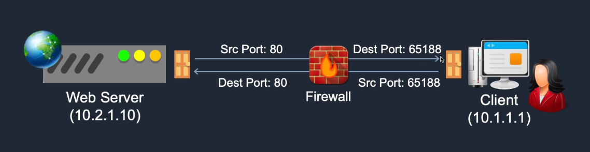
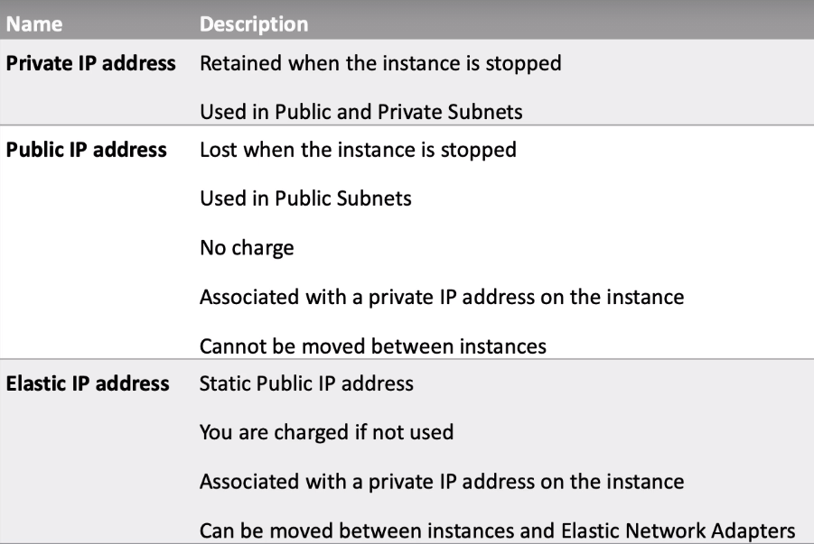

# 00 - Getting Started #
_________________________________________

<code>EDEN: This note was created after I finished Stephane Maarek's SysOps course. I did the first section of Neal Davis's SysOps course and I've found some important-to-remember primer details.</code>

<code>Note that some of the information here may been mentioned already in the succeeding note.</code>

_________________________________________

These are general information which will be reiterated again on the other notes, but I find as core details for any Solutions Architect or simply anyone in an AWS SysOps role.

1.  [AWS Public and Private Services](#aws-public-and-private-services)
2.  [Stateful and Stateless Firewalls](#stateful-and-stateless-firewalls)
3.  [The AWS CLI](#the-aws-cli)
4.  [Public, Private, and Elastic IP](#public-private-and-elastic-ip)
5.  [Instance Profile](#instance-profile)
_________________________________________

## AWS Public and Private Services ##

AWS is a **multi-tenant service** - which means that for the most part, you'll be running your resources on hardware that is shared across multiple customers.

There are options where you can have *dedicated* hardware or connection and you can find more details on that in the other notes, but the majority of AWS services are configured in a multi-tenant setup.

These AWS services can either be **Public** or **Private**.

### Public Services ###

These are services with **public endpoints.**
- have a DNS or IP address whihch you can connect to
- as example, S3 buckets have a URL which you can access

### Private Services ###

These are services that can have a public IP address but exist within a VPC.
- all resources have private IP address and is in your VPC
- as an example, EC2 instances have public IP addresses which you can SSH into.
- from the VPC, your resources can access outside resources through:
    
    - **Internet Gateway**
        Can be used to go to the public internet and connect to AWS public services
    
    - **VPC Endpoint**
        Can be used to access AWS public resources throguh a private connection
_________________________________________

## Stateful and Stateless Firewalls ##

A **Stateful firewall** allows the return of traffic automatically. A Security Group is a stateful firewall.

A **Stateless firewall** checks for an allow rule for both connections - inbound and outbound. Network ACLs (NACLs) are stateless firewalls.



_________________________________________

## The AWS CLI ##

You can spun up instances and provision resources by configuring them through the console. You could also run commands through the AWS Command Line or AWS CLI.

You can find more details on how to install and use AWS CLI in the [AWS Documentation Page.](https://docs.aws.amazon.com/cli/latest/userguide/cli-chap-welcome.html)


_________________________________________

## Public, Private, and Elastic IP ##

Below is a comparison of public IP, private IP, and ELastic Ip address which we use to access our EC2 instances.



### How IP addresses work in an instance ###

Let's say we have an instance and this instance could have a public IP if it's in a public subnet. We could also allocate an Elastic IP to it if we want the IP address to be static.


Now, the **public IP is not actually assigned to the instance**.
- it is associated with the private IP address of that instance
- this means that the instance OS is not aware of it's public IP

When data comes in on the internet gateway with **destination address set to the public IP address of the instance**, the internet gateway is actually doing a **1:1 NAT Translation**.
- destination address (public IP of target instance) is translated to the private IP of the instance.
- it then checks its route table if the private IP address matches a CIDR block
- it then forwards the data to the target instance
- the same process happens when the instance is sending internet-bound data
_________________________________________

## Instance Profile ##

An **Instance Profile** is a container for an IAM role that you can use to pass role information to an EC2 instance when the instance starts.
- can only contain 1 IAM role
- instance can only have one assigned role at a time
- a role can be included in multiple instances profile

You can follow the [create-instance-profile.sh](../scripts_digitalcloud_labs/Amazon_EC2/create-instance-profile.sh) to create an isntance profile on your EC2 instance.

```bash
# Make sure you have configured you AWS CLI already with your information
aws configure

# Create instance profile
aws iam create-instance-profile --instance-profile-name mytestinstanceprofile

# Add role to instance profile
aws iam add-role-to-instance-profile --role-name S3ReadOnly --instance-profile-name mytestinstanceprofile

# Remove role from instance profile
aws iam remove-role-from-instance-profile --role-name S3ReadOnly --instance-profile-name mytestinstanceprofile

# Delete instance profile
aws iam delete-instance-profile --instance-profile-name mytestinstanceprofile
```
_________________________________________
