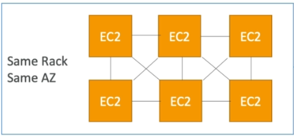
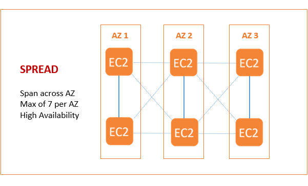
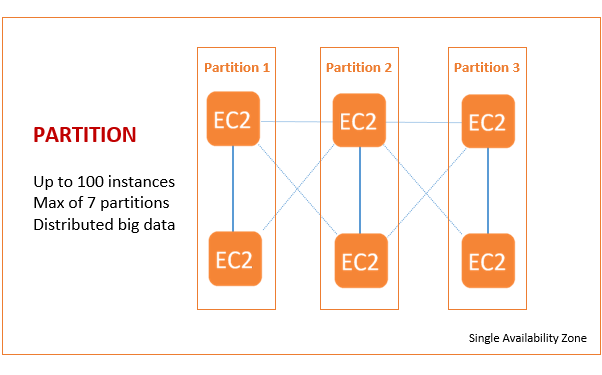
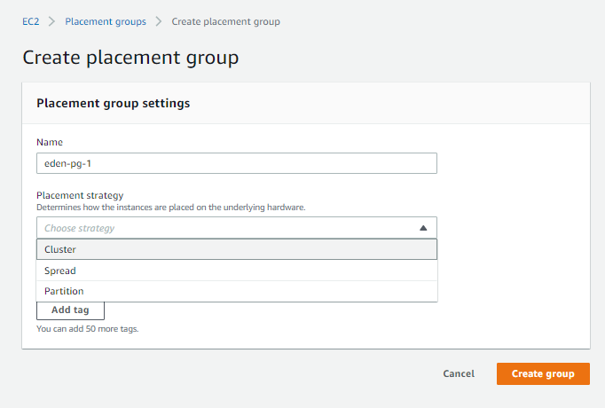
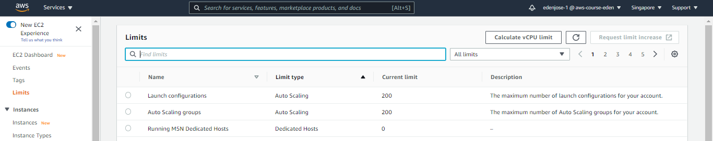
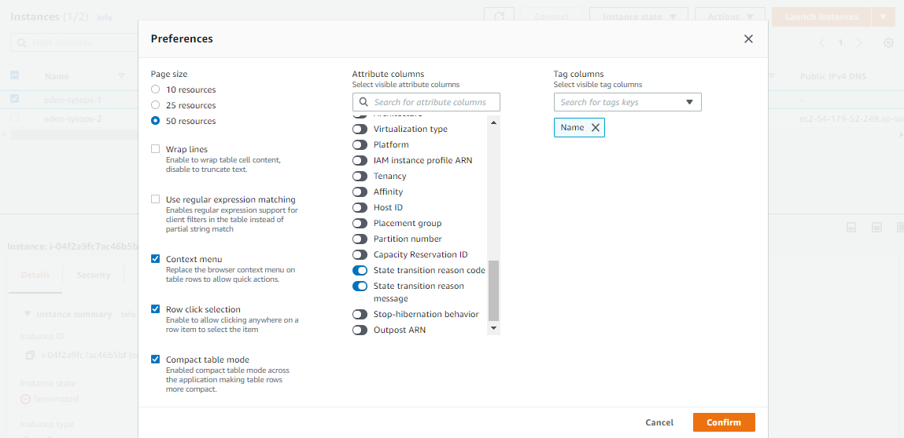
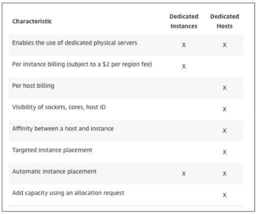
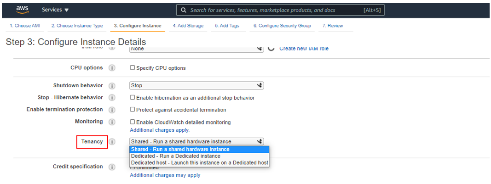
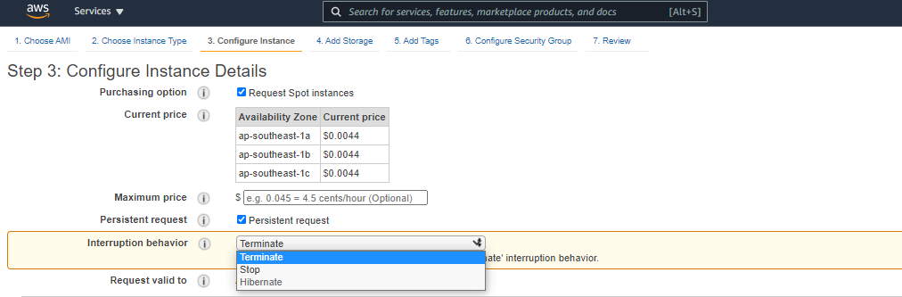

<!-- 2021-01-27 06:03:44 -->

# 1 - EC2 for SysOps #
________________________________________________

    

The focus of these note will be on EC2 from the SysOps perspective:

- Operations
- Troubleshooting
- Instance Types
- Launch Modes
- AMI
- CloudWatch

It is also assumed that you have prior knowledge to some basics of Amazon Web Services. The  AWS Console UI changes from time to time so the images that you may see in my notes might not be the same with what you see on your console.

This note are broken down into these sections:

1.  [Changing Instance Type](#changing-instance-type)
2.  [EC2 Placement Groups](#ec2-placement-groups-csp)
3.  [Shutdown Behavior and Termination Protection](#shutdown-behavior-and-termination-protection)
4.  [EC2 Launch Issues](#ec2-launch-issues)
5.  [EC2 SSH Issues](#ec2-ssh-issues)
6.  [EC2 Instance Launch Types](#ec2-launch-types)
7.  [Spot Instances and Spot Fleet](#spot-instances-and-spot-fleet)
8.  EC2 Instances Deep Dive
9.  EC2 AMIs
10. Cross-accoung AMI
11. Elastic IPs
12. CloudWatch Metrics for EC2
13. Custom CloudWatch Metrics
14. CloudWatch Logs
15. Unified CloudWatch Agent

________________________________________________

## CHANGING INSTANCE TYPE ##

This is a commonly done in SysOps. Notes to remember are:

- can only be done on EBS-backed instances
- you need to stop the instance before changing the instance type
- from instance settings, click **Change Instance Type** 
- we can upsize and downsize
- on some instances, we have an option to tick **EBS Optimized**
- once changed, restart instance
- the public ip may change when you reboot an instance

Before restarting instance, I have t2.micro:

    [ec2-user@ip-172-31-27-248 ~]$ free -m
                  total        used        free      shared  buff/cache   available
    Mem:            983          75         506           0         401         770
    Swap:             0           0           0

After changing to the a bigger one - t2.small:

    [ec2-user@ip-172-31-27-248 ~]$ free -m
                  total        used        free      shared  buff/cache   available
    Mem:           1991          76        1730           0         183        1776
    Swap:             0           0           0

________________________________________________

## EC2 PLACEMENT GROUPS - CSP ##

These are used to control EC2 Placement strategy within the AWS infrastructure.

- no direct interaction with hardware
- we just let AWS know how we want our instances to be 'arranged'
- three EC2 placement group options:

1.  **Cluster**
    - same rack, same AZ
    - Instances are grouped together in 1 Availability Zone.
    - low latency - 10 Gbps BW 
    - high performance, but high risk
    - if rack fails, all instances fial at the same time
    - for applications that needs to complete fast

        

2.  **Spread**
    - span across multiple AZ
    - instances are spread across different hardware
    - limit of **7** instances **per AZ per group**
    - for **max availability**
    - for critical applications

        

3.  **Partition**
    - similar with spread
    - spread on different partitions on different racks within an AZ
    - risk of failures can be isolated by partitions
    - up to **100 instances per group**
    - used for big data applications (Hadoop, Cassandra, Kafka)

        

To use Placement Groups, create the **Placement group** under **Network and Security** first and then when you're configuring instance details during instance creation, choose your Placement group.

________________________________________________

## SHUTDOWN BEHAVIOR AND TERMINATION PROTECTION ##

You can enable termination protection and shutdown behavior during instance creation or while its running.

**SHUTDOWN BEHAVIOR**
This is how the instance will react when shutdown from OS, not on AWS Console or API. There are two options here:
- Stopped (default)
- Terminated

Note that the CLI Attribute is **InstanceInitiatedShutdownBehavior**

**TERMINATION PROTECTION**
Protection against accidental termination in AWS Console or CLI.
- **Shutdown Behavior > Termination Protection**
- If SB=Terminate, then it'll terminate instance regardless if TP is enabled.

________________________________________________

## EC2 LAUNCH ISSUES ##

**InstanceLimitExceededError**
This means you have reached max number of running On-demand instances per region. The limits are counted in vCPU.

 - Max vCPU per region: 32
 - Either launch instance i another region or open support ticket to AWS to increase limit on your region.

You can view current limit in your region through the EC2 console.

 

**InsufficientInstanceCapacity**
This means AWS doesn't have much On-demand capacity in the particular AZ to which instance is launched.

- wait for a few minutes before requesting again
- break down requests into smaller ones.
- request for a different instance type and then resize later.

 

**Instance Terminates Immediately**
You are able to start instance but it went from pending to terminated immediately.

- EBS limit is reached
- EBS volume is corrupt
- root EBS volume is encrypted and you don't have access to KMS key for decryption.
- instance store-backed AMI is missing a part.

To see how the instance was terminated abruptly, you can select Settings icon at the upper right of the EC2 console to show **State Transition**.

(The [AWS Documentation](https://docs.aws.amazon.com/AWSEC2/latest/UserGuide/troubleshooting-launch.html) has a whole section discussing about instance launch issues. You can also view per-region [EC2 service quotas](https://docs.aws.amazon.com/AWSEC2/latest/UserGuide/ec2-resource-limits.html).

________________________________________________

## EC2 SSH ISSUES ##

**Unprotected Private Key File Error**
This means the private key file in your Linux machines doesn't have the necessary permissions. Make sure to set the .pem file to allow read permission - chmod 400

**Hostkey not found Error**
Username used in logging via SSH to the instance is not found.
You'll usually get a **permission denied** message.

**Connection Timeout**
This is usually caused by security groups not configured correctly.
It's also possible that CPU load is high that the instance cannot reply back.
________________________________________________

## EC2 LAUNCH TYPES ##

1.  **On-demand Instances** 
    - used for short workload and uninterrupted workloads
    - pay for what you use (billing per second, after the first minute)
    - highest cost, but no upfrontpayment
    - no long-term commitment

2.  **Reserved Instance** 
    - Minimum of **1 year**
    - up to **75% discount** compared to On-demand
    - upfront payment for long-term commitment
    - reservation can be 1 or 3 years        
    - recommended for steady usage, example is database
    - three types of reserved instances (RI):

        - **Reserved Instances** - specific instance type for long workloads
        - **Convertible RI** - can convert to other instance types 
        - **Scheduled RI** - reserving instances in a specific schedule

3.  **Spot Instance** 
    - short workloads, you can lose instances any time.
    - up to **90% discount** compared to On-demand
    - most cost-efficient but less reliable, you can *'lose'* instances any time
    - if current spot price is higher than your max price, you lose the instance
    - **max price** - how much you're willing to pay for the spot instance
    - **current spot price** - bidding price or market price
    - not recommended for critical applications or database
    - for workloads resilient to interruptions or failures
        - batch jobs
        - data analysis
        - image processing
        - any job that can be re-tried
    - **Suggested:** RI + On-demand + Spot
    - Use RI for baseline capacity with predictable usage
    - Use Spot or On-demand for jobs with unpredictable workload

4.  **Dedicated Instances**
    - no other customer will share your hardware.
    - may share with other instance under the same account
    - no control on instanc eplacement
    - no control on underlying hardware

5.  **Dedicated Host** 
    - Entire physical EC2 server is dedicated to you
    - Full control of EC2 instance placement
    - Full control on sockets/physical cores
    - **3 year** period reservation, more expensive
    - For companies with strong regulatory and compliance needs
    - For software with BYOL licensing model
    - **BYOL** - Bring Your Own License

     

    Below is comparison between dedicated hosts vs. dedicated instances

    

You can set choose instance types during creation of instance

**INTERRUPTION BEHAVIOR**
You can set what will happen to your spot instance when it is terminated and reclaimed by AWS.
- terminate / delete
- stop instance (you can then re-assign workload or change instance type)

**PERSISTENT REQUEST**
When you have a persistent spot request, you'll automatically have another spot instance created when the current instance is terminated by AWS. 

Note that if you terminate your own instance, it will just go through the same cycle - AWS checks if spot request is still valid and if it is, it will launch a new instance. To fully stop an instance from going through the persistent request cycle:
1.  delete first the spot request
2.  then delete the instances

To configure persistent request and interruption behavior

________________________________________________

## SPOT INSTANCES AND SPOT FLEET ##

**SPOT INSTANCES**
You can defined a max spot price and get the instance while **current spot price < max price you're willing to pay**.

- spot prices are most of the time stable for a certain period 
- but it will be projected as changing from the exam's perspective
- the hourly spot price varies based on **offer** and **capacity**
- AWS gives **2 minutes period** before fully reclaiming spot instance
- if you don't want the instances to be reclaimed, you can use Spot Block

**SPOT BLOCK**
You can *block* spot instances for a specified period of time without interruptions.
- 1 to 6 hours
- this is pretty rare since AWS can still reclaim the instance
