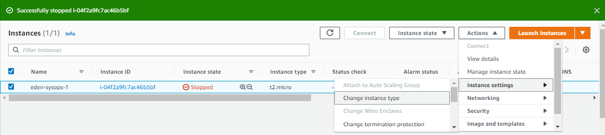

<!-- 2021-01-27 06:03:44 -->

# 1 - EC2 for SysOps #
________________________________________________

The focus of these note will be on EC2 from the SysOps perspective:

- Operations
- Troubleshooting
- Instance Types
- Launch Modes
- AMI
- CloudWatch

It is also assumed that you have prior knowledge to some basics of Amazon Web Services. The  AWS Console UI changes from time to time so the images that you may see in my notes might not be the same with what you see on your console.
________________________________________________

## CHANGING INSTANCE TYPE ##

This is a commonly done in SysOps. Notes to remember are:

- can only be done on EBS-backed instances
- you need to stop the instance before changing the instance type
- from instance settings, click **Change Instance Type** 

    

- we can upsize and downsize
- on some instances, we have an option to tick **EBS Optimized**
- once changed, restart instance
- the public ip may change when you reboot an instance

Before restarting instance, I have t2.micro:

    [ec2-user@ip-172-31-27-248 ~]$ free -m
                  total        used        free      shared  buff/cache   available
    Mem:            983          75         506           0         401         770
    Swap:             0           0           0

After changing to the a bigger one - t2.small:

    [ec2-user@ip-172-31-27-248 ~]$ free -m
                  total        used        free      shared  buff/cache   available
    Mem:           1991          76        1730           0         183        1776
    Swap:             0           0           0

________________________________________________

## PLACEMENT GROUPS - C.S.P. ##

These are used to control EC2 Placement strategy within the AWS infrastructure.

- no direct interaction with hardware
- we just let AWS know how we want our instances 'arranged'
- three EC2 placement group options:

 

    1.  **Cluster**
        - same rack, same AZ
        - Instances are grouped together in 1 Availability Zone.
        - low latency - 10 Gbps BW 
        - high performance, but high risk
         
            
            

         
    2.  **Spread**
        - instances are spread across different hardware
        - limit of **7** instances **per group per AZ**
        - for critical applications

    3.  **Partition**
        - similar with spread, but spread on different partitions on different racks within an AZ
        - failures can be isolated by partitions
        - up to 100 instances per group
        - used for big data applications (Hadoop, Cassandra, Kafka)

________________________________________________

### C - CLUSTER PLACEMENT GROUP ###