<!-- 2021-02-01 08:26:28 -->

# 02 - EC2 Management at scale #
______________________________________________

<p align=center>
    
</p>

This section will focus on two topics that are important for the AWS SysOps exam: **SSM and Opsworks**. By the end of this notes, you'll be able to answer the following questions:

- How to manage an EC2 instance fleet and on-premise servers?
- How to apply patches at scale?
- How to run automations?
- How to store parameters?
- How to use Chef and Puppet?

This note will be broken down into the following sections:

1.  [Systems Manager Overview](#aws-systems-manager-overview)
2.  [EC2 Instances with SSM Agent](#lab-ec2-instances-with-ssm-agent)
3.  [AWS Tags and Resource Groups](#aws-tags-and-resource-groups)
4.  [SSM Documents and Run Command](#ssm-documents-and-run-command)
5.  [SSM Inventory and Patches](#ssm-inventory-and-patches)
6.  [SSM Secure Shell](#ssm-secure-shell)
7.  [What if I lose my EC2 SSH Key?](#what-if-i-lose-my-ec2-ssh-key)
8.  [SSM Parameter Store Overview](#ssm-parameter-store-overview)
9.  [AWS Opsworks Overview](#aws-opsworks-overview)
______________________________________________

## AWS SYSTEMS MANAGER OVERVIEW ##

This helps you manage your EC2 instances and on-premise systems at scale.

- Get operational insight about the state of your infrastructure
- Detect problems and **automated patches** for enhanced compliance
- Works both for Windows and Linux OS
- Integrated with **CloudWatch Metrics/dashboard** and **AWS Config**
- Free service

Main features:

- Resource Groups
- Insights
    - Insight Dashboard
    - Inventory
    - Compliance
- **Parameter Store**
- Action
    - automation (shutting down ec2,etc.)
    - **Run command**
    - **Session Manager**
    - **Patch Manager**
    - Maintenance Windows
    - State Manager

<p align=center>
    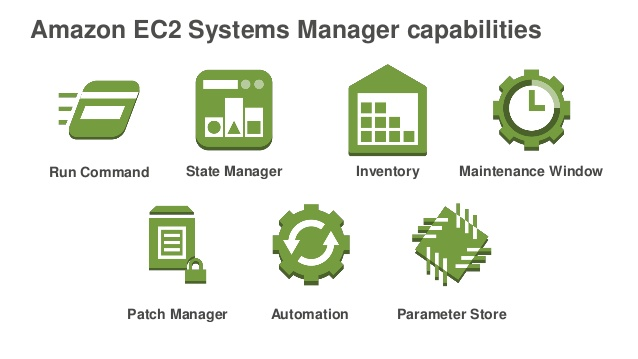
</p>

**HOW SYSTEMS MANAGER WORKS**
The SSM agent must first be installed on our EC2 instances which will then report to the SSM service.
- agent is installed by default for Amazon Linux AMI and some Ubuntu AMI
- if instance can't talk to  SSM service, most likely an issue with the SSM Agent

<p align=center>
    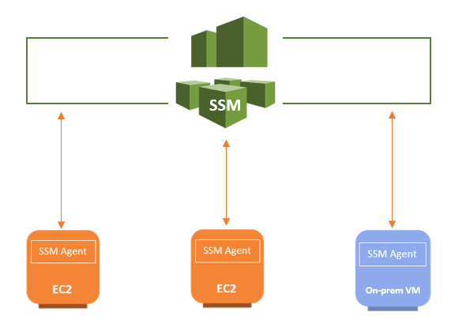
</p>

___________________________________________________

### LAB - EC2 INSTANCES WITH SSM AGENT ###

We will setting up 3 instances with SSM agent. We will use Amazon Linux AMI since it comes pre-built with the SSM agent

1.  Create a role with attached **AmazonEC2RoleforSSM** - this is the default policy.

    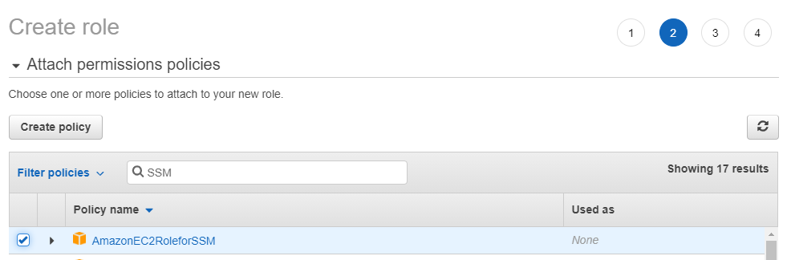 

2.  Create three instances and attach the newly created role.
    For the security gruop, create a new one and remove any rule attached to it.

3.  Go to **Systems Manager > Managed instances**. You should see the three newly created instances there.

    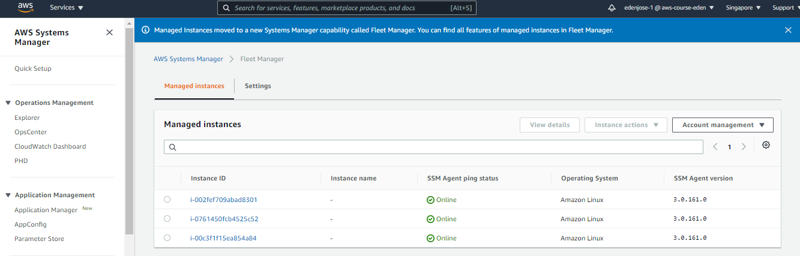

___________________________________________________

## AWS TAGS AND RESOURCE GROUPS ##

**AWS TAGS**
Key-value pairs that can be attached to different AWS resources (but mostly used in EC2).
- free-naming convention
- can be used for resource-grouping, cost-allocation, automation
- better to have many tags than few!

**RESOURCE GROUPS**
Create, view, or manage logical groups of resources using the tags
- can be based on 
    - application
    - layers of application task
    - prod vs. dev environments
- this can be done thru SSM
- region-specific - you'll need to create different RG per region
- works with EC2, S3 Lambda, DynamoDB

___________________________________________________

### LAB - TAGS AND RESOURCE GROUPS ###

We'll use the same three instances from the last lab.

1.  Create tags for each instance. Go to **EC2 > Select instance > Actions > Instance Settings > Manage Tags**. use the value below for each instance.

    | Instance | Tags | Value |
    | --- | --- | --- |
    | Instance 1 | Name | eden-dev-svr |
    | | Environment | dev | 
    | | Team | anaheim |
    | Instance 2 | Name | eden-prod-svr |
    | | Environment | prod | 
    | | Team | anaheim |
    | Instance 3 | Name | eden-dev2-svr |
    | | Environment | dev | 
    | | Team | orlando |

2.  The **Resource groups** can be initially be accessed at the top of the UI console but it has been changed for the new update. You can read more in the [AWS Documentation](https://docs.aws.amazon.com/ARG/latest/userguide/welcome.html). To access RG, go to **Services > Management and Governance > Resource Groups and Tag Editors**

3.  In the Resource Groups console, click **Create a resource group**.
    You will then be given two options to use:

    - Tag based
    - CloudFormation stack based

    Since we did the tags manually, we'll select **tag-based**.
    
    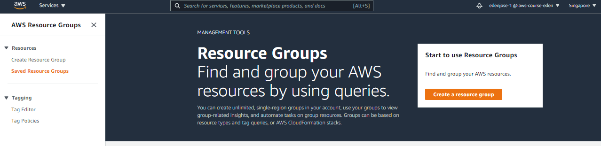
    
    For the **Grouping-criteria**, type instances and select EC2 instances.
    For the **Tags**, we want to select just the instances with Environment=dev.

    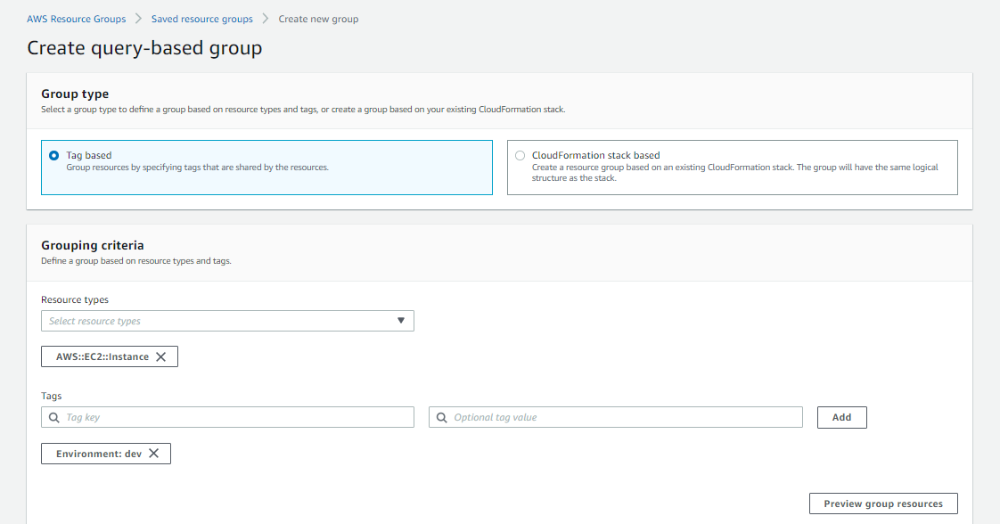

    At the bottom, you can see a preview of the **Group Resources**.
    You can also provide a **Group Name** and **Group Description**.

    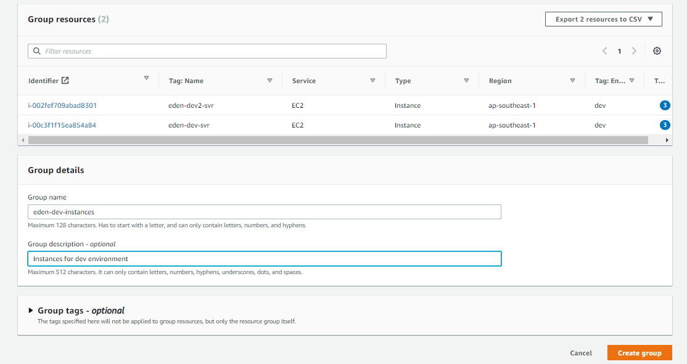

    When you're done, hit **Create group**.

4.  Create another one for prod instances and another one for Anaheim instances. Follow the same steps in number 3. You should see all three resource groups in **Saved Resource Groups**.

    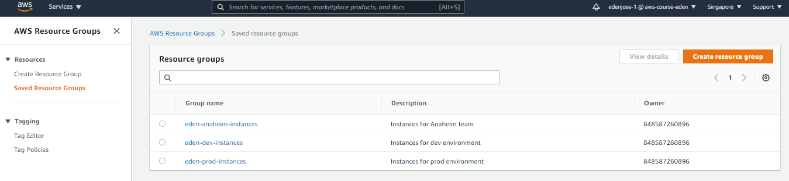

    We can now apply OS patching, automations, and the sorts on the instances based on these groups.

______________________________________________________________

## SSM DOCUMENTS AND RUN COMMAND ##

**SSM DOCUMENTS**
You can define parameters and actions in the SSM Documents.
- can be in JSON or YAML format
- wide number of documents are available in AWS
- it can be applied to:
    - patch manager
    - state manager
    - automation
    - parameter store
    - run command
    - to execute a document, we use the **run command**

To see all the available documents, go to **Systems Manager > Documents**.

**RUN COMMAND**
You can execute a document or a script using the *run command*.
- you can run command across multiple instances(using RGs)
- you can use **Rate Control/Error Control**
- integrated with IAM and CloudTrail
- no need to SSH to run a command
- results can be printed in the console

______________________________________________________________

### LAB - SSM DOCUMENTS AND RUN COMMAND ###

We'll be using the same lab all throughout this section. For this one, we we will be using the SSM Documents to install an Apache server on all three instances.

1.  Recall that there is no inbound rule on the security group we created for this lab - **SSM-Managed-Instances**. Edit the security group to allow HTTP/HTTPS.

    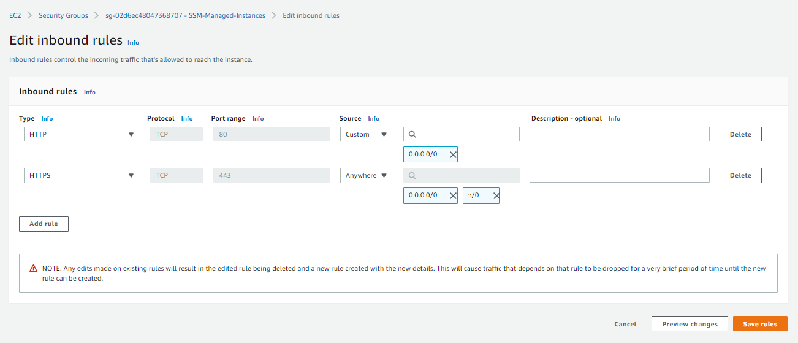

2. Go to **Systems Manager > Documents > Create command or session**. You can use the details below.

    | Section | Value | 
    | --- | --- |
    | Name | Install-configure-apache |
    | Content | YAML |

    For the actual YAML code, you can use the [install-apache.yaml](../install-apache.yaml) below. Click **Create document** once you're done.

    ```YAML
    ---
        schemaVersion: '2.2'
        description: YAML file to install Apache on the instances
        parameters:
            Message:
                type: "String"
                description: "Welcome Message"
                default: "Hello from the Other Side!"
        mainSteps:
        -
            action: aws:runShellScript
            name: configureApache
            inputs:
                runCommand:
                - 'sudo yum update -y'
                - 'sudo yum install -y httpd'
                - 'sudo systemctl start httpd'
                - 'sudo systemctl enable httpd'
                - 'echo  "{{Message}} from $(hostname -f)" > /var/www/html/index.html'
    ```

3.  To use the SSM Document we just created, fo to **Run Command > Run a command**. On the search bar, type in **Owner: Owned by me** and then select the document you created.

    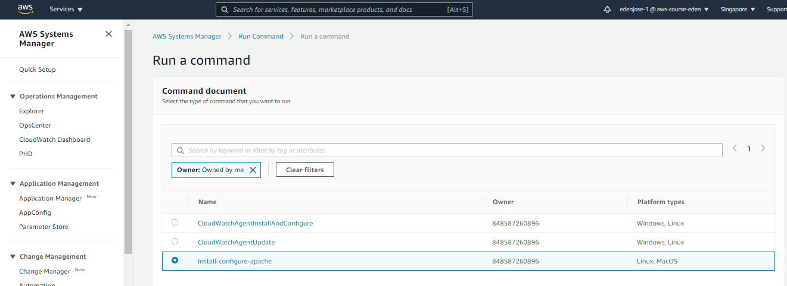

4.  Scroll down on the **Command parameters** section. We can change this to another value. For this one, we'll set it to "*To infinity and beyond!*".

    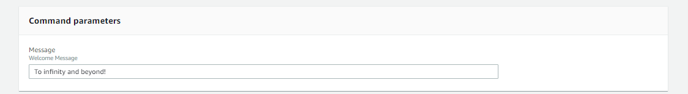

    On the **Target** section, we can specify instance tags or manually select instances. For this we'll just select all three instances.

    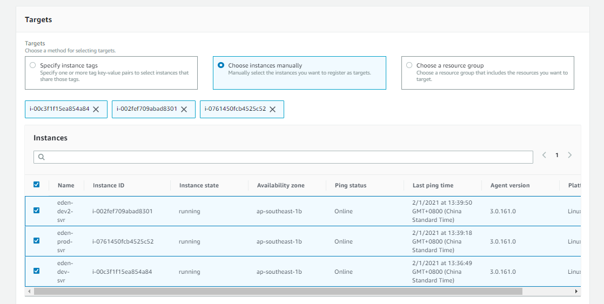

5.  Scroll further below. We can see the **RATE CONTROL** - this specifies how many isntances at a time in which to execute the task. This means that if our value is **3**, we can run the command for 3 instances at a time.

    **ERROR THRESHOLD** - stop the task after the task fails on a specific number of percentages or targets.

    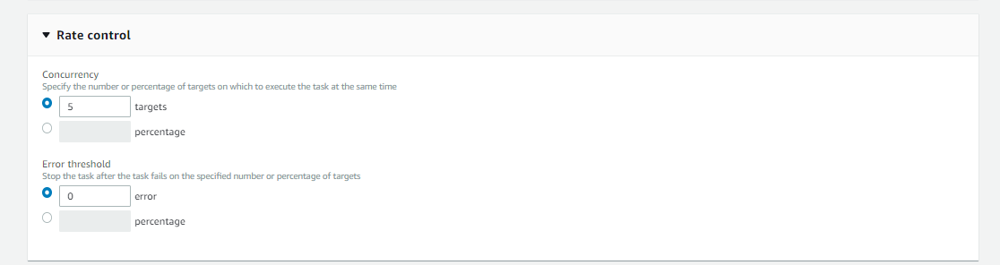

    On the **Output** section, we can choose to have the output to be written on an S3 bucket. For now we'll disable it.
    
    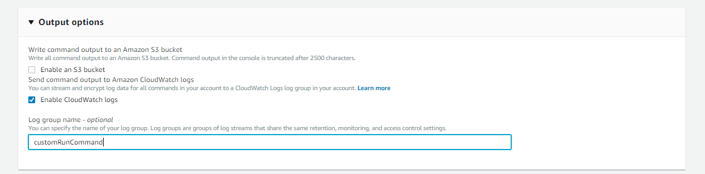

    We can also have the output sent to CloudWatch. You can use **customRunCommand** on the **Log group name** field.

6.  Once you're done, hit **Run** at the bottom to run the task. You should see the same:

    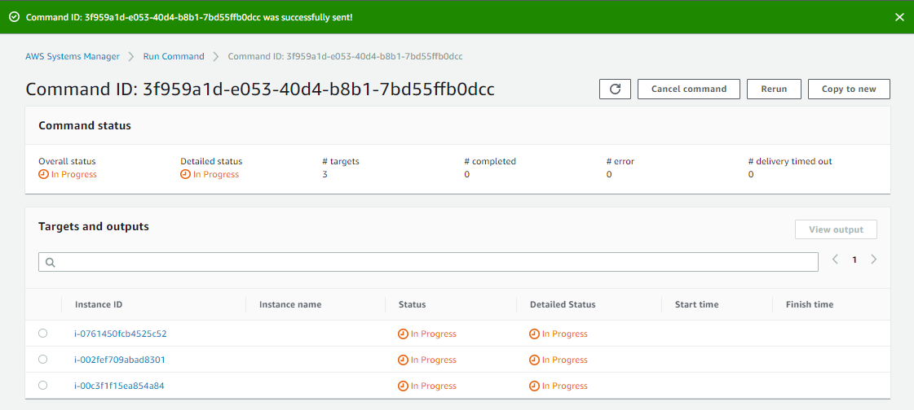

    Click refresh icon. All three instances should now show as *Succeeded*.

    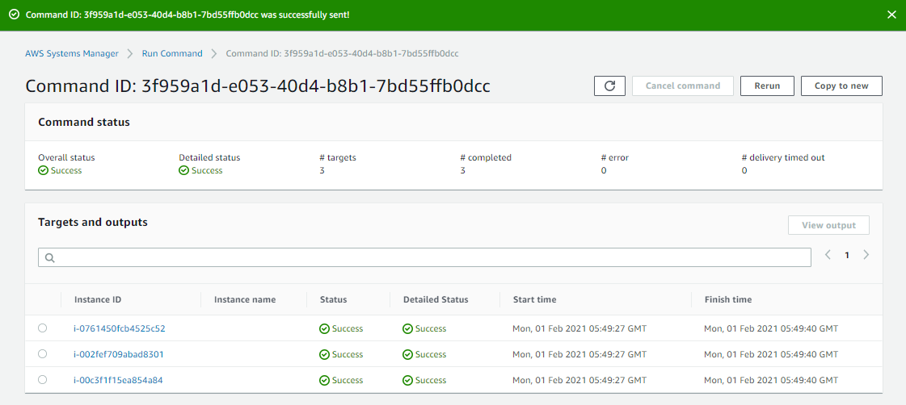

7.  Go to **CloudWatch > Log Groups** and then select the log we created - **customRunCommand**

    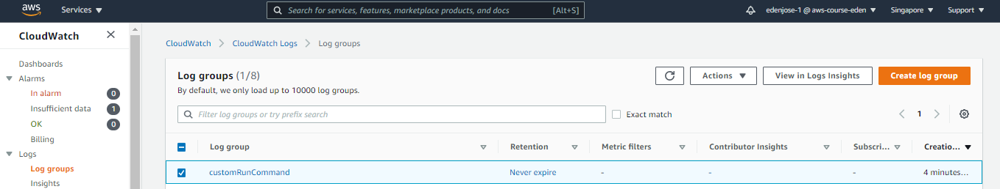

    

8.  You can also see the logs in Systems Manager. Go to **Systems Manager > Run command > select an instance > see the output at the bottom**

9.  To verify, copy the public DNS of each instance and open it in a browser. You should see the index.html with the message we edited earlier - *"To infinity and beyond!"*

    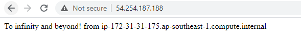

_________________________________________________________

<!-- 2021-02-01 21:31:00 -->

## SSM INVENTORY AND PATCHES ##

We can use AWS Systems Manager to patch all our instances. It also gives us visibility on the progress of the patches. There are many ways to patch instances:

- **inventory** - list software on an instance
- **inventory + run command** - allows us to patch software
- **Patch manager + Maintenance Window** - allows us to patch OS
- **Patch compliance** - gives us compliance insights
- **State manager** - ensures instances are in a consistent state 

**SAMPLE LAB**
1.  Go to **Systems Manager > Inventory**. 
    Under the **Managed instances with inventory enabled**, hit '*click to enable*'. Once it shows good, click **View details**. You should see somethng like this

    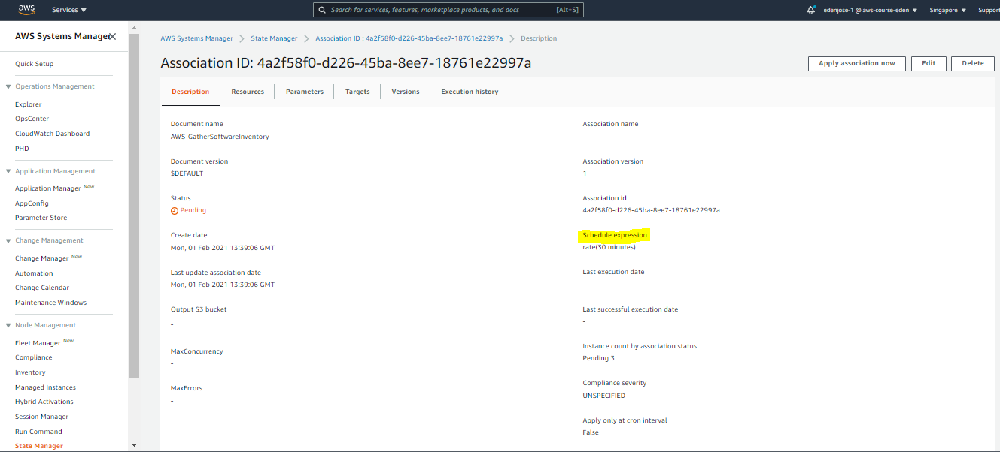

    Notice the **Schedule Expression Rate** - this is how often the instances will report to SSM. After a couple of minutes, you should see the job succeeding.

2.  Going back to inventory and scroll down to the bottom. You should see the three instances we worked on the previous labs. You cna click on any of this instance and you'll be able to see the softwares installed by checking the **Inventory** tab.

    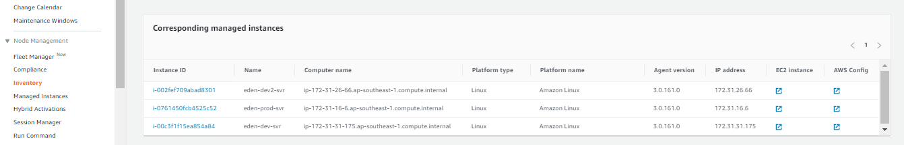

    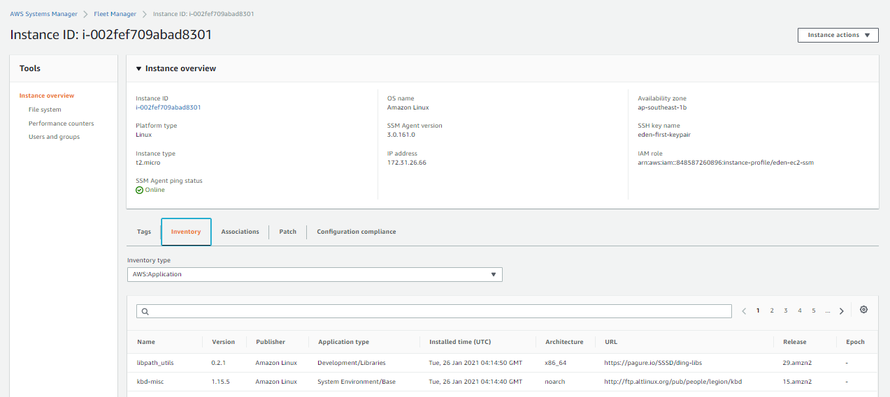

**PATCH MANAGER**
You can use the patch manager to apply patching or configure patching automatically on the instances based on tags, etc.
_________________________________________________________

## SSM SECURE SHELL ##

#### SESSION MANAGER ####
This allows you to start a secure shell in your VM but it does not use SSH access or bastion hosts.
- currently works on EC2 only
- logs action done to the targets through secure shell to S3 and CloudWatch Logs - this **needs to be enabled**
- we need IAM permissions on the EC2 instance which can:
    - access SSM
    - write to S3
    - write to CloudWatch
- CloudTrail can intercept **StartSession events.**
- Advantage against SSH:
    - no need for port 22
    - no need for bastion hosts
    - all commands are logged to S3/CloudWatch - useful for auditing
    - access to secure shell is done through **User IAM** and not SSH keys

#### SAMPLE LAB ####

1.  Create a log group in CloudWatch - **eden-ssm-secureshell-logs** - this is where all the logs for secure shell will stream.

2.  Go to **Systems Manager > Session Manager > Configure preferences**.
    Make sure untick box for **Enforce encryption**. Click *enable* under the **CloudWatch logging** section. and then choose the log group we just created.

    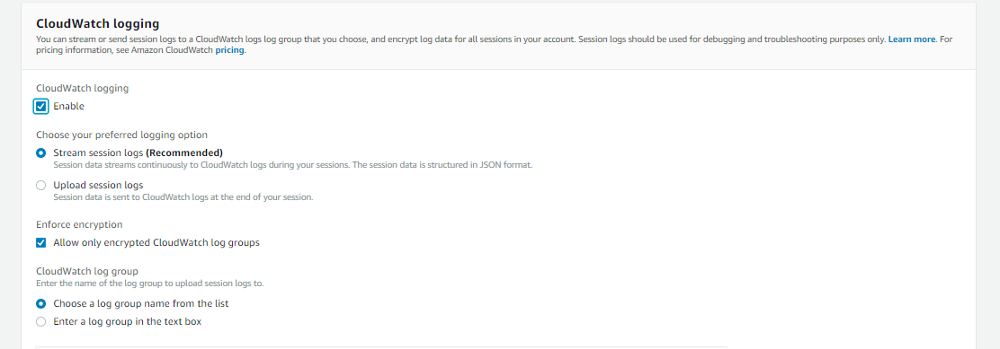
    

    Once you're done, hit **Save** at the bottom of the page.

3.  Recall that port 22 is not allowed in the security group of our three instances. To start a secure shell session to one of the instance, go to **Systems Manager > Session Manager > Sessions > Start session**
    Select an instance and click **Start Session** at the bottom.

    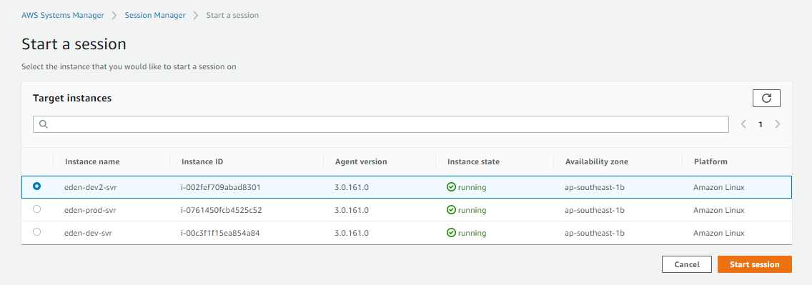

    You can see all sessions that were created by looking at the **Session History** tab.

_________________________________________________________________

## WHAT IF I LOSE MY EC2 SSH KEY? ##

This is a commonly asked question in the exam. The answer depends on whether the instance is:

- **EBS backed - traditional method**
    1.  If you lose your EC2 SSH key, stop instance, and detach the root volume
    2.  Attach the root volume on another instance as a data volume.
    3.  Ssh to the new instance and 
    4.  Modify **~/.ssh/authorized_keys** file and add your new key.
    5.  After modifying, move the volum back to the stopped instance.
    6.  Start the instance and SSH again to the instance.

- **EBS - new method**
    1.  Run the **AWSSupport-ResetAccess** automatio document in SSM.
    2.  SSM will now work in the background to restore your admin and ssh privileges

- **Instance store-backed**
    1.  You can't stop the instance because you'll lose the data on it.
    2.  For this one you cannot recover the ssh key and you can't do anything.
    3.  AWS recommend terminating the instance.
    4.  Tip: use Session Manager to access EC2 and edit the ~/.ssh/authorized_keys file directly.

_________________________________________________________

## SSM PARAMETER STORE OVERVIEW ##

This allows us to store configurations and secrets.
- option to use **Seamless encryption using KMS** to encrypt configurations you put in the parameter store
- serverless,scaleable, durable, easy SDK, free
- you can do **version tracking** of configurations and secrets
- configuration management  using path and IAM
- you can get notifications with **CloudWatch Events**
- integration with **CloudFormation**

<p align=center>
    
</p>

### AWS PARAMETER STORE HIERARCHY ###

You can organize the tree however you want. The main point is to have some convention or hierarchy on how to store the parameters

<p align=center>
    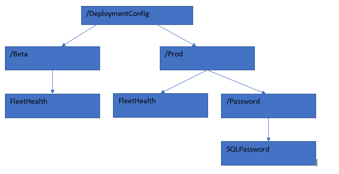
</p>

To access parameters from the AWS CLI, you can use:

    aws ssm get-parameters --names <insert-name-of-parameter>

To access encrypted parameters

    aws ssm get-parameters --names <insert-name-of-parameter> --with-decryption

To query all parameters that are in a path:

    aws ssm get-parameters-by-path --path <insert/path/here>

    # we can also get all parameters recursively

    aws ssm get-parameters-by-path --path <insert/> --recursive

__________________________________________________________

## AWS OPSWORKS OVERVIEW ##

**Chef** and **Puppet** are both open-source software which you can use to perform server configurations and automations. They can work with EC2 and on-premise VM.

**Opsworks** is basically the same as **Chef** and **Puppet**.
- alternative to SSM
- helps with managing configurations-as-code
- helps in having consistent deployments
__________________________________________________________
