<!-- 2021-02-02 00:05:02 -->

# 03 - EC2 High Availability and Scalability #

___________________________________________________________

We'll touch here the basics of load balancers and auto-scaling groups but from the SysOps perspective.

This note is broken down into these sections:

1.  [High Availability and Scalability](#high-availability-and-scalability)
2.  [Load Balancer Overview](#load-balancer-overview)
3.  [Load Balancer Stickiness](#load-balancer-stickiness)
4.  [ELBs for Sysops](#elbs-for-sysops)
5.  [Metrics, Logging, and Tracing for ELBs](#metrics-logging-and-tracing-for-elbs)
6.  [Auto Scaling Groups Overview ](#auto-scaling-groups-overview)
7.  [ASG Scaling Process](#asg-scaling-processes)
8.  [ASG for SysOps](#asg-for-sysops)
9.  [CloudWatch Metrics for ASG](#cloudwatch-metrics-for-asg)

__________________________________________________________________

## HIGH AVAILABILITY AND SCALABILITY ##

**SCALABILITY**
This means your system or application can handle greater loads by adapting. Scalability is linked with High Availability but they are different.

There are two kinds of scalability:

1.  **Vertical Scalability** - increasing or decreasing the size of instance.
2.  **Horizontal Scalability** - increase or decrease the number of instances.

**HIGH AVAILABILITY**
This means running your system in at least 2 data centers (avaialbility zone) in case 1 goes down, we still have an available data center.

__________________________________________________________________

## LOAD BALANCER OVERVIEW ##

Load Balancers are servers that forward internet traffic to multiple servers (EC2 instances) downstream.
- expose only a single point of access (DNS) to your application
- mask downstream failures; the loadbalancer will do healthchecks
- if it detects one instance is failing, it will redirect traffic to working instance
- provide SSL termination (HTTPS) for your websites
- can **enforce stickiness with cookies**
- high availability across zones
- separates public traffic from private traffic

#### EC2 LOAD BALANCER (ELB) ####

This is an AWS managed load balancer
- maintenance and some configuration are done by AWS
- costs less to setup your own load balancer but requires more effort
- this is same reason why it is suggested to used managed load balancer
- you cna setup **internal** or **external** load baalncers

#### 3 KINDS OF LOAD BALANCERS IN AWS ####

1.  **Classic Load Balancer** - deprecated
2.  **Application Load Balancer** - recommended
1.  **Network Load Balancer** - recommended

#### HEALTH CHECKS ####

This allows the load balancer to know which instances are avaialable to receive traffic and reply to requests.
- you configure this by giving it a **port** and a **route**
- if response is 200(OK), then instance is healthy

__________________________________________________________________

#### APPLICATION LOAD BALANCER ####

These are also called **Layer-7** load balancers since they do load baalncing at the application level.
- load balance to multiple HTTP applications across machines (target groups)
- load balance to multiple applications on the same machine (container)
- load balance based on route in URL
- load balance based on hostname in URL

Good to know:
- great fit for microservices and container-based applications
- has a port-mapping feature to redirect to a dynamic port
- enable stickiness at the target group level
    - same request goes to same instance
    - stickiness is directly generated by ALB, not the application
- ALB supports the following
    - HTTP
    - HTTPS
    - Websocket protocol
- the application servers behind the load balancer don't see the client IP directly
    - ALB does **Connection Termination**
    - the true IP si inserted in the header - **X-Forwarded-For**
    - application servers sees the private IP of the load balancer but not that of the client.

__________________________________________________________________

#### NETWORK LOAD BALANCER ####

This is also called **Layer-4 load balancer** since it forwards TCP traffic to your instances
- handle millions of requests
- support for static IP and Elastic IP
- less latency ~ 100 ms
- mostly used for extreme performance
- NLB cna directly see the client IP
- **Load Balancer error 503** means at capacity or no registered targets

__________________________________________________________________

#### LAB - LOAD BALANCER WITH SSM ####

We'll be launchign three instances and a load balancer and we will also be using SSM.

1.  Create three instances on separate Availability Zones.
    Also attach the IAM role we created in the previous notes. You can create a new role and attach **AmazonEC2RoleforSSM** policy to it.

    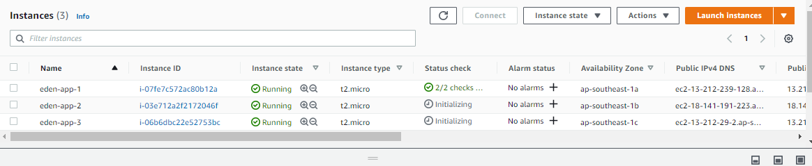

2.  Before creating he Load Balancer, we can first create the **Target Group**. use **instances** as target and put a name as well. After hitting Next, you will need to register the targets. Select all 3 instance, add them to the target group, and then hit **Create target group** at the bottom

    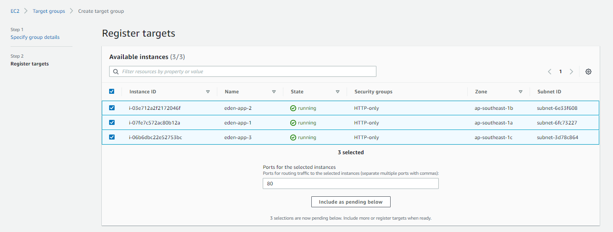

    You should now see the target group created. Click it to see that the instances are indeed registered.

    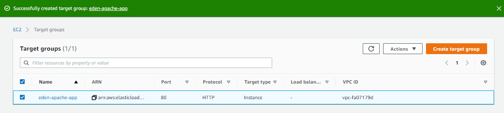

    All three targets will show as *unused* for now since there's no traffic into it. It should show as green later when we configure it to receive traffic from a load balancer.

    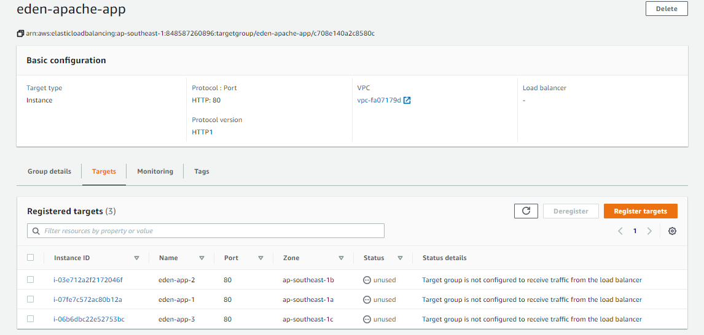

3.  Create a Load Balancer. Select **ALB**. You can follow the details below.

    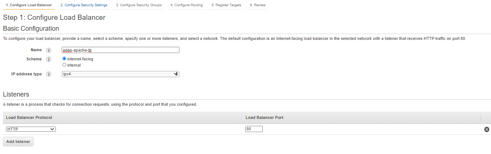

    Make sure to select all three Availability Zones where you launched your instances

    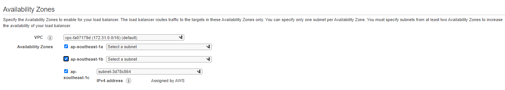

    Create a new security group - **elb-ssm-http-only**

    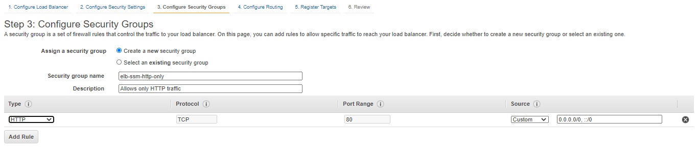

    Next is to configure target group.

    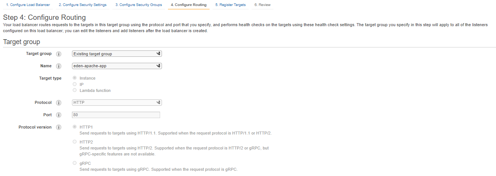

    Click Next. The succeeding steps are pretty much configured already.
    When you reached the end, click **Create** at the bottom.

4.  We then deploy an apache web server on the three instances using SSM. Go to **Systems Manager > Run command > Run command**. We'll use the document **Install-configure-apache** from the previous notes.

    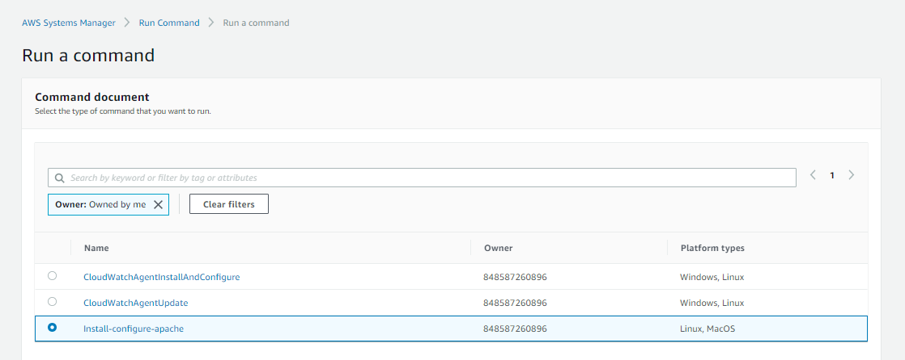

    Scroll at the bottom. Make sure to select all three instances in the **Targets** section.

    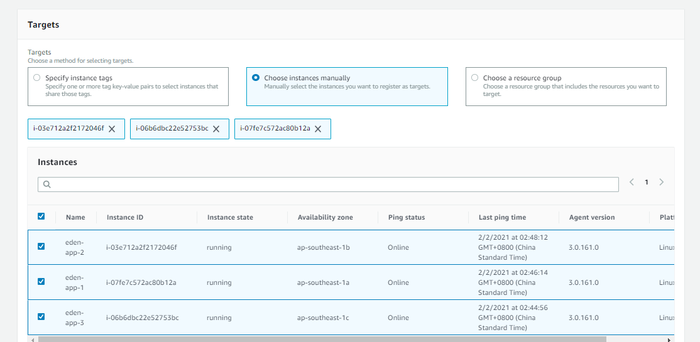

    In the **Output** section, untick the boxes. Hit **Run**.

    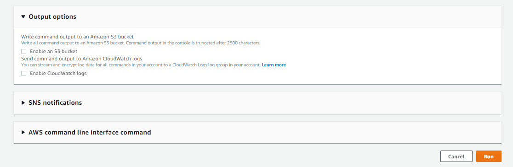

    You should now see the following. If it is still showing 'red', click the refresh button.

    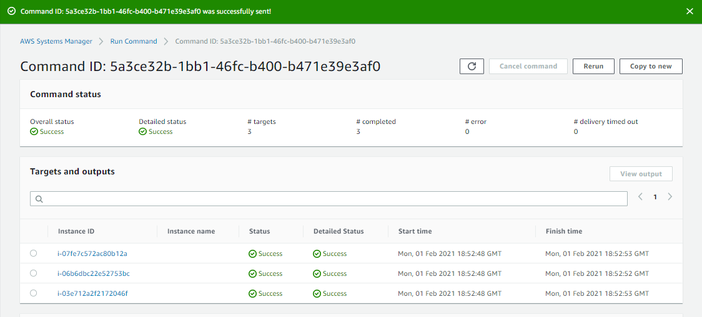

5.  Going back to the target groups, select the target group we just created and open **Targets** tab. You should now see all three instances in **healthy** status.

    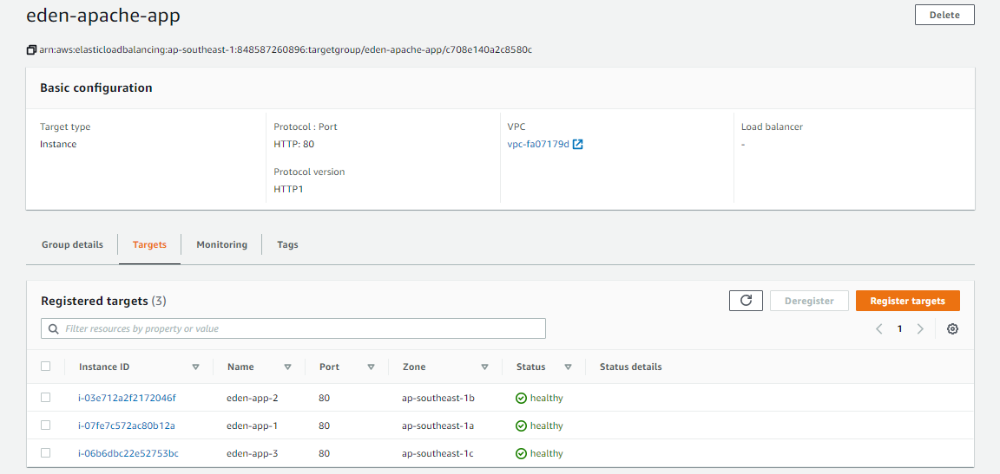

6.  Go to the Load Balancer console and copy the **DNS Name** under the **Descriptions** tab. Open this in a browser. You should see somethng like this. Notice that everytime you refresh the page. the IP appearing is changing. This is because the load balancer is distributing the traffic to the backend instances.

    

__________________________________________________________________

## LOAD BALANCER STICKINESS ##

Stickiness means the same client si always redirected to the same instance behind a load balancer
- works for both CLB and **ALB**
- uses **cookies** which has an expiration date which you can control
- helpful if you don't want the user to lose his session data
- enabling stickiness can bring **imbalance** to the load over the backend instances

To enable stickiness:

1.  Go to your **Target group > Attributes**. Edit the attirbutes and tick the *Enable stickiness box*. 

2.  Also specify the **stickiness duration** - this is basically how long is the expiration date. You can set this to 60 seconds for now.

3.  Hit save afterwards

__________________________________________________________________

## ELBs FOR SYSOPS ##

This is just a summarize comparison of NLB and ALB.

| Application Load Balancer | Network Load Balancer |
| --- | --- |
| Layer 7 | Layer 4 |
| HTTP, HTTPs, Websocket | TCP |
| URL based routing (hostname or path) | TCP-based traffic |
| Does not support static IP,but has fixed DNS | 1 Static IP per subnet |
| requires pre-warming for sudden traffic spike | doesn't require pre-warming |
| SSL termination | No SSL termination (SSL must be enabled on application) |

**LOAD BALANCER PRE-WARMING**
For the CLB and ALB, both scale gradually to traffic
- ELB may fail if there's a sudden spike in traffic
- if you expect high traffic, open a support ticket to AWS to **pre-warm** your ELB
- this basically means scaling up your ELB in advance
- for the support ticket, you'll need to provide the following estimate:
    - duration of traffic
    - expected requests per second
    - size of request in kB

**LOAD BALANCER ERROR CODES**
Below are just some high-level definition for the error codes
- **200** - Successful request
- **4xx** - Unsuccessfulat client side
- **400** - Bad Request
- **401** - Unauthorized
- **403** - Forbidden
- **460** - Client closed the connection
- **463** - X-Forwarded for Header with >30 IP (similar to malformed request)
- **5xx** - Unsuccessful at Server side
- **500** - Internal Server Error - coudl be on the ELB itself
- **502** - Bad Gateway
- **503** - Service Unavailable - service could be overloaded
- **504** - Gateway Timeout - coudl eb an issue with the server
- **561** - Unauthorized

__________________________________________________________________

#### SUPPORTING SSL FOR LOAD BALANCERS ####

A common question is: **how do we support legacy browsersthat has an old TLS (e.g. TLS 1.0)?**

Answer:
Change the ELB policy  to allow for weaker cipher (deprecated ciphers).
Note that only a very small percent of the internet uses TLS 1.0

To read more about the ELB policies, you can check out this [site.](https://docs.aws.amazon.com/elasticloadbalancing/latest/application/create-https-listener.html)

__________________________________________________________________

#### LOAD BALANCER COMMON TROUBLESHOOTING ####

If you encounter errors when workig with ELBs, you can use this checklist as a guide:

- Security Groups
- Health Checks
- Sticky Sessions
- For Multi-AZ, make sure |**cross-zone load balancing* is enabled
- Use **Internal Load Balancers** for private applications - no need for public access
- Enable **Deletion protection** to prevent against acciental deletes

**Deletion Protection** for ELBs can be modified in the **Attriutes** section of the ELB console.

__________________________________________________________________

## METRICS, LOGGING, AND TRACING FOR ELBs ##

All Load Balancer metrics are directly pushed to CloudWatch metrics.
- **BackendConnectionErrors** - 
- **HealthyHostCount / UnHealthyHostCount**
- **HTTCode_Backend_2XX** - successful request
- **HTTCode_Backend_3XX** - redirect request
- **HTTCode_ELB_4XX** - Client error codes
- **HTTCode_ELB_5XX** - Server error codes
- **Latency**
- **SurgeQueueLength** - total requests that are in pending routing to a healthy instance. <code>MAX VALUE: 1024</code>
- **SpilloverCount** - when surgequeue is filled, requests will spillover. These will be rejected.

### LOAD BALANCER ACCESS LOGS ###

Access logs from Load Balancers can be stored in S3 - **this needs to be enabled**. 
- These logs will contain:
    - time
    - client IP address
    - latencies
    - request path
    - server response
    - trace ID

- Note that you **only pay for the S3 storage**.
- Helpful for compliance
- Helpful for keeping access data even after ELB or EC2 instances are terminated
- Access logs are **automatically encrypted**

To enable Access Logs, go to **Load Balancer > Description > Attributes** and then tick the box for **Access Logs**. You will need to specify the bucket name and then tick the box for **Create this location for me**.

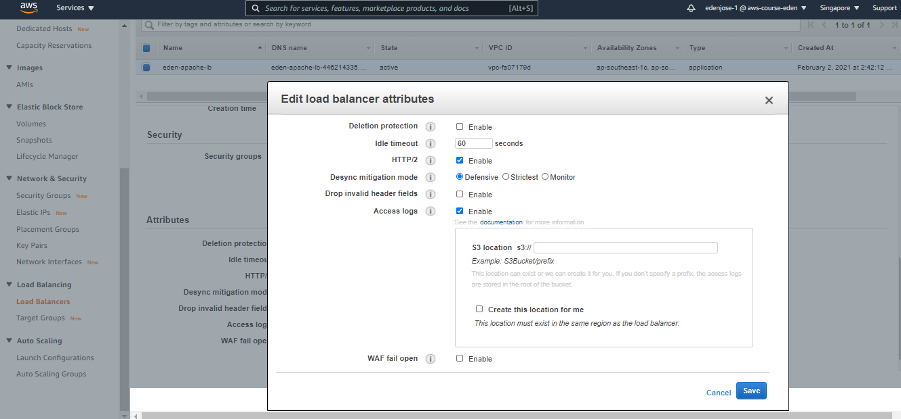

Any requests you'll do will now be logged ontothe S3 bucket you specified.

### ALB REQUEST TRACING ###

Every time you hit the Load Balancer with a request, it will add a custom header called **X-Amzn-Trace-Id**
- this allows for tracing
- useful in logs/distributed tracing platform to track a single request
- ALB is **not integrated with Amazon X-Ray**

Example fo the trace Id:

    Root=1-54bkjhknjh-dffdfdfj-fdsfdksfslkf

### LOAD BALANCER TSHOOT USING METRICS ###

**HTTP 400: BAD REQUEST**
Client sent a malformed request that does not meet HTTP specifications.

**HTTP 503: SERVICE UNAVAILABLE**
Ensure you have healthyinstances in every AZ that your Load Balancer is configured to respond in. Check **HealthyHostCount** in CloudWatch.

**HTTP 504: GATEWAY TIMEOUT**
Check keep-alive settings on your EC2 - ensure they're enabled and keep-alive timeout must be greater than the idle timeout settings of the load balancer.

You can read more about ELB error messages in the [AWS Documentation page](https://docs.aws.amazon.com/elasticloadbalancing/latest/application/load-balancer-troubleshooting.html).

_________________________________________________________

## AUTO SCALING GROUPS OVERVIEW ##

The goal of an ASG is to **scale out** (add instances) to match an increased load and to **scale in** (remove instances) to match a decreased load.
- ensures we have a minimum and maximum number of instances running
- we can **automatically register** new instances to a load balancer

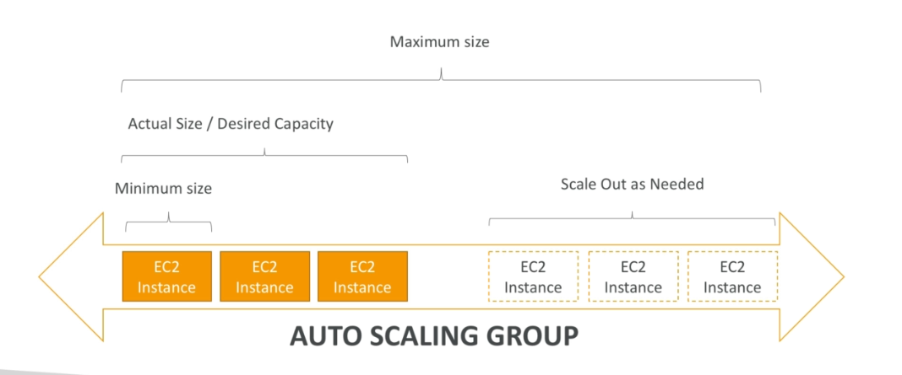

An ASG has the following attributes
- **launch coniguration**
    - AMI + instance type
    - EC2 user data
    - EBS Volumes
    - Security Groups
    - SSH key pair
- **Minimum Size**
- **Maximum Size**
- **Initial Capacity**
- **Network + Subnets information**
- **Load Balancer information**
- **Scaling Policies**

### AUTO SCALING ALARMS ###

It is possible to scale an ASG based on CloudWatch alarms
- these alarms cna trigger the scaling process
- alarms monitor a metric (e.g. CPU)
- **Metrics are computed as an average of the overall instances**

### AUTO SCALING NEW RULES ###

We can now define *better* auto scaling rulesthat are directly managed by EC2. This could be:
- Target CPU Usage
- Number of requestson the ELB per instance
- Average Network In/out

### AUTO SCALING CUSTOM METRIC ###

We can define a custome metric and auto scale based on that metric.
To do this, we have to:
1.  Send custom metric from application on EC2 to CloudWatch using **PutMetric API**
2.  Create a CloudWatch alarm to react to the low/high values.
3.  Use these alarms to trigger the scaling policies.

________________________________________________

### ASG BRAIN DUMP! ###

- Scaling policies can be on CPU, network,..and custom metrics or based on schedule
- to update your ASG, you can just provide a new ASG launch configuration
- if you attached an IAM role to ASG, it will be assigned to the EC2 instances
- ASG are **free**. You only pay for the underlying resources being used
- if you accidentally termiante an instance, the ASG will automatically restart them
- if load balancer marks the instance as unhealthy, the ASG will automatically replace it

________________________________________________

## ASG SCALING PROCESSES ##

Note that we can suspend these proceses.

**Launch**
Increase capacity by adding new ec2 instance to the group.

- **Terminate**
    Decreasing capacity by removing an instance.

- **HealthCheck**
    Checks the health of the instances.

- **ReplaceUnhealthy**
    Terminate unhealthy instances and replace them.

- **AZRebalance**
    Balance teh instances across the availability zones.

- **AlarmNotification**
    Accept notification from CloudWatch.

- **ScheduledActions**
    Perform scheduled actions that you create.

- **AddToLoadBalancer**
    Adds instances to Load Balancer or target groups

To suspend processes, go to your **ASG** and down on the **Advanced Configurations**, click edit. You should see the **Suspend Processes** field which will show you a dropdown of the processes you can suspend.

As an example, when we suspend **Terminate**, we are telling AWS that it cannot terminate any of our EC2 instance.

This is useful in troubleshooting issues in you auto scaling group.

### AZREBALANCE ###

When there's imbalance in our instances in the avaialbility zones, AWS will try to balance the distribution of instances in each AZ.

**AZRebalance** is basically just launching new instance then terminating old instance.

If you suspend **Launch** process,
- AZRebalance can't launch instances
- AZRebalance can't terminate instances
- AZRebalance becomes useless

If you suspend **Terminate** process,
- the **ASG can grow up to 10% of its size** (this is allowed during rebalancing)
- the ASG could then remain in this increased capacity since it cannot terminate instances
 
________________________________________________

## ASG FOR SYSOPS ##

This is a summary of this section for Auto Scaling Groups.
- To have high availability, you need atleast 2 running instances across 2 AZs in your ASG.
- You must atleast have a multi-AZ ASG
- Health Checks available:
    - EC2 Status Checks
    - ELB Health Checks
- ASG automatically launch new instance after terminating an unhealthy one
- ASG does not reboot unhealthy hosts - you'll have to suspend a process and manually reboot instances

### TSHOOTING ASG ISSUES ###

**<number of instances> instances are already running. Launchign EC2 instance failed**
This means your ASG has already reached the limit set by your *DesiredCapacity* parameter so it's not able to launch any more instances. TO resolve this, change the paramater to a higher value.

**Failing when trying o launch EC2 instance**
It's possible that the security group doesn't exist or is deleted.
It's also possible keypair doesn't exist or is deleted.

**ASG fails to launch instance for over 24 hours**
This will automatically suspend the processes - this is called **administration suspension**.

_______________________________________________________________

## CLOUDWATCH METRICS FOR ASG ##

This is just a recap of the available CloudWatch metrics.

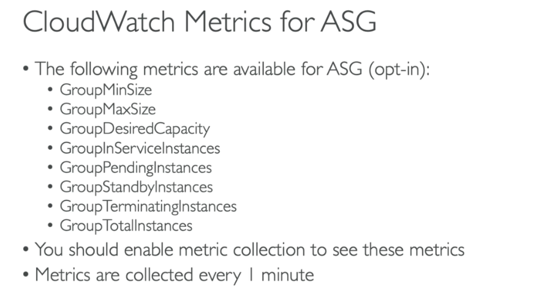 

_______________________________________________________________
