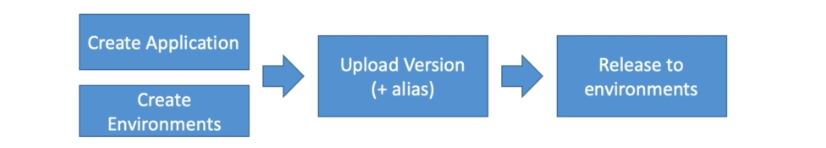
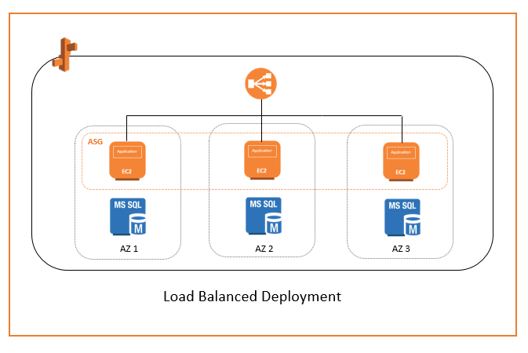
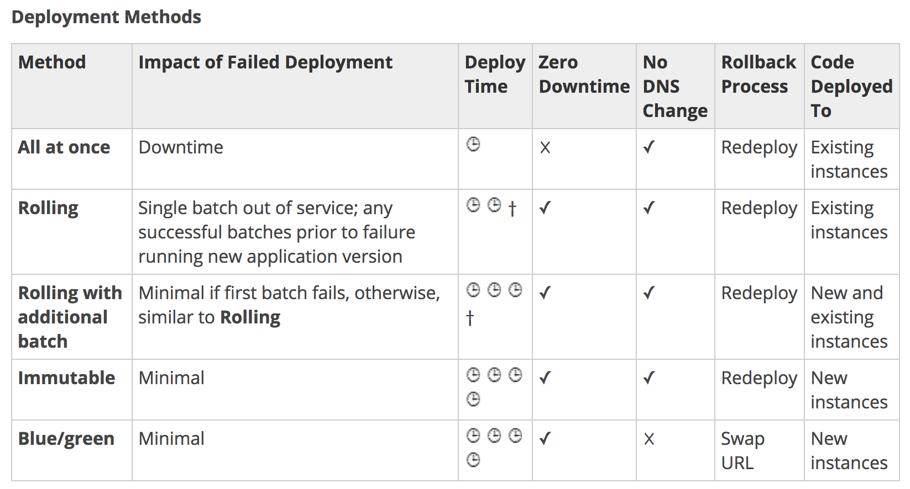

<!-- 2021-02-03 02:41:24 -->

# 04 - ELASTIC BEANSTALK FOR SYSOPS #
_______________________________________

This note is all about automating deployments. An AWS Service dedicated for that is the **Elastic Beanstalk**. Since this is a feature explored more in the AWS Developer Exam, this note will just be short but succint.

These note is broken down into these sections:

1.  [Beanstalk Overview](#beanstalk-overview)
2.  [Beanstalk Deployment Modes](#beanstalk-deployment-modes)
3.  [Beanstalk for SysOps](#beanstalk-for-sysops)

______________________________________________________________

## BEANSTALK OVERVIEW ##

### DEVELOPER PROBLEMS ###
- Managing infrastructure
- Deploying code
- Configuring databases, load balancers, etc.
- Scaling concerns
- Web apps normally have the same architecture (ALB + ASG)
- Consistently run the code across environments

### COMES IN ELASTIC BEANSTALK ###

**Elastic Beanstalk** is adeveloper-centric view of deploying an application in AWS.
- uses the same components: EC2, ASG, ELB...
- but you'll just look in one console
- you'll still have full control over the configuration
- free, you just pay for the underlying configuration
- **Managed Service**
    - instance configuration is handled by Beanstalk
    - deployment strategy is configurable but handled by Beanstalk
- you deploy application versions to environments
- you can promote application versions to the next environment
- you can also rollback toa previous feature
- full control over lifecycle environments
- support for many platforms
    - Go
    - Java SE
    - Java with Tomcat
    - .Net on Windows Server
    - Nodejs
    - PHP
    - Python
    - Ruby
    - Packer Builder
    - Single Container Docker
    - Multicontainer Docker
    - Preconfigured Docker
- If not supported, you can write your own platform

### BEANSTALK ARCHITECTURE MODELS ###

1.  **Single Instance** - good for dev
2.  **LB + ASG** - great for production/pre-production
3.  **ASG Only** - great for non-web apps

### BEANSTALK COMPONENTS ###

1.  Application
2.  Application Version
3.  Environment Name

### TIPS WHEN CONFIGURING BEANSTALK ###

- you can deploy an application and then have multiple environments
- you can deploy a sample code or you can upload your own code
- you can configure the:
    - instances, 
    - software running on the instance, 
    - capacity of auto scaling group, 
    - load balancers, 
    - databases, etc.
- once you configured all of this, Beanstalk will deploy this environemnt
- no need to delete individual components when you delete the application
- it is not recommended to have database inside of Beanstalk 
- better to have a databas eoutside of Beanstalk
- you cannot change the loadbalancer once the application is deployed 
_________________________________________________________________

## BEANSTALK DEPLOYMENT MODES ##

**SINGLE INSTANCE DEPLOYMENT**
This is great for development. 1 EC2 instance, 1 Elastic IP, 1 ASG

**HIGH AVAILABILITY WITH LOAD BALANCER**
This is great for production-type of deployments. Here you may have an ASG that spans across availability zones and each AZ may have several EC2 instances.

### DEPLOYMENT OPTIONS FOR UPDATES ###

1.  **ALL AT ONCE**
    - This is basically deployment in one go
    - fastest
    - great for quick iterations in development environment
    - but instances are not able to serve traffic for a bit - **downtime**

    

2.  **ROLLING**
    - update few instances at a time (time is called bucket)
    - you can set the bucket size (number of instance to update)
    - application is running both versions simultaneously
    - no additional cost
    - once bucket is done and healthy, the next bucket is then updated
    - **long deployment** 
    
    

3.  **ROLLING WITH ADDITIONAL BATCHES**
    - similar with rolling, but new instances are added
    - application is running at capacity
    - application is running both version simultaneously
    - **small additional cost**
    - this ensures old application is still available during update
    - ensures application is operating at full capacity during  update
    - additional batch is removed at the end of deployment
    - **good for production**
    - **longer deployment** 

    

4.  **IMMUTABLE**
    - **Zero downtime**
    - spinning up new instances with version 2 in a temporary ASG 
    - when all is healthy, new instances are merged to original ASG
    - this **doubles the original number of instances**
    - temporary ASG is then deleted
    - **high cost, double capacity**
    - **longest deployment**
    - **quick rollback in case of failures**
    - when update fails, just terminate new ASG and restart process
    - **great for production - if you're prepared for cost**

    

### BLUE-GREEN DEPLOYMENT ###

This is not a *direct feature* but is a common practice.
- zero downtime and release facility
- create a new **stage** environemnt and deploy v2 there
- the new environment (green) can be validated independently
- it can also easily rollback in case of issues
- **Route53** can be setup using weighted policies to redirect a portion of traffic to the stage environment
- you cna then **swap URLs** when done with the environment test
    

___________________________________________________

## BEANSTALK FOR SYSOPS ##

A summary of the Beanstalk section.
- Beanstalk application logs are automatically put into CloudWatch
- you manage the code, AWS manages the underlying infrastructure
- you are not responsible for patchign the runtime
- know the different modes for your application
- **you can put a Route53 Alias or CNAME on top of the Beanstalk URL**

### HOW BEANSTALK DEPLOY APPLICATIONS - ROLLING ###

1.  EC2 has a base AMI - this is configurable
2.  EC2 gets the new code of the applciation
3.  EC2 **resolves the app dependencies - can take a long time**
4.  Apps get swapped on the instances until old version is not running anymore

**HOW CAN WE SHORTEN THE TIME TO GET A NEW VERSION OUT?**
We can use **Golden AMI** - standard company-specific AMI
- OS dependencies are already packaged
- packaged app dependencies
- other packaged company-wide softwares

**GOLDEN AMI WITH BLUE-GREEN DEPLOYMENT**
By using a Golden AMI in combination with Blue-green deployment, our application won't need to resolve dependencies since the configurations are already packaged on the golden AMI

### TROUBLESHOOTING BEANSTALK ###

If health of environment changes to red, you can try the following:
- review environment events
- pull logs and view log file entries
- roll back to a previous working version of the application

When accessing external resources, make sure security groups are configured correctly.

In case of **TIMEOUTS**, you can increase deployment timeouts.

### DEPLOYMENT MODES ###

___________________________________________________
