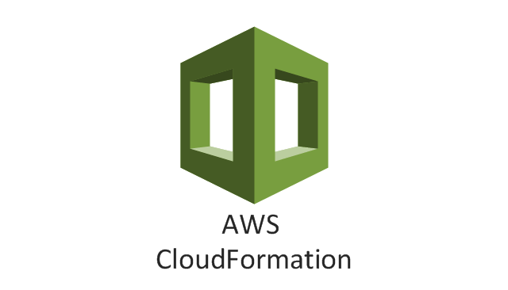

<!-- 2021-02-03 07:51:29 -->

# 05 - CLOUDFORMATION FOR SYSOPS #
______________________________

This note is all about managing **Infrastructure as Code**. This will go over the basics of CloudFormation, which will be followed by troubleshooting and more advanced topics.

This notes will be broken down into these sections:

1.  [CloudFormation Overview](#cloudformation-overview)
2.  [Creating Stacks](#creating-stacks)
3.  [Update and Delete Stacks](#update-and-delete-stacks)

______________________________

## CLOUDFORMATION OVERVIEW ##

______________________________

## CREATING STACKS ##

______________________________

## UPDATE AND DELETE STACKS ##