<!-- 2021-02-03 07:51:29 -->

# 05 - CLOUDFORMATION FOR SYSOPS #
______________________________

This note is all about managing **Infrastructure as Code**. This will go over the basics of CloudFormation, which will be followed by troubleshooting and more advanced topics.


This section is loaded with a lot of concepts and labs, but I haven't noted them all here since they'll take up a lot of space. I just jot down the first two labs - Creating stacks and Updating/Deleting Stacks. The rest, I just performed in my AWS account.

If you want to follow along and do all the labs, I suggest you check out Stephane Maarek's Udemy course [here.](https://www.udemy.com/course/ultimate-aws-certified-sysops-administrator-associate/)

This note will be broken down into these sections:

1.  [CloudFormation Overview](#cloudformation-overview)
2.  [Lab - Creating Stacks](#lab-creating-stacks)
3.  [Lab - Update and Delete Stacks](#lab-update-and-delete-stacks)
4.  [YAML Crash Course](#yaml-crash-course)
5.  [CloudFormation Parameters](#cloudformation-parameters)
6.  [CloudFormation Resources](#cloudformation-resources)
7.  [CloudFormation Mappings](#cloudformation-mappings)
8.  [CloudFormation Outputs](#cloudformation-outputs)
9.  [CloudFormation Conditions](#cloudformation-conditions)
10. [CloudFormation Intrinsic Functions](#cloudformation-intrinsic-functions)
11. [CloudFormation User Data](#cloudformation-user-data)
12. [CloudFormation cf-init](#cloudformation-cf-init)
13.  [CloudFormation cfn-signal and wait conditions](#cfn-signal-wait)
14. [Troubleshooting: cfn-signal](#troubleshooting-cfn-signal)
15. [CloudFormation Rollbacks](#cloudformation-rollbacks)
16. [CloudFormation Nested Stacks](#cloudformation-nested-stacks)
17. [CloudFormation ChangeSets](#cloudformation-changesets)
18. [CloudFormation DeletionPolicy](#cloudformation-deletionpolicy)
19. [CloudFormation TerminationProtection](#cloudformation-terminationprotection)
______________________________

## CLOUDFORMATION OVERVIEW ##

### INFRASTRUCTURE AS CODE ###

This simply means all our infrastructure can now be written as code and then deployed anytime. This is where **CloudFormation** comes in.
- it is a **declarative** way of outlining your AWS infrastructure
- CloudFormation will build this in the **right order** with the **exact configuration**
- **code can be version controlled**
- **each resources within a stack has an identifier**
- you can **estimate your costs using the CloudFormation template**
- no resources are manually created
- changes to the infrastructure are reviewed through code
- this identifiers helps in tracking your costs
- ability to destroy/re-create your infrastructure on the fly
- automated egneration of diagram for your templates
- **leverage existing templates on the web**
- **Separation of concern** - create many stacksfor many apps layers:
    - VPC stacks
    - Network stacks
    - App stacks

### HOW CLOUDFORMATION WORKS ###

1.  Upload templates to S3 and then CloudFormation reference it.
2.  **We cannot edit previoud templpates.**
3.  To update a template, you just re-upload a new version
4.  Stacks are identified by name
5.  Deleting a stakc deletes every artifact created by the template.

### DEPLOYING CLOUDFORMATION TEMPLATES ###

**MANUAL WAY**
- Editing templates in the CloudFormation Designer
- Using the console to input parameter

**AUTOMATED WAY**
- Editing templates in the YAML file
- Using the AWS CLI to deploy the templates
- **Recommended** when you want automated deployment

### CLOUDFORMATION BUILDING BLOCKS ###

**TEMPLATE COMPONENTS**

1.  **Resources**
    These are the AWS resources declared in the template.

2.  **Parameters**
    Dynamic inputs/variables for your template.

3.  **Mappings**
    Static inputs/variables for your template.

4.  **Outputs**
    References to what has been created.

5.  **Conditionals**
    List of conditions to perform resource creation.

6.  **Metadata**

**TEMPLATE HELPERS**

1.  **References**
    Linking yoru stuff within your template.

2.  **Functions**
    Use functions to transform data within your template.
______________________________

## LAB - CREATING STACKS ##

We'll be using the [01-ec2.yaml](../01-ec2.yaml) whihc will launch a single instance using CloudFormation. Create your own YAML file and use the code below.

```yaml
---
Resources:
    MyInstance:
        Type: AWS::EC2::Instance
        Properties:
            AvailabilityZone: us-east-1a
            ImageId: ami-a4c7edb2
            InstanceType: t2.micro
```

1.  Go to the CloudFormation console. Note that for this lab, we will be launching all templates in the **us-east-1 (N. Virginia)** region. Select **Create Stack**.

    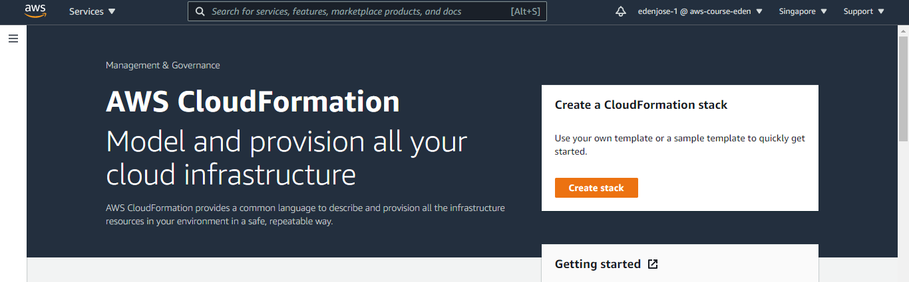

2.  You'll be brought to the next page which shows 4 steps. You can explore the options in each step but we'll do a simple one here.

    - **Step 1:**
    Template is ready > Upload a template file > Upload > Select your 01-ec2.yaml

        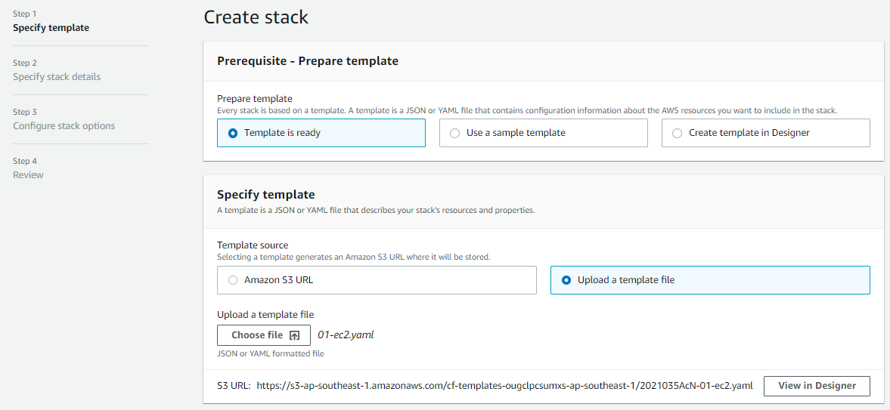

        You can click **View Designer** to see it's diagram.
    
        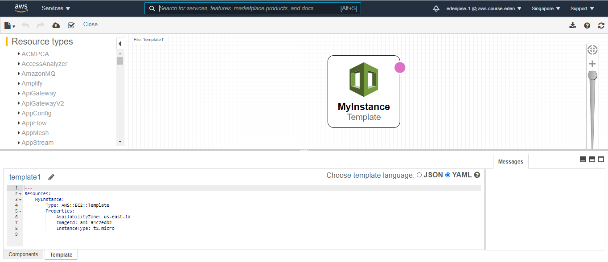
    
        To proceed with the steps, go back to previous page and hit **Next** at the bottom.

    - **Step 2:**
        Put in a Stack Name and then hit Next.

    - **Step 3:**
        You can explore the options here but we'll just hit Next again.

    - **Step 4:**
        You can review all the details here. Once they're all good, hit **Create Stack**.

3.  You should now see the **EVents** tab. It will show the stack in **CREATE_IN_PROGRESS** status.

    

    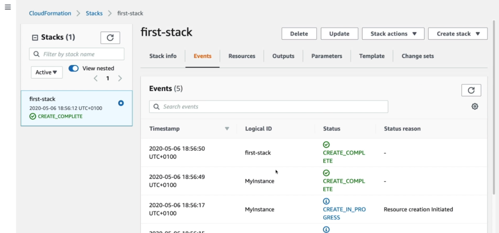

______________________________

## LAB - UPDATE AND DELETE STACKS ##

For this lab, we'll be using the [02-update-ec2.yaml](../02-update-ec2.yaml).
Basically, this script will add a **parameter** and we are also modifying the EC2 instance. In addition to that, there are two security groups and one elastic IP added.

```yaml
---
Parameters:

    SecurityGroupDescription:
        Description: Security Group Description 
        Type: String

Resources:
    
    MyInstance:
    Type: AWS::EC2::Instance
    Properties:
        AvailabilityZone: us-east-1a
        ImageId: ami-a4c7edb2
        InstanceType: t2.micro
        SecurityGroups: 
        - !Ref SG-SSH
        - !Ref SG-Server

    # adding an elastic ip to our Instance
    MyEIP:
        Type: AWS::EC2::EIP
        Properties:
            InstanceId: !Ref MyInstance
    
    # creating the first security group 
    SG-SSH:
        Type: AWS::EC2::SecurityGroup 
        Properties:
            GroupDescription: Enable SSH access via port 22
            SecurityGroupIngress: 
            -
                IpProtocol: tcp
                FromPort: 22
                ToPort: 22
                CidrIp: 0.0.0.0/0
    
    # creating the second security group
    SG-Server:
        Type: AWS::EC2::SecurityGroup 
        Properties:
            GroupDescription: !Ref SecurityGroupDescription 
            SecurityGroupIngress: 
            -
                IpProtocol: tcp
                FromPort: 80
                ToPort: 80
                CidrIp: 0.0.0.0/0
            -
                IpProtocol: tcp
                FromPort: 22
                ToPort: 22
                CidrIp: 0.0.0.0/0
              
```
1.  To update the stack we created from the first lab, just select your stack and click **Update**.

    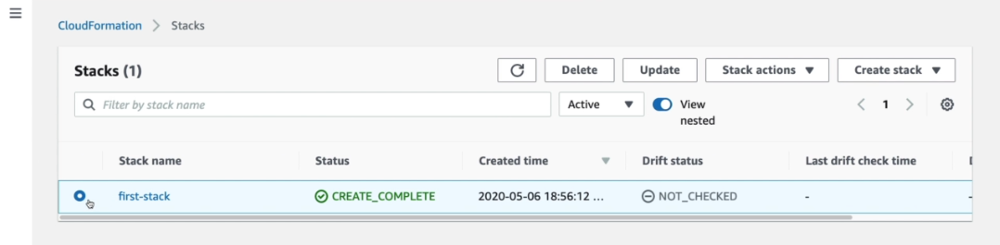

2.  Choose **Replace current template** and then **Upload template file**. Select 02-update-ec2.yaml. Hit **Next** afterwards.

    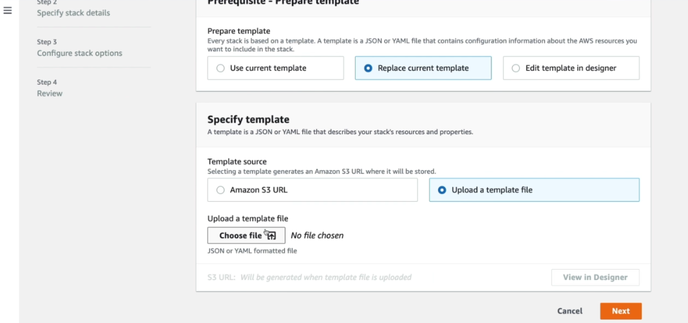

3.  You'll then be brought to **Parameter** section which will prompt you to enter a value. This is because we determined a **Parameter** section in our new template. Parameters are dynamic variables that user can modify.

    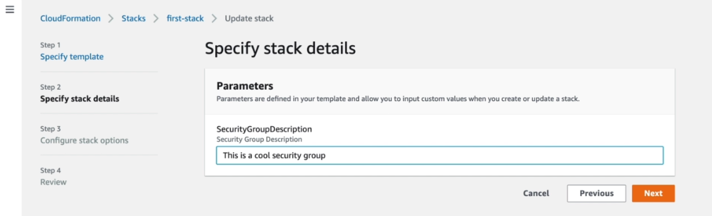

4.  We'll not modify any options in Step 4 and proceed to **Review**. Notice at the bottom, we have a **Change Preview**. This shows what will be modified by the new template.

    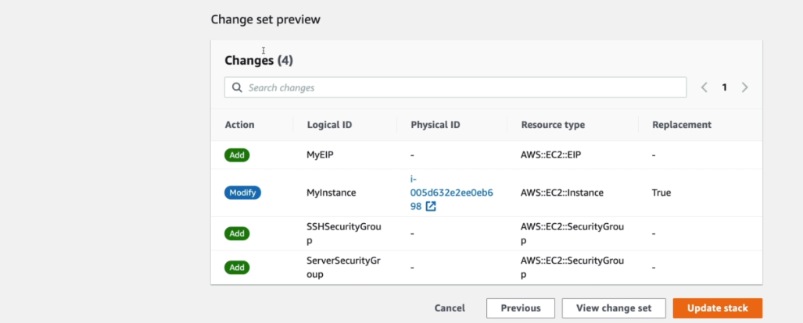

    Hit **Update Stack**.

5.  Going back to the **Events** tab, you can see that teh stack is now in **UPDATE_IN_PROGRESS** status.

    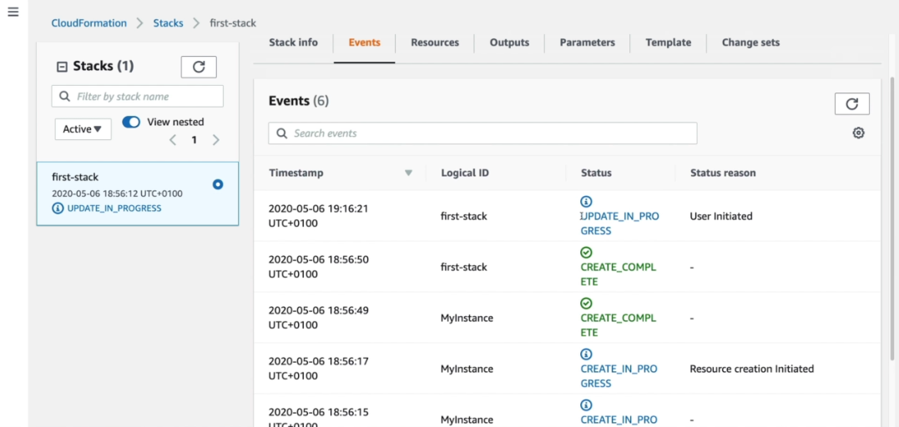

    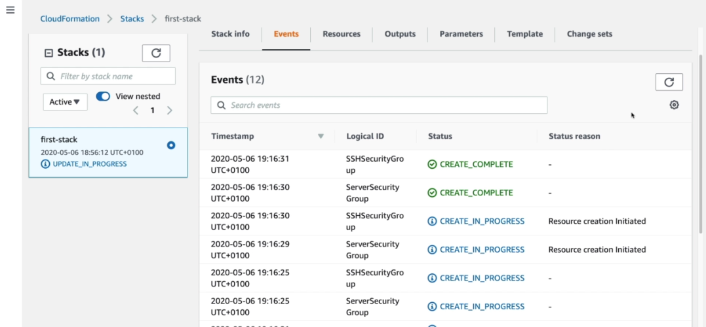

To delete the components, you can simply delete the stacks we created and CloudFormation will take care of deleting the instances, security groups, etc.
______________________________

<!-- 2021-02-04 02:27:12 -->

## YAML CRASH COURSE ##

YAML and JSON can be both used to build your CloudFormation templates. However, YAML is much preferred for being readable.
- key-value pairs
- nested objects
- support for array (similar with list)
- multi-line strings - by using the **pipe** character (|)
- can include comments

An example of this is the [02-update-ec2.yaml](../02-update-ec2.yaml) which we used in the previous lab.

```yaml
---
Parameters:

    SecurityGroupDescription:
        Description: Security Group Description 
        Type: String

Resources:
    
    MyInstance:
    Type: AWS::EC2::Instance
    Properties:
        AvailabilityZone: us-east-1a
        ImageId: ami-a4c7edb2
        InstanceType: t2.micro
        SecurityGroups: 
        - !Ref SG-SSH
        - !Ref SG-Server

    # adding an elastic ip to our Instance
    MyEIP:
        Type: AWS::EC2::EIP
        Properties:
            InstanceId: !Ref MyInstance
    
    # creating the first security group 
    SG-SSH:
        Type: AWS::EC2::SecurityGroup 
        Properties:
            GroupDescription: Enable SSH access via port 22
            SecurityGroupIngress: 
            -
                IpProtocol: tcp
                FromPort: 22
                ToPort: 22
                CidrIp: 0.0.0.0/0
    
    # creating the second security group
    SG-Server:
        Type: AWS::EC2::SecurityGroup 
        Properties:
            GroupDescription: !Ref SecurityGroupDescription 
            SecurityGroupIngress: 
            -
                IpProtocol: tcp
                FromPort: 80
                ToPort: 80
                CidrIp: 0.0.0.0/0
            -
                IpProtocol: tcp
                FromPort: 22
                ToPort: 22
                CidrIp: 0.0.0.0/0
              
```
_________________________________________________________

## CLOUDFORMATION PARAMETERS ##

Parameters are inputs whihc you can dynamically used in your CF Template.
- useful if you want tor reuse the template across the company
- you can use this for inputs that you can't determine ahead of time.
- can prevent errors - using **types**
- you are prompted to enter a value for the parameter during deployment
- a bit more stable, no need to reupload new template to change the parameter.
- **use this if you know resource config is likely to change in the future**

### PARAMETER SETTINGS ###

These settings can control the parameters:
1.  **Type**
    - String
    - Number
    - CommaDelimitedList
    - List <type>
    - **AWS Parameter** - used in catching invalid values
2.  **Descriptions**
3.  **Constraints**
4.  **ConstraintDesctiption** (String)
5.   **Min/MaxLength**
6.  **Min/MaxValue**
7.  **Defaults**
8.  **AllowedValues** - for restricting the values 
9.  **AllowedPattern** - to verify user input
10. **NoEcho** - to pass in a secret

### HOW TO REFERENCE A PARAMETER ###

You can use **Fn::Ref** function to reference a parameter.
- you can also use the shorthand method, **!Ref**
- parameters can be used anywhere in the template
- function can also reference other elements in the template


From the [02-update-ec2.yaml](../02-update-ec2.yaml), we can see that the parameter for Security Group was determined at the top, while ti is referenced inside the Resources:

```yaml
---
Parameters:

    SecurityGroupDescription:
        Description: Security Group Description 
        Type: String

Resources:

    # Contents are ellipsed
    # .......
    # .......

    # creating the second security group
    SG-Server:
        Type: AWS::EC2::SecurityGroup 
        Properties:
            GroupDescription: !Ref SecurityGroupDescription 
            SecurityGroupIngress: 
```

### PSEUDO-PARAMETERS ###

These are offered by AWS and are avalable to use in any CloudFormation template.
- enabled by default
- can be used anytime

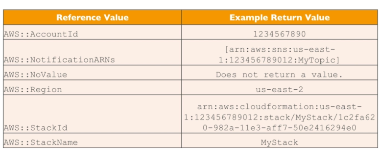
_____________________________________________

## CLOUDFORMATION RESOURCES ##

This is a mandatory part of the template - this is the **core of the template**.
- represents the components to be created/configured
- resources are declared and can reference each other
- there are **over 224 types of resources**
- resource types follow this format
    
        AWS::aws-product-name::datatype-name
- you can read more about resources in the [AWS Documentation page](https://docs.aws.amazon.com/AWSCloudFormation/latest/UserGuide/aws-template-resource-type-ref.html)

**CAN I CREATE DYNAMIC AMOUNT OF RESOURCES?***
No. Everything in the CloudFormation template has to be declared.

**IS EVERY AWS SERVICE SUPPORTED?**
Almost. For unsupported ones, you can use AWS Lambda Custom Resources.
_____________________________________________

## CLOUDFORMATION MAPPINGS ##

Mappings are fixed variables in your template.
- handy if you need to hardcode values based on environments
- use this for values you can determine in advance
- allows safer control over the template
- it looks like this:

    ```yaml
    RegionMap:
        us-east-1:
            "32": "ami-4634s20f"
            "64": "ami-4454s21f"
        us-west-1:
            "32": "ami-1544d30w"
            "64": "ami-4567s45c"
        eu-west-1:
            "32": "ami-4634s20f"
            "64": "ami-4454s21f"
    ```

### ACCESSING MAPPING VALUES ###
We use **Fn::FindInMap** to return a named value from a specific key.
- you can also use the shorthand format:

    ```bash
    !FinddInMap [ MapName, TopLevelKey, SecondLevelKey ]
    ```
___________________________________________

## CLOUDFORMATION OUTPUTS ##

The outputs section declares *optional* output values that we can be used by other stacks - **you just have to export them**
- you can link your templates using the outputs
- you can also view the outputs in the AWS Console or AWS CLI
- great for cross-stack collaboration
- **you cannot a stack fi it's outputs are being refeenced in another stack**

### EXPORTING THE VALUES ###

This is how we export the outputs so that it can be used by another stack.

    ```yaml
    # Notice the export block at the end.
    # Other stacks can now use this security group \
    # by referencing the name - SG-SSH-Out.

    Outputs:
        SG-SSH:
            Description: Security Group for SSH for Anaheim Team
            Values: !Ref SG-Company
            Export:
                Name: SG-SSH-Out
    ```

### IMPORTING THE VALUES ###

On our second template, we can reference the output from the first template.
- we just use the **Fn::ImportValue** function
- we can also use the shorthand method:

        !ImportValue <output-name>

- note that you can't delete first stack until all references are deleted too

    ```yaml
    Resources:
        MyInstance:
            Type: AWS::EC2::Instance
            Properties:
                AvailabilityZone: us-east-1a
                ImageId: ami-a4f5edb2
                InstanceType: t2.micro
                SecurityGroup:
                - !ImportValue SG-SSH-Out 
    ```
____________________________________________

## CLOUDFORMATION CONDITIONS ##

Conditions are used to control the creation of resourcesor outputs.
- you can have any conditions
- conditions can be based also on:
    - kind of environment (dev, test, prod)
    - AWS Region
    - Any parameter value
- each condition can reference another condition, parameter value, or mapping
- syntax:

    ```yaml
    # In this condition, resources will only be created if 
    # the environment type is equal to "prod"

    Conditions:
        CreateProdResources: !Equals [!Ref EnvType, prod ]
    ```
- you can name your condition however you like
- logical functions you can use:
    - **Fn::Equals**
    - **Fn::And**
    - **Fn::If**
    - **Fn::Not**
    - **Fn::Or**
- you can also use the shorthand method:
    - **!Equals**
    - **!And**
    - **!If**
    - **!Not**
    - **!Or**

_______________________________

## CLOUDFORMATION INTRINSIC FUNCTIONS ##

These are the important ones:

- **!Ref**
    Can be used to reference:
        
    - **Parameters** - returns value of parameters
    - **Resources** - returns physical ID of the resource

- **!GetAtt**
    Can be used to get other information/attributes about the resources

- **!FindInMap**
    Can be used to return a named value from a specific key

- **Fn::ImportValue**
    Import values that are exported in other templates

- **!Join**
    Join values wih a delimiter

    ```bash
    !Join [ delimiter, [comma-delimited-list-of-values]]
    
    # the exmaple below will output 'a--b--c'
    !Join [ "--", [a,b,c]]
    ```

- **!Sub**
    Substitute variables from a text. String must contain <code>${VariableName}</code>

- **Condition functions** 
    (discussed in [CloudFormation Conditions](#cloudformation-conditions))

______________________________________

## CLOUDFORMATION USER DATA ##

Recall that we can have user data configured when launching an EC2 instance. This can also be included in a CloudFormation template.
- we just pass the entire script through **Fn::Base64**
- this function will then convert the script to a base64 string
- user data script log will be in **/var/log/cloud-init-output.log**
- Syntax:

    ```yaml
    Resources:
        MyInstance:
            Type: AWS::EC2::Instance
            Properties:

                # code is ellipsed
                # ....
                # ....

                UserData:
                    Fn::Base64: |
                        #!/bin/bash -xe
                        sudo yum update -y
                        sudo yum install -y httpd
                        sudo systemctl start httpd
                        sudo systemctl enable httpd
                        echo "Hello World" > /var/www/html/index.html
    ```
_______________________________________

## CLOUDFORMATION cf-init ##

With the **cf-init script**, you can make complex EC2 configurations readable.
- **AWS::CloudFormation::Init** must be in the metadata of the resource
- the EC2 instance will query the CloudFormation service to get init data
- As soon as CF applies the init data, all logs will go to **/var/log/cf-init.log**
- Syntax:

    ```yaml
    Resources:
      MyInstance:
        Type: AWS::EC2::Instance
          Properties:

                # code is ellipsed
                # ....
                # ....

            UserData:
              Fn::Base64: 
                !Sub: |
                  #!/bin/bash -xe
                  # get the latest CF package
                  sudo yum update -y aws-cfn-bootstrap
                  # start cfn-init script
                  /opt/aws/bin/cfn-init -s ${AWS::StackId} -r MyInstance --region ${AWS::Region} ||
                  error_exit 'Failed to run cfn-init'
        Metadata:
          Comment: Install a simple Apache HTTP page
            AWS::CloudFormation::Init:
              config:
                packages:
                  yum:
                    httpd: []
                files:
                  "/var/www/html/index.html":
                    content: |
                      <h1> Hello from the Other Side! </h1>
                      <p> This was created using cfn-init </p>
                    mode: '000644'
                commands:
                  hello:
                    command: "echo 'Hello there!'"
                services:
                  sysinit:
                    httpd:
                      enabled: 'true'
                      ensureRunning: 'true'
    ```
_______________________________________

## cfn-signal / wait ##

Note that when we use cfn-init and the process failed, it would still show as **completeD** in the CloudFormation console. For this, we can use the **cfn-signal script**
- we run **cfn-signal** right after the cfn-init
- we tell CloudFormation to keep going or fail based on outcome
- we define a **WaitCondition** which tells CF to wait until it receives a signal from cfn-signal
- this blocks the template until it receives a signal
- we attach a **CreationPolicy** which tells how many signals you want to receiv and how long we're willing to wait.
__________________________________________

## TROUBLESHOOTING: cfn-signal ##

#### WHAT IF WAIT SIGNAL DIDN'T RECEIVE THE REQUIRED NUMBER OF SIGNALS? ###

1.  Ensure that the AMI you're using has the CF helper scripts installed.
2.  If it's not included, you can download them to your instance
3.  Verify that cfn-init and cfn-signal is successfully running on instance.
4.  You can view **/var/log/cloud-init.log** or **/var/log/cfn-init.log** to help you debug the launch.
5.  You can retrieve the logs by logging in via SSH.
6.  Note that you must have **rollback on failue disabled** to prevent CF from deleting stack after it fails.
7.  Verify that instance has connection to the internet.
8.  To check internet connectivity, <code>curl -l https://aws.amazon.com</code>

__________________________________________

## CLOUDFORMATION ROLLBACKS ##

**If a stack creation fails**, by default, everything rolls back and gets deleted.
- you have an option to disable rollback so that stack won't get deleted
- this is useful if you want to troubleshoot the issue

**If you update a stack and it fails**, stack will roll back to the previous known working state.
- you get the ability to see the logs and error messages

__________________________________________

## CLOUDFORMATION NESTED STACKS ##

These are stacks inside another stack.
- allows you to isolate patterns/common components
- **best practice**
- **to update a nested stack, always update the parent stack**
- example would be:
    - Load Balancer configuration that is re-used
    - Security Group that is re-used
__________________________________________

## CLOUDFORMATION CHANGESETS ##

This is basically like a **preview** which tells you if the update will be successful even before you update the stack.
- helps you understand what will be changed, created, or deleted
- we can see before hand if we are willing to do the change
- if we won't proceed, you can just delete it
- if we want to proceed, you can apply it

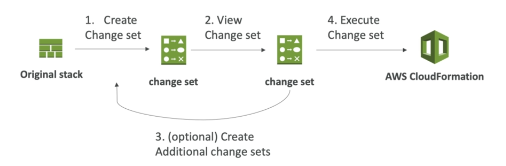

__________________________________________

## CLOUDFORMATION DELETIONPOLICY ##

You can set the **DeletionPolicy** on any resource to control what happens when the stack is deleted.
- **DeletionPolicy=Retain**
    - CF will backup or preserve the resource/s you specified
    - to keep a resource, we specify **Retain**
- **DeletionPolicy=Snapshot**
    - actual instance gets deleted but it will make a snapshot
    - this way, we can keep our data
    - Applies to only:
        - EBS Volumes
        - ElastiCache clusters
        - ElastiCache ReplicationGroup
        - RDS DB Instance
        - RDS DB Cluster
        - Redshift cluster
- **DeletionPolicy=Delete**
    - **Default** behavior except for RDS DB cluster
    - to delete an S3 bucket, you must first empty the bucket
__________________________________________

## CLOUDFORMATION TERMINATIONPROTECTION ##

You can use this to prevent accidental deletes of CloudFormation templates.
- same one with EC2 instances
- TerminationProtection is **disabled by default**
- you can enable TerminationProtection after you've launched it
__________________________________________
