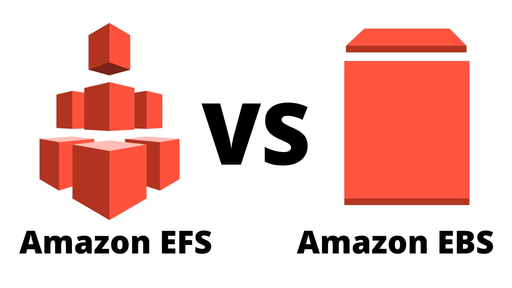
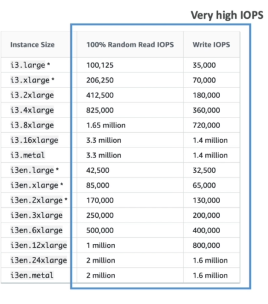
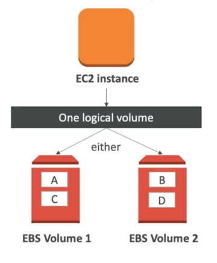
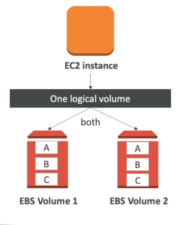

# 06 - EBS and EFS #
_________________________________________

This note will dive in to the available storage options for EC2, **EBS and EFS**, but from a SysOps perspective. 

The main concepts that we'll focus on are:
- Performance
- Troubleshooting
- Operations
- Monitoring

This note is broken down into these sections:

1.  [EBS Overview](#ebs-overview)
2.  [EBS Volume Types](#ebs-volume-types)
3.  [EBS Volume Burst](#ebs-volume-burst)
4.  [EBS Computing Throughput](#ebs-computing-throughput)
5.  [EBS Operation Volume Resizing](#ebs-operation-volume-resizing)
6.  [EBS Operation Snapshots](#ebs-operation-snapshots)
7.  [EBS Operation Volume Migration](#ebs-operation-volume-migration)
8.  [EBS Operation Volume Encryption](#ebs-operation-volume-encryption)
9.  [EBS vs. Instance Store](#ebs-vs-instance-store)
10. [EBS for SysOps](#ebs-for-sysops)
11. [EBS Raid Configurations](#ebs-raid-configurations)
12. [CloudWatch and EBS](#cloudwatch-and-ebs)
13. [EFS Overview](#efs-overview)
______________________________________________

## EBS OVERVIEW ##

Recall that an EC2 machine loses its root volume by default when the instance is terminated. This results to loss data. To prevent this, you can have your data saved on another attached volume. For this, we can use **EBS (Elastic Block Store) Volumes**.
- this is simply a network drive that can be attached/detached
- data inside EBS volumes persist even after the isntance termination
- best comparison is a **USB Stick, but over the network**
- since it uses the network, there maybe some **latency**
- **locked to an AZ** - you cannot attach it to an instance in another AZ
- to move volume across AZ, you'll need a **snapshot**
- you have to define a **provisione capacity** - size in GB, IOPS)
- you get billed by the provisioned capacity
- you can increase capacity over time

______________________________________________

## EBS VOLUME TYPES ##

1.  **GP2** - burstable
    - Recommended for most workloads
    - System boot volumes
    - Virtual desktops
    - Low-latency apps
    - Dev and test environments
    - small gp2 can burst IOPS up to 3000
    - **Max IOPS is 16000**
    - 3 IOPS per GB means 5334 gb - this is already maxed

2.  **IO1**
    - for critical business applications
    - where requirement is **sustained IOPS** performance
    - great if you need **more than 16000 IOPS**
    - use-case includes databases
    - **IOPS is provisiones**
    - **MIN 100**
    - **MAX 64000** (Nitro instances)
    - **MAX 32000** (the rest of instances)
    - **MAX IOPS:GB 50:1**

3.  **ST1** - burstable
    - **Streaming workloads, for **consistent, fast throughput**
    - Apache Kafka, Big Data
    - cannot be boot volume
    - ***500 GB - 16 TB**
    - **MAX IOPS 500**

4.  **SC1** - burstable
    - **THroughput-oriented storage**
    - for large volumes of data that is infrequently accessed
    - **MAX IOPS 2500**

______________________________________________

## EBS VOLUME BURST ##

- **gp2 volume < 100GB, this means IOPS < 3000**
- if IOPS < 3000 ---- this can still burst up to 3000
- **burst** means it can boost up to its maximum IOPS performance.
- you accumulate **burst credits** over time
- the bigger the volume, the faster to fill up burst credits
- if you  maxed out burst credit balance, the max I/O will become your baseline
- if you always max out your credits, better to switch to a IO1
- you can use **CloudWatch to monitor credit balance**

______________________________________________

## EBS COMPUTING THROUGHPUT ##

- **gp2**
    - Note that throughput in in MB/seconds
    - Max 250 MB/s

            Throughput = (Volume size) x (IOPS per GB) x (I/O in KB)

- **io1**
    - Note that throughput in in MB/seconds
    - throughput limit is 256 KB/s per  PIOPS
    - Max of 500 MB/s at 32,000 IOPS
    - Max of 1000 MB/s at 64,000 IOPS

            Throughput = (Provisioned IOPS) x (I/O in KB)
______________________________________________

## EBS OPERATION VOLUME RESIZING ##

Note that **you can only on increase the size or IOPS of EBS volumes**
- after resizing, you'll **need to repartition your drive**
- it is also possible for the drive to be in **optimization phase**
- this phase is where drive is usable but doesn't have otimal performance
______________________________________________

## EBS OPERATION SNAPSHOTS ##

Snapshots are a way to *capture* the current state of the volume.
- this is **incremental** - only backup the changesm not the whole
- **backups uses IO** - better to not do other processes during backups
- snapshots are **stored in S3**
- no need to detach volume, but is recommended
- **Max 100,000** snapshots per region
- you can copy snapshots across region
- you can encrypt snapshots
- you can make an AMI directly from snapshots
- EBS volumes restored from snapshots need to be **pre-warmed**
- pre-warming means reading the entire volume
- **snapshots can be automated using Amazon Data Lifecycle Manager**
______________________________________________

## EBS OPERATION VOLUME MIGRATION ##

EBS Volumes are locked into specific AZ. To migrate snapshot to another AZ or region
- snapshot the volume
- (optional) copy the snapshot to another region
- create a volume from the copied snapshot
______________________________________________

## EBS OPERATION VOLUME ENCRYPTION ##

The actual underlying process of ecypting and decrypting volumes and snapshots are take care by AWS. When you create an encrypted EBS Volume, you get the following:
- data at rest is encrypted
- data in flight between instance and volume will be encrypted too
- all snapshots are encrypted
- all volumes created from hat snapshot are encrypted

Also note that **EBS Encryption leverages keys from KMS (AES-256).**

#### HOW DO ENCRYPT AN UNENCRYPTED EBS VOLUME? ####

1.  Create an EBS snapshot of the volume.
2.  Encrypt the EBS snapshot (using the copy function)
3.  Create new EBS volume from the encrypted snapshot
4.  The new EBS volume will then be automatically encrypted.

_______________________________________________

## EBS vs. INSTANCE STORE ##

Recall that some instances doesn't come with root EBS volumes. These instances comes with **instance stores**

**INSTANCE STORES**
These are basically **ephemeral storage** which is **physically attached to instance**

&nbsp;&nbsp;&nbsp;&nbsp;&nbsp;&nbsp;&nbsp;&nbsp;&nbsp;&nbsp;&nbsp;&nbsp;&nbsp;&nbsp;&nbsp;&nbsp;

**Pros:**
- lower latency, faster
- **better I/O** performance
- **good for buffer/cache/scratch data**
- it is still a block storage, just likE EBS
- **data survives reboots** 

**Cons:**
- **data doesn't survive stop or termination**
- **risk of data loss if hardware fails**
- you can't resize the instance store 
- backups must be operated by user

_______________________________________________

## EBS FOR SYSOPS ##

If you plan to use the root volume of an instance after instance is terminated,
- set the **Delete on Termination** to **No**
- this can be seen during the instance creation

If you use EBS for **high-performance**,
- use **EBS-optimized instances**
- you can see mroe details on the AWS Documentation page

If an **EBS is unused**,
- you still pay for ti
- remember that **you pay for the provisioned capacity**
- you don't pay on how many of the storage you consumed
- if you're just using half of the storage, you will still paythe whole price\
- better to **start with small voluem then resize overtime**
- you can also just **take a snapshot** and then delete the EBS Volume
- you can always restore the same volume from the snapshot

### EBS TROUBLESHOOTING ###

- High wait time? -> increase IOPS
- slow response for SSD? --> increase IOPS
- EC2 won't start if EBS volume is not mapped correctly
- After resizing, you'll need to repartition to use the incremental storage

_______________________________________________

## EBS RAID CONFIGURATIONS ##

RAID configurations are normally done in datacenters for **redundancy**. IN EBS's case, **EBS is already a redundant storage.**
- your EBS volume is replicated within your AZ
- you have an option to **mirror** EBS Volumes
- you could also **mount volumes in parallel** in RAID settings

Note that RAIID is possible **only fi your OS supports it.**
- RAID 0
- RAID 1
- RAID 5 - not recommended for EBS
- RAID 6 - not recommended for EBS
- RAID 10 - not recommended for EBS

### RAID 0 (Increased performance) ###

Here we may have an instance with two EBS Volumes. When you write data to volumes, the data will either go to Volume A or VOlume B.
- this means each volume has different sets of data
- **data is distributed to each volume**
- **combining volumes means higher storage and IOPS**
- downside: if one disk fails, all the data in that disk is gone
- **increased performance but risk of data loss**
- **Use cases:**
    - app that needs lot of IOPS but not fault tolerance
    - database that has built-in replication

&nbsp;&nbsp;&nbsp;&nbsp;&nbsp;&nbsp;&nbsp;&nbsp;&nbsp;&nbsp;

### RAID 1 (Increased fault tolerance)

Here we have the same setup but this time, the data is distributed twice - original on volume A and a copy on volume B
- EC2 instance writes to both volumes at the same time
- **mirroring the value**
- if one disk fails, we still have a copy of the data in the other volume
- **uses 2x network throughput** when writing data on both volume
- **Use cases:**
    - app that needs increased fault tolerance
    - app that needs service disks

&nbsp;&nbsp;&nbsp;&nbsp;&nbsp;&nbsp;&nbsp;&nbsp;&nbsp;&nbsp;

_________________________________________

## CLOUDWATCH AND EBS ##

These are some of the improtant metrics that you need to know for the SysOps exam:

1.  **VolumeIdleTime** - number of seconds when no read/write is being submitted.

2.  **VolumeQueueLenght** - number fo operations waiting to be executed.

3.  **BurstBalance** - if this becomes 0, you need more IOPS

Also note that there difference on the reporting interva of each EBS Volume type

- **gp2** - every 5 minutes
- **io1**   - every 1 minute

Similar with EC instances, EBS volumes also have status checks:

- **Okay** - volume is performing good
- **Warning** - performance is below expected
- **Impaired** - severely degraded performance
- **Insufficient data** - metric data collection is still in progress
_________________________________________

## EFS OVERVIEW ##

**Elastic File System** is a managed NFS (network file system) that can be shared by multiple EC2 instances across availability zones.
- can be mounted on many instances
- the instances can access the same files in the EFS
- highly available, highly scalable
- expensive (3x on gp2)
- **pay per use**
- use cases: content management, web serving, data sharing
- uses **NFSv4,1 protocol**
- uses security groups to control access to EFS
- **compatible with only Linux-based AMI**
- you can **encrypt data t rest using KMS**

### EFS - PERFORMANCE AND STORAGE CLASSES ###

#### EFS SCALE ####

EFS is built for **1000s of concurrent NFS clients**
- more than 10GB/s throughput
- EFS can grow to petabyte-scale automatically

#### EFS PERFORMANCE MODES ####

This one is set during the creation of EFS.

**a.    General Purpose**
- default
- latency-sensitive use cases
- web server, CMS

**b.    Max I/O**
- higher latency, throughput
- highly parallel
- big data, media processing

#### EFS STORAGE TIERS ####

EFS has a **lifecycle management feature** which allows you to move files after a specific number of days.

**a.    Standard**
- for frequently accessed files

**b.    Infrequent-access (EFS-IA)**
- for file not accessed frequently
- lower cost to store files
- but higher cost to retrieve files

_________________________________________
