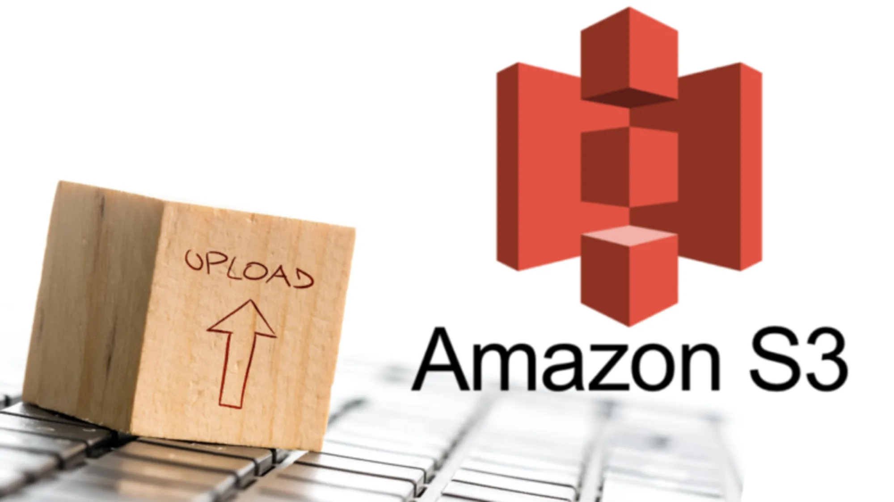

<!-- 2021-02-05 02:05:25 -->

# 07 - S3 Fundamentals #
____________________________________________

This is another huge topic which is heavily explored in all three AWS Associate exams. This note will be dealing with the basics of S3 while the next note will deal with the more SysOps-focused discussion.

This note will be broken down into these sections:

1.  [S3 Buckets and Objects](#s3-buckets-and-objects)
2.  [S3 Versioning](#s3-versioning)
3.  [S3 Encryption](#s3-encryption)
4.  [S3 Security and Bucket Policies](#s3-security-and-bucket-policies)
5.  [S3 Websites](#s3-websites)
6.  [S3 CORS](#s3-cors)
6.  [S3 Consistency Model](#s3-consistency-model)
________________________________________________________

## S3 BUCKETS AND OBJECTS ##

________________________________________________________

## S3 VERSIONING ##

________________________________________________________

## S3 ENCRYPTION ##

________________________________________________________

## S3 SECURITY AND BUCKET POLICIES ##

________________________________________________________

## S3 WEBSITES ##

________________________________________________________

## S3 CORS ##

________________________________________________________

## S3 CONSISTENCY MODEL

________________________________________________________
