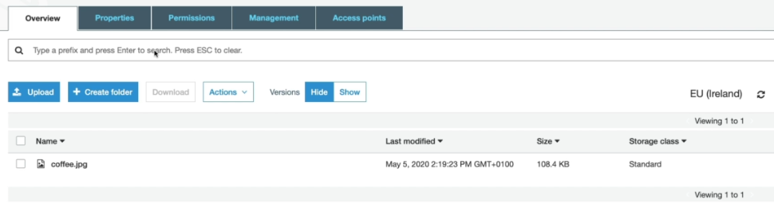
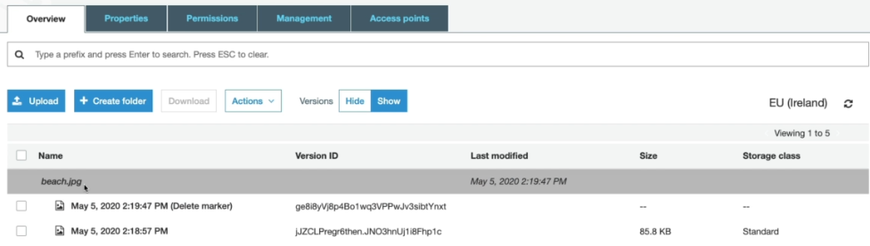
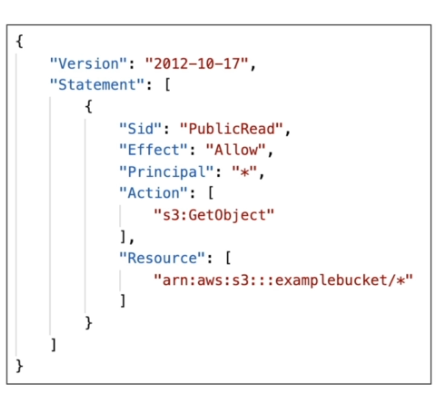
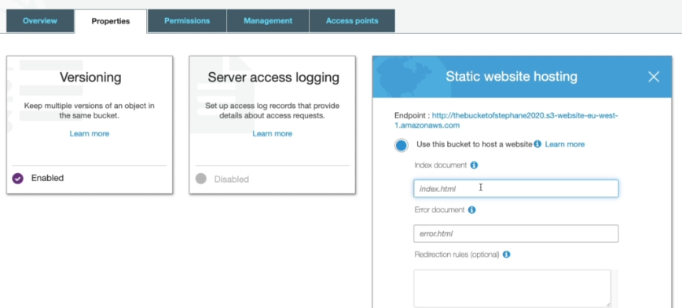
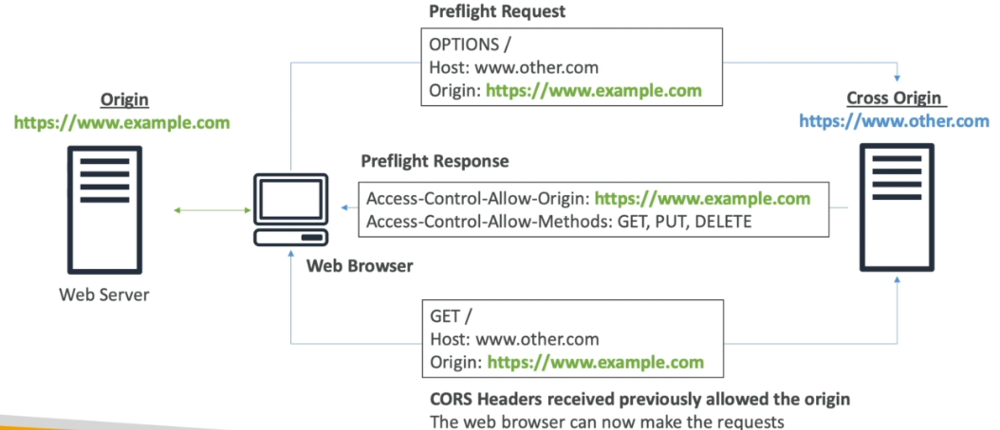
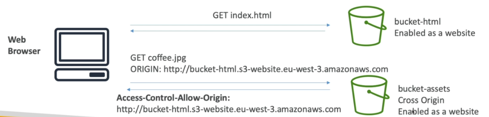

<!-- 2021-02-05 02:05:25 -->

# 07 - S3 Fundamentals #
____________________________________________

This is another huge topic which is heavily explored in all three AWS Associate exams. This note will be dealing with the basics of S3 while the next note will deal with the more SysOps-focused discussion.


This note will be broken down into these sections:

1.  [S3 Buckets and Objects](#s3-buckets-and-objects)
2.  [S3 Versioning](#s3-versioning)
3.  [S3 Encryption](#s3-encryption)
4.  [S3 Security and Bucket Policies](#s3-security-and-bucket-policies)
5.  [S3 Websites](#s3-websites)
6.  [S3 CORS](#s3-cors)
6.  [S3 Consistency Model](#s3-consistency-model)
________________________________________________________

## S3 BUCKETS AND OBJECTS ##

<!-- 2021-02-06 00:41:52 -->

S3 is a storage solution that allows us to store *files* in **buckets**.
- buckets must have globally unique name

- naming convention:
    - no uppercase
    - no underscore
    - 3-63 characters long
    - not an IP
    - must start with either a number or a lower-case letter
- bucket are region-specific
- objects or files are accessed by their keys
    - the key is the **full path** of the file
    - the key is also compose of the **prefix** + **object name**

            # the key here is the same as the object name.
            # it is 'my-file.txt'     

            s3://my-bucket/my-file.txt

            # the key here is 'folder1/folder2/folder3/my-file.txt
            # the prefix is 'folder1/folder2/folder3/' , while
            # the object name is 'my-file.txt'

            s3://my-bucket/folder1/folder2/folder3/my-file.txt

- **max object size: 5 TB**
- note that you cannot upload 5 TB in one go, you must use **multipart upload**

- objects will have:
    - **metadata** - key-value pairs, data about the system or the user
    - **tags** - unicode key-value pair, used for security/lifecycle
- you can also enable **versioning**
- you can set your bucket and files to private or public
________________________________________________________

## S3 VERSIONING ##

You can **version** your files in S3 but **you must enable it at the bucket-level**
- this means re-uploading the same file will not overwrite the existing file 
- it will just create a second or third version of the file
- to see the previous versions of the file, click the **Show** at the top right, beside the **Hide** and **Version** tab.

    

- it is best practice to version your files
- this prevent accidental deletes   
- you can restore or rollback to a previous version
- any deleted file that is versioned will just have a **delete marker**
- to truly delete the file, you must delete the versioned file
- you can also delete specific versions of any file in the **Version > Show** tab

    

- note that any **files not versioned prior to enabling versioning will have version set to null**
- **suspending versioning doesn't delete the previous versions**
- to suspend versioning, go to **properties > versioning suspend versioning**
________________________________________________________

## S3 ENCRYPTION ##

There are 4 methods to encrypt objects in your S3 buckets.

1.  **SS3-S3** 
    - This uses **AWS-managed keys** to encrypt the objects.
    - encryption is done on the **server side**
    - uses **AES-256** encryption algorithm
    - must set header: **x-amz-server-side-encryption":"AES256"**

2.  **SSE-KMS** 
    - here you can use AWS KMS to manage encryption keys
    - you have more control on the keys + audit trail
    - object is encrypted at the **server side**
    - must set header:**x-amz-server-side-encryption":"aws:kms"**

3.  **SSE-C** 
    - User manages his/her own encryption keys
    - Amazon S3 doesn't store the encryption key
    - **HTTPS must be used**
    - Encryption key must be provided with the header for every HTTP request

4. **Client-Side Encryption** 
    - objects is already encrypted before they are uploaded to the S3 bucket.
    - you can use the **S3 Encryption Client**
    - users must also decrypt the data themselves when retrieving from S3


### ENCRYPTION IN TRANSIT (SSL/TLS)

Amazon S3 exposes an two endpoints:

- **HTTP endpoint** that is not encrypted
- **HTTPS  endpoint** that uses encryption in flight

You're free to use whichever of the two, but most clients would use the HTTPS endpoint.

Encryption in flight is called **SSL or TLS** 

Note that you can also enable **Default encryption** - this means objects will be automatically encrypted when they are uploaded to the S3 bucket. To do this, go to your bucket and click the **Properties tab > Default encryption** where you'll be given 3 choices:
- **None** - object will not be encrypted
- **AES-256**
- **AWS-KM**
________________________________________________________

## S3 SECURITY AND BUCKET POLICIES ##

Here we have different kinds of security:

1.  **User-based**
    - using **IAM policies** - which API calls should be allowed

2. **Resource-based**
    - **Bucket policies** - bucket-wide rules which we can set from the S3 console
    - **Object ACL** - finer-grain fo security, done on the object-level
    - **Bucket ACL**

Note:
An IAM user can access the S3 bucket IF:
- the IAM user permissions are allowing it, or
- the resource policy allows it
- **AND** there must be NO EXPLICIT DENY on the bucket policies

### S3 BUCKET POLICIES ###

These are JSON-based policies that define the **Actions** allowed to be done by the **Principal** on the **Resources**



The bucket policy consist of the following:

- **Resources** - buckets and objects
- **Actions** - Set of API to allow or deny
- **Effect** - Allow/Deny
- **Principal** - Account or user to apply the policy to

Common uses of bucket policies include:
- grant public access to the bucket
- force objects to be encrypted at upload
- grant access to another account (cross-accoutn bucket policies)

### BUCKET SETTINGS FOR BLOCKING PUBLIC ACCESS ###

You can block public access to your bucket or objects through:
- **new** access control lists (ACLs)
- **any** access control lists (ACLs)
- **new** public bucket or access point policies

These setting were created to prevent data leaks. You can also set this on the **account-level**.

### S3 SECURITY - OTHERS ####

- **Networking**
    - Supports VPC endpoints (for instance with no internet access)

- **Logging and Audit**
    - S3 Access logs can be stored in an S3 bucket
    - API calls can be logged in AWS CloudTrail

- **User Security**
    - **MFA Delete**
        MFA can be required when someon tries to delete objetcs in a versioned bucket
    - **Pre-signed URLs**  
        Users can be provided with pre-signed URLs that are only valid for a limited time.
________________________________________________________

## S3 WEBSITES ##

S3 can host static websites and have them accesible to the internet.
- the website URL is in this format:

        <bucket-name>.s3-website-<aws-region>.amazonaws.com

- make sure to set bucket policy that allows public reads
- to enable S3 to host statis websties, you must enable it on the properties tab

    
________________________________________________________

## S3 CORS ##

An **Origin** is a scheme or protocol, host (domain), or port
- as an example, the link below is an origin
    
        # the implied port is 443 for https
        https://www.example.com

        # the implied port is 80 for http
        https://www.example.com

We can use **CORS** or **Cross-origin Resource Sharing** to get and use resources across origins.
- the web browser allows requests to other origins while visiting the main origin
- to understand what **same origin** and **different origin** is:

        # this are same origins
        http://example.com/app1
        http://example.com/app2

        # these are different origins
        http://example.com/app1
        http://anotherone.com/app1
- note that the browser will block request across different origins unless you have the correct CORS header    
- the CORS header is in this format

        Access-Control-Allow-Origin

### CORS DIAGRAM ###

Before we dive in on how the S3 CORS works, we'll have to understand how web browsers uses CORS between origins.
<br>


<br>

1.  Our web browser visits the web server hosting http://www.example.com. Since this is the first visit, this is the **origin**.

2.  For some requests made by the browser, the first server(origin) will instruct the browser to make a request to a another web server which hosts http://www.other.com. Since they are different servers, the second URL is considered a **cross-origin**.

3.  The web browser will then send a **pre-flight request** which will inform the cross origin that the origin instructed it(browser) to send a request to the cross-origin.

4.  The cross-origin will then send a **pre-glifht response** which contains what the browser can do (API calls allowed).

5.  Since the browser is now allowed, it will issue a **GET request** to the origin.


### S3 CORS ###

If the client does a cross-origin request onto a website that is hosted in our S3 bucket, we must ensure that the **correct CORS headers are enabled.**
- we can allow a specifi origin by specifying the origin name
- we can also allow any origins by specifying an asterisk (*)
- note that the CORS should be **defined on the cross-origin bucket**



<br>

1.  The client sends a **GET index.html** request to our site that is hosted on our S3 bucket. The file contains **coffee.jpg** that is on another origin.

2.  The client sends a pre-flight request - **GET coffee.jpg** to the other bucket hosting the cross-origin.

3.  If the other bucket is configured with the correct CORS headers, it will allow the client access to the JPG file.

To set the CORS headers, go to the **Permissions** tab and then click the **CORS configuration** tab. Put in the correct CORS Configuration in the editor.


You can follow the format below for the COR Configuration

```html
<CORSConfiguration>
    <CORSRules>
        <Allowedorigin> 
            http://insert-bucket-name-here.s3-website-insert-region.amazonaws.com
            <Allowedorigin>
        <AllowedMethod>
            GET
            </AllowedMethod>
        <MaxAgeSeconds>
            3000
            </MaxAgeSeconds>
        <AllowedHeader>
            Authorization
            /<AllowedHeader>
    </CORSRules>
</CORSConfiguration>
```
________________________________________________________

## S3 CONSISTENCY MODEL

Amazon S3 is an **EVENTUALLY-CONSISTENT** storage system.
However, there are different consistency models for each operation.

1.  **PUTS - Read after Write**
    - Read after write consistency for PUTS of new objects.
    - as soon as the file is uploaded on the bucket, you can immediately send a GET request for the file.
        
            PUT 200 => GET 200

    - this is not the case if you first send a GET to check if the file exists, uploaded the file and send the GET request again. You might received a 404 response and you might need to wait for a while.

            GET 404 => PUT 200 => GET 404

2.  **DELETES/PUTS of existing objects - EVENTUAL CONSISTENCY**
    - if you read an object after updating it, you might get the older version.
    - to get the newer version, you'll have to wait for a bit

            PUT 200 (old) => PUT 200 (new) => GET 200 (old)

    - if you delete an object, you might still retrieve the object for a very short time (1-3 seconds)

            DELETE 200 => GET 200

**NOTE:**
STRONG CONSISTENCY is NOT POSSIBLE.
________________________________________________________

