<!-- 2021-02-07 00:48:20 -->

#  08 - S3 for SysOps #
________________________________________

This note will dive in on S3 topics that are important to know for the SysOps exam. You can checkout the basics and theory of S3 in [07 - S3 Fundamentals](07-S3-Fundamentals.md).


This note is divided into these sections:

1.  [S3 Versioning Advanced](#s3-versioning-advanced)
2.  [S3 MFA Delete](#s3-mfa-delete)
3.  [S3 Default Encryption](#s3-default-encryption)
4.  [S3 Access Logs](#s3-access-logs)
5.  [S3 Replication](#s3-replication)
6.  [S3 Pre-signed URLs](#s3-pre-signed-urls)
7.  [CloudFront Overview](#cloudfront-overview)
8.  [CloudFront Monitoring](#cloudfront-monitoring)
9.  [S3 Inventory](#s3-inventory)
10. [S3 Storage Tiers](#s3-storage-tiers)
11. [S3 Lifecycle Policies](#s3-lifecycle-policies)
12. [S3 Performance](#s3-performance)
13. [S3 Select and Glacier Select](#s3-select-and-glacier-select)
14. [S3 Event Notifications](#s3-event-notifications)
15. [S3 Analytics](#s3-analytics)
16. [Glacier Overview](#glacier-overview)
17. [Snowball Overview](#snowball-overview)
18. [Storage Gateway for S3](#storage-gateway-for-s3)
19. [Athena Overview](#athena-overview)
_______________________________________________

## S3 Versioning Advanced ##

S3 Versioning creates a new version each time you change a file.
- you can enable verisoning during bucket creation
- you can also do it in the **Properties** tab

    
    
    

- you can list down the versions by enabling **List versions**

    

- encrypting the file also creates a new version
- deleting a file just adds a delete marker to the version
- to restore a deleted file, just delete the version with delete marker
- to delete a bucket, you must remove all file versions in it
_______________________________________________

## S3 MFA Delete ##

We ca use MFA Delete which forces the user to generate a code on a device, usually a mobile phone, and S3 must authenticate that code before allowing the user to proceed with the operations on S3.
- **you can use MFA for:**
    - permanently delete a version 
    - suspend versioning on the bucket
- **you won't need MFA for:**
    - enabling versioning
    - listing deleted versions

Important tips to remember
- MFA Delete can only be enabled/disabled by **bucket owner(root account)**
- you must **enable versioning first**
- you can then **enable MFA Delete thru CLI only**

    ```bash
    # you can enable/disable versioning and MFA Delete 
    # on the 4th line

    aws s3api put-bucket-versioning \
    --bucket <insert-bucket-name> \
    --versioning-configuration \
    Status=Enabled,MFADelete=Disabled \
    --mfa "<insert-ARN-of MFA-device> <insert-MFA-code>" \
    --profile <insert-root-username>
    ```
_______________________________________________

<!-- 2021-02-07 13:25:30 -->

## S3 Default Encryption ##

The traditional way to enable default encryption was to use **Bucket Policies** and refuse any HTTP command without the proper headers.

The new way is to use **Default encryption** under the **Properties** tab.
    


Note that **Bucket Policies are evaluated first before default encryption.**
_______________________________________________

<p align=right>
    

## S3 Access Logs ##

You may have an entire bucket dedicated for S3 logs for audit purposes.

- any request made to S3 will be logged into these bucket
- the request could be from any account, 
**authorized or denied**
- data can then be analyze using analysis tools
- **to enable access logging**, on your monitored bucket, 
    go to the **Properties > Server accesss logging** 

    


### S3 LOGS: WARNINGS ###

- Do not set your logging bucket as the monitoring bucket
- this will create a **logging loop**, growing the size exponentially


</p>
_______________________________________________

## S3 Replication ##

The idea here is that we can replicate our bucket in another region **asynchronously.**
- we must **enable versioning on both source and destination buckets**
- we then have to giver proper IAM permissions to S3
- we can then choose from these two replication options:

    - **CRR - Cross Region Replication**
    - **SRR - Same Region Replication**
- note that buckets can be on different accounts
- after activating, **only new objects are replicated**
- for **DELETE** operations:
    - only source bucket is affected - will have delete marker
    - the same file in the destiantion bucket won't be deleted
    - in short, **delete operations are not replicated**
- there is **no chaining of replication**
    - if bucket-1 has replication into bucket-2 and bucket-2 has replication into bucket-3, bucket-1 is not replicated to bucket-3
- to enable replication, go to the **Management** tab of your bucket and hit **Create replication rule**

    

    You will then be required to fill-in details for the source bucket, destination bucket, IAM role to use, etc. For the IAM role, you can follow this [s3-replication.json](../s3-replication.json) policy document:

    ```JSON
    {
        "Version": "2012-10-17",
        "Statement": [
            {
                "Action": [
                    "s3:Get*",
                    "s3:ListBucket"
                ],
                "Effect": "Allow",
                "Resource": [
                    "arn:aws:s3:::eden-replica-origin",
                    "arn:aws:s3:::eden-replica-origin/*"
                ]
            },
            {
                "Action": [
                    "s3:ReplicateObject",
                    "s3:ReplicateDelete",
                    "s3:ReplicateTags",
                    "s3:GetObjectVersionTagging"
                ],
                "Effect": "Allow",
                "Resource": "arn:aws:s3:::eden-replica-destination-1/*"
            }
        ]
    }
    ```
______________________________________________

## S3 Pre-signed URLs ##

Another way to provide security to your S3 buckets is by giving users **Pre-signed URLs** which is only valid for a limited time.
- you can generate pre-signed URL using SDK or CLI
- for **downloads**, you can use **CLI**
- for **uploads**, you must use **SDK**
- by default, it is **valid for 3600 seconds or 1 hour**
- you can change this by using **--expires-in <time-in-seconds>** parameter
- users given the pre-signed URL can perform GET/PUT
- to provide user/s pre-signed URL for a file, you can follow the steps in [s3-presigned-url.sh](../s3-presigned-url.sh)

    ```bash
    aws s3 presign s3://<insert-bucket-name>/<insert-filename> \
    --expires-in <insert-time-in-seconds> \
    --region <insert-region-here>
    ```
_______________________________________________

## CloudFront Overview ##


CloudFront is a **Content Delivery Network (CDN)** which distributes and caches the contents at the edge locations
- there are about 220 points of presence globally (edge locations)
- this improved read performance
- as an addition, it also gives you **DDoS protection**
- integration with AWS Shield, AWS WAF
- allows you to expose an external HTTPS endpoint by loading a certificate
- can also talk internally through HTTPS backends

### CloudFront Origins ###

**S3 Bucket**
You can use S3 buckets as origins - basically CloudFront will be in front of S3.
- for distributing files globally and caching them at the edge
- enhanced security with **CloudFront Origin Access Identity (OAI)**
- CF-OAI allows your bucket to communicate only with CloudFront
- CloudFront can also be used as an **ingress** - to upload files to S3

**Custom Origin (HTTP)**
You can also use custom origins - anything that respects the HTTP protocol
- Application Load Balancer
- EC2 instance
- S3 website (S3 static website must be enabled on bucket)
- any HTTP backend

### CloudFront at a High Level ###

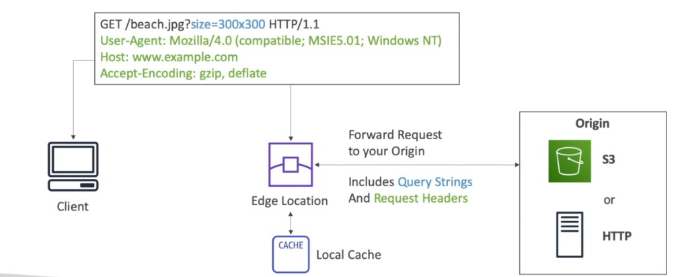

1.  Clients will access the CloudFront distribution through the edge location. Client will send an HTTP request to CloudFront.

2.  The edge location will forward the request to the origin - in this case, an S3 bucket. The requests will include **query strings** and **request headers**.

3.  The origin will send a response back to the edge location.

4.  The edge location will cache the response based on the settings defined.

5.  It will then return the response back to the client.

6.  The next time another client send the same request, the edge location will check first its cache. If the requested content is cached, it will just send a response back to client. If the requested content is not cached, it will forward the request again to the origin.

### CloudFront Geo-Restriction ####

You can restrict who can access your distribution based on the country that is determined using a 3rd-parti Geo-IP database.

- **Whitelist**
    Allow your users to access your content only if their country is on the list of approved countries.

- **Blacklist**
    Prevent users from accessing your content if their country is on the list of banned countries.

### CloudFront vs. S3 Cross Region Replication ###

**You use CloudFront:**
- for Global edge network
- files are cached for a TTL
- if you're okay with files being outdated for a bit, depending on how frequent content is accessed or requested
- for static content that must be available everywhere

**You use S3 CRR:**
- you need to setup each region where you want the "replicas" to reside
- if you want the files to be updated in near real-time
- **read-only**
- for **dynamic content** that needs to be available at low latency
_______________________________________________

## CloudFront Monitoring ##

Similar with S3 access logs, you can also log every request made to CloudFront to into a logging S3 bucket.

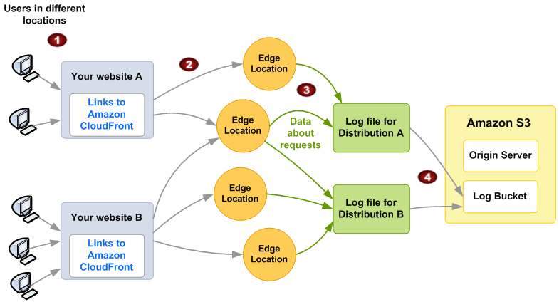

### CloudWatch Reports ###
 
You can generate reports which are based on data from access logs:
 - Cache Statistics Report
 - Popular Objects Report
 - Top Referrers Report
 - Usage Reports
 - Viewers Report

### CloudFront Troubleshooting ###

CloudFront caches HTTP 4xx and 5xx status codes returned by S3.
- 403 indicates user doesn't have access to the underlying bucket
- 404 indicates that the object requested by user is not found
- 5xx error codes may indicate gateway issues
_______________________________________________

## S3 Inventory ##

This helps you manage your storage
- audit and report on replication and encryption status
- common uses-case are busines, compliance, regulatory needs
- you can generate a csv or a parquet file
- you can also query your data using Amazon Athena, Redshift, Presto. etc.
- you can setup multiple inventories
- policy is configured on the spurce bucket to send inventory o destination bucket
- to configure policy, go to your source bucket and under **Management** tab, on **Inventory configurations**, click **Create inventory configurations**.

    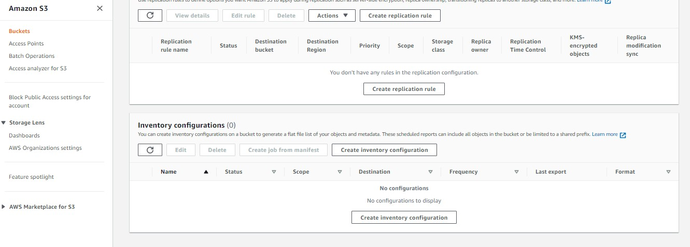

- note that when you configure the source bucket, the destination bucket is also automatically updated witht he bucket policy to allow traffic from the source bucket
- you can set the source bucket to send inventory on a **weekly** or **daily** basis

_______________________________________________

## S3 Storage Tiers ##

1.  **Amazon S3 Standard - General Purpose**
    - 11 nines durability, - 99.999999999%
    - 4 nines availability - 99.99%
    - sustain 2 concurrent facility failures

2.  **Amazon S3 Standard - Infrequent Access (S3-IA)**
    - Good for less frequently accessed data, but requires rapid access when needed.
    - 11 nines durability, - 99.999999999%
    - 3 nines availability - 99.9%
    - sustain 2 concurrent facility failures
 
3.  **Amazon S3 One Zone - Infrequent Access**
    - same as IA, but data is in only one AZ
    - 11 nines durability, - 99.999999999%
    - but if AZ is destroyed, data is lost
    - 99.5% availability
    - great for storing data we can recreate

4.  **Amazon S3 Intelligent Tiering**
    - 11 nines durability, - 99.999999999%
    - small monthly monitoring and auto-tiering fee
    - automatically moves objects across storage tiers based on changing access patterns

5.  **Amazon Glacier**
    - 11 nines durability, - 99.999999999%
    - low cost archive storage for archive/backup
    - data is retained for logn time (10 years)
    - each item in Glacier is called an **Archive**
    - these items are stored in **Vaults**
    - minimum storage duration - **90 days**
    - retrieval options:

        - **Expedited** - 1-5 minutes
        - **Standard** - 3-5 hours
        - **Bulk** - 5-12 hours

6.  **Amazon Glacier Deep Archive**
    - for longer term storage - cheapest
    - minimum storage duration - **180 days**
    - retrieval options:
        
        - **Standard** - 12 hours
        - **Bulk** - 48 hours

### COMPARISON ###

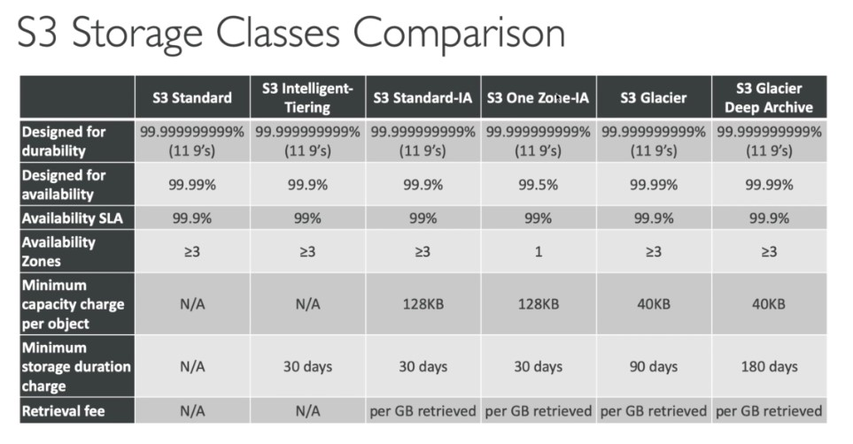
_______________________________________________

<!-- 2021-02-07 22:46:40 -->

## S3 Lifecycle Policies ##

You can transition objects between storage classes, however the transitions are "*one-way*" - this is when you can only transition to another storage class but you cannot return back to the original storage class.
- S3 Standard can be moved to all other 5 storage tiers
    - s3 Standard-IA
    - S3 One-Zone-IA
    - Inteliigent Tiering
    - Glacier
    - Deep Archive
- S3 Standard-IA can only be moved to other 4 tiers, except S3 Standard
- Intelligent Tiering can only be moved to the 3 tiers below
- Glacier can only be moved to Deep Archive

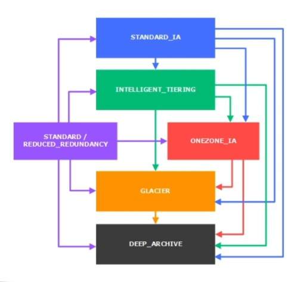

**As a general rule:**

- For infrequently accessed object, move to STANDARD-IA
- For archive objects not needed in real time, move to GLACIER or DEEP ARCHIVE
- Moving objects can be done manually or automatically

### LIFECYCLE RULES ###

**Transition Actions**
Defines when objects are transitioned to another storage class. As an example:
- moving objects to Standard-IA, 60 days after creation
- moving objects to Glacier after 6 months

**Expiration Actions**
Configure objects to exoire or be deleted after some time.
- can also be sued to delete old versions of a file.
- can be used to delete incomplete multipart uploads

Note that rules can be applied to specific prefixes or certain object tags. To set the lifecycle rules in yoru bucket, go to the **Management** tab and click **Lifecycle > Create lifecycle rule.**

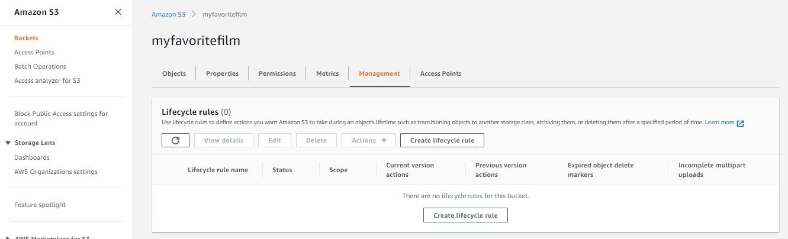
_______________________________________________

<!-- 2021-02-07 23:13:57 -->

## S3 Performance ##

By default, Amazon S3 automatically scales to high request rates, with very low latency - 100-200 ms.
- your application can achieve at least:
    - **3500 PUT/COPY/POST/DELETE**
    - **5500 GET/HEAD requests per second per prefix in a bucket**
- there are no limit to the number of prefixes in your bucket
- note that the **prefix** is anything between the bucket and the file, as an example:
    
    | Path | Prefix |
    | --- | ---- |
    | bucket1/folder1/subfolder1/file.txt | /folder1/subfolder1/ |
    | bucket1/dept1/file.txt | /dept1/ |

### S3 - KMS Limitation ###

If you have SS-KMS , you might be impacted by the KMS Limits
- when you upload a file, it calls **GenerateDataKey KMS API**
- when you download a file, it calls the **Decrypt KMS API**

These two requests will count towards the KMS Quota. This means if you'll have more than 10,000 requests per second, there will the same number of API calls per second, which could max out you KMS Quota per second.
- KMS Quota per second can vary between regions
- you cannot request for a quota increase

### S3 performance - Optimizing Uploads ###

**Multipart Upload**
- parallelize uploads, speeding up transfers
- recommended for files > 100 MB
- must use for files > 5GB

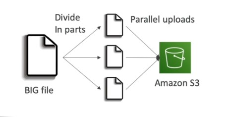

**S3 Transfer Acceleration**
- this is for UPLOAD ONLY
- increase transfer speed by transferring file to an edge location
- the edge location will then forward the data to the bucket
- it will use the AWS private network
- this is also compatible with multipart upload

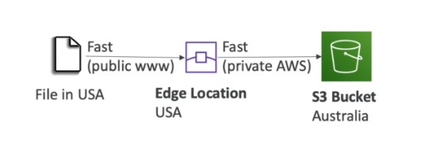

### S3 performance - Optimizing Downloads ###

**S3 Byte-range Fetches**
- can be used to speed up downloads
- can also be used to retrieve just a portion of a file
- parallelize GETS by requesting specific byte ranges
- better resilience in case of failures
- if current byte-range fetch fails, you can try a smaller byte-range fetch


_______________________________________________

<!-- 2021-02-08 00:00:27 -->

## S3 Select and Glacier Select ##

We can use **server-side filtering** to retrieve less data
- we can use SQL to perform the filtering
- can filter rows and columsn (simple SQL statements)
- since small portions are retrieved, this uses less traffic
- less network traffic = less CPU cost = cheaper
- for complex querying, we can use **Amazon Athena**

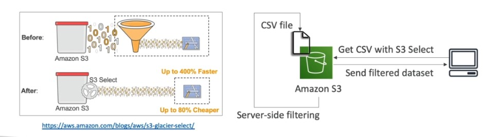

_______________________________________________

<!-- 2021-02-08 00:05:59 -->

## S3 Event Notifications ##

This allows us to react to events happening in S3 - this could be  object creation,removal of an object, replication, etc.
- you can create rules for the event notifications
- you can also filter object names
- you can create many S3 events as desired
- targets of event notifications can be:
    - **SNS** - to send SMS or emails
    - **SQS** - to add messages to a queue
    - **Lambda** - to generate some custom code based on the notification
- you need to **enable versioning** on your bucket to make sure every notification is delivered
- to enable event notifications on your bucket, go to **Properties > Event notifications > create event notification**

    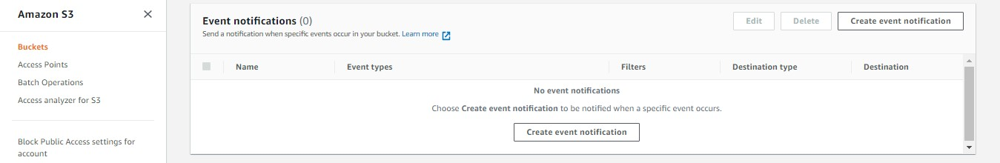

_______________________________________________

<!-- 2021-02-08 00:19:19 -->

## S3 Analytics ##

You can use the available S3 analytics to determine when to transition objects netween storage classes.
- **does NOT work for ONE_ZONE-1A and GLACIER**
- report is updated on a daily basis
- this helps you on setting up lifecycle rules
- to enable analytics on your bucket, go to **Metrics tab > Storage Class Analysis > Create Analytics configuration**

    
_______________________________________________

<!-- 2021-02-08 00:28:14 -->

## Glacier Overview ##

A cold storage for low-cost, archiving/backup
- data is retained for long term (20s of years)
- same durability as S3 Standard
- cheaper cost, but you'll have a **retrieval cost**
- glacier operations

    - **Upload**
        Single operation or by part using multipart upload
    
    - **Download**
        To initiate a retrieval job, Glacier has to prepare the file for download so file is not retrieved right away.

    - **Delete**
        Use Glacier Rest API or AWS SDKs by specifying Archive ID
- note that **restore links** have **expiry dates**
- we have 3 retrieval options
    
    - **Expedited** - 1-5 minutes retrieval
    
    - **Standard** - 3-5 hours

    - **Bulk** - 5-12 hours

### VAULT POLICIES AND VAULT LOCKS ###

Recall that **vault** is a collection of archives, and each vault has:
- one vault access policy
- one vault lock policy

**Vault Access Policy** are written in JSON and similar to bucket policies, 
- it allows us to restrict user/account permissions

**Vault Lock Policy** is a policy you lock, for regulatory and compliance requirements.
- policy is immutable, it can never be changed
- can be used to implement **WORM** - write once, read many
- WORM policy prevent tampering of a file
_______________________________________________

<!-- 2021-02-08 00:47:11 -->

## Snowball Overview ##

A physical device which allows you to transport data physically to/from AWS.
- data ranges in terabytes to petabytes
- alternative to moving data over the network
- secure, tamper-resistant, uses KMS 256-bit encryption
- tracking using SNS or text messages
- pay per data transfer job
- great for large data cloud migrations
- **general rule:** if it'll take a week to move your data to AWS, use Snowball 

### Snowball Process ###

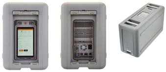

<br>

1.  Request Snowball device through AWS Console
2.  Install Snowball client in your servers.
3.  Connect the Snowball to your servers and copy files using the client.
4.  Ship back the devicewhen you're done - goes to the right AWS facility.
5.  Data will be loaded to an S3 bucket. 
6.  Snowball will then be completely wiped.
7.  Tracking is done through SNS, sms, or through the console.

### AWS Snowball Edge ###


Snowball Edges adds **computational capacbility** on the device.
- 100 TB capacity with either:
    - **Storage optimized** - 24 vCPU
    - **Compute Optimizes** - 52 vCPU and optional GPU
- you can load a custom EC2 AMI on the device so you can perform processing while it is being transferred.
- supports Lambda functions
- useful for pre-processing data on the go.

### AWS Snowmobile ###

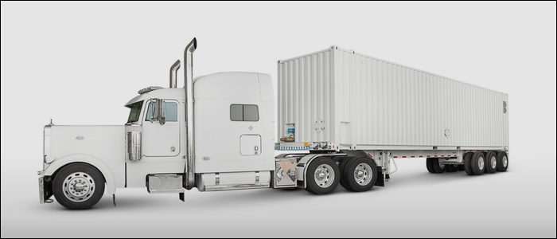

An actual truck that can transfer **exabytes** of data.
- 1 Exabyte = 1,000,000 Petabytes
- each snowmobile has 100 PB capacity - you can use multiple in parallel
- use this if you'll transfer data > 10 PB

### Solution Architecture: Snowball into Glacier ###

Note that Snowball **cannot directly import** your data into Glacier.
- you'll have to set an S3 Lifecycle policy

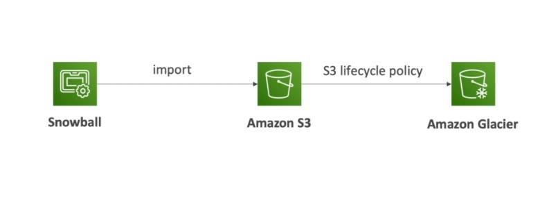

_______________________________________________

<!-- 2021-02-08 01:14:39 -->

## Storage Gateway for S3 ##

AWS is pushing for **hybrid cloud** - this is where part of your infrastructure is on the cloud while the other half could be on-premise.
- this can be due to many reasons:
    - long cloud migrations
    - security requirements
    - compliance requirements
    - IT strategy
- for hybrid cloud, we will need to expose S3 data to on-premise
- to do this, we could use **AWS Storage Gateway**

### AWS Storage Gateway ###

This gives us access to S3 through a gateway. This will basically serve as a **bridge** to the storage solutions.

<p align=center>
    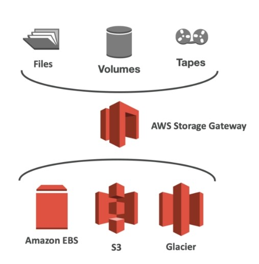
</p>

There are three types of Storage Gateways:

1.  **File Gateway**
    Allow us to view files on-premise and these files are backed by S3.
    - configured S3 buckets - to be accessible using NFS or SMB protocol
    - supports all S3 storage classes except Glacier and Deep Archive
    - each bucket must have an IAM role
    - most recently used data is caced on the file gateway
    - can be mounted on any servers


    
2.  **Volume Gateway**
    Allow us to view volumes on-premise and these files are backed by S3.
    - block storage using iSCSI protocolbacked by S3
    - EBS snapashots are made from time to time
    - these snapshots are backed in S3 and can help us to restore on-premise volumes
    - options for volume gateway:
        - **Cached Volumes** - low latency access o the most recent data
        - **Stored Volumes** - entire dataset is on-premise, scheduled backups to S3

    

3.  **Tape Gateway**
    This is used for backups and recovery.
    - company can backup physical tapes to the cloud
    - **Virtual Tape Library (VTL)** backed by S3 and Glacier
    - back up data using existing tape-based process
    - works with leading backup software vendors
    
    

_______________________________________________

## Athena Overview ##

This is a serverless service to perform analytics directly against S3 files.
- no need to load files from S3
- direct query using SQL
- had a JDBC/ODBC driver for BI tools
- pay per query and the amount of data scanned
_______________________________________________
