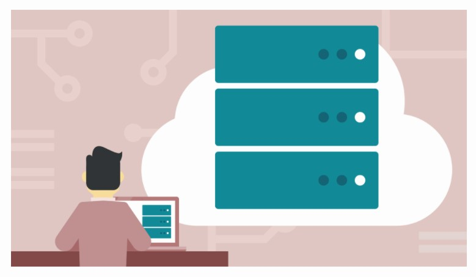
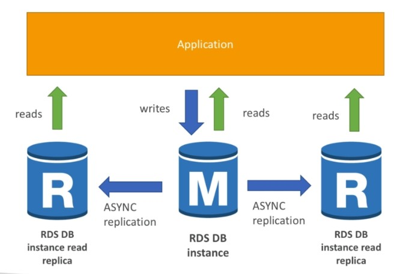
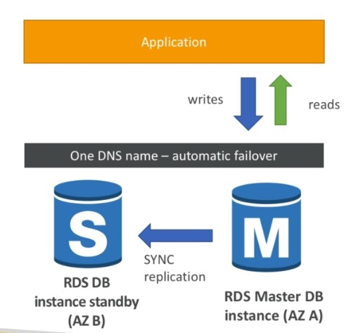
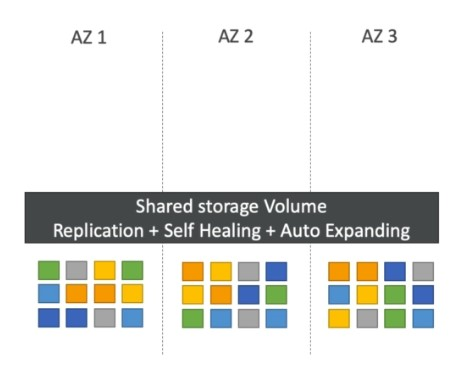
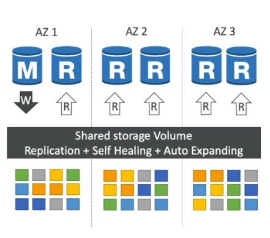
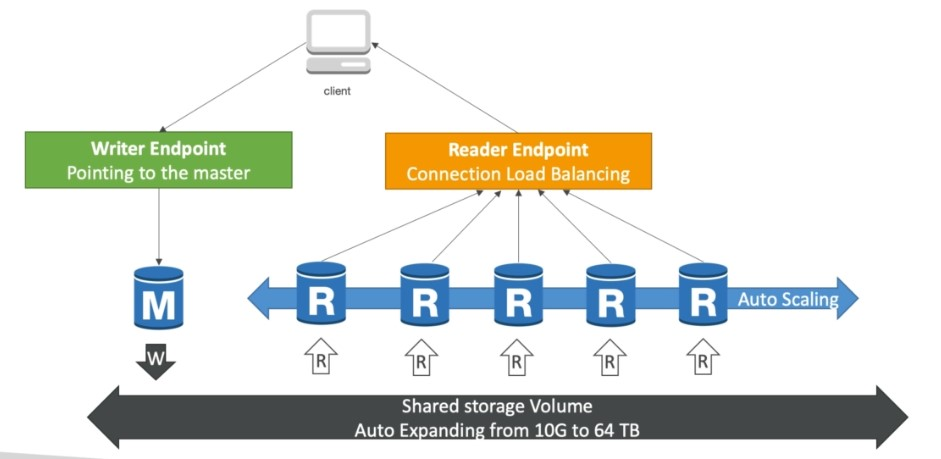
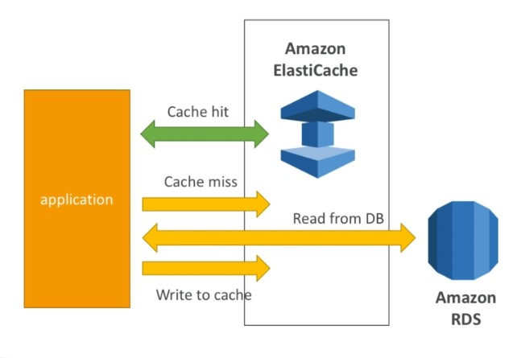
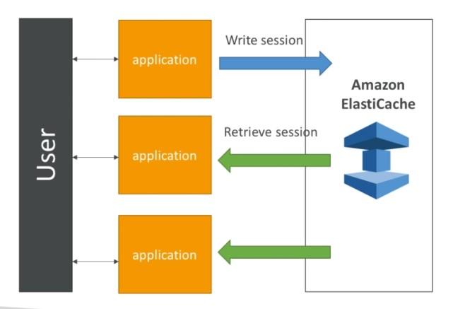
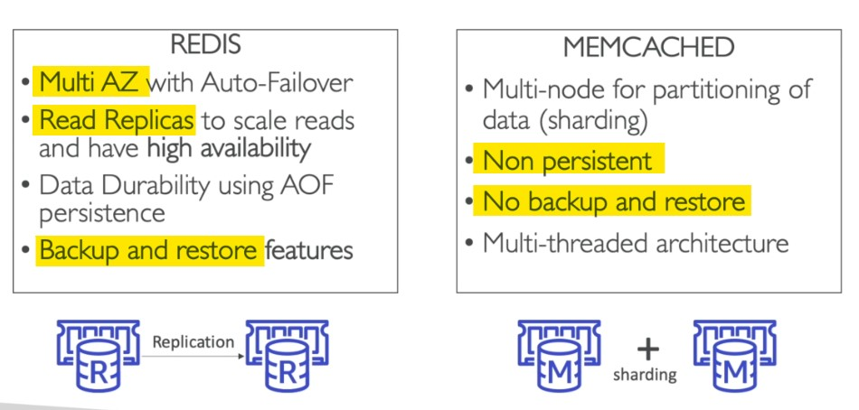

<!-- 2021-02-08 02:12:02 -->

# 09 - Databases for SysOps #
_________________________________________

This note is dedicated to in-depth discussion about the available database options from AWS.



This note is broken down into the following secions.

1.  [RDS Overview](#rds-overview)
2.  [RDS Multi-AZ and Read Replica](#rds-multi-az-and-read-replica)
3.  [RDS Parameter Groups](#rds-parameter-groups)
4.  [RDS Backup and Snapshots](#rds-backup-and-snapshots)
5.  [RDS Security](#rds-security)
6.  [RDS API](#rds-api)
7.  [RDS and CloudWatch](#rds-and-cloudwatch)
8.  [RDS Performance Insights](#rds-performance-insights)
9.  [Aurora Overview](#aurora-overview)
    - [Aurora HA and Read Scaling](#aurora-ha-and-read-scaling)
    - [Aurora DB Cluster](#aurora-db-cluster)
    - [Aurora Serverless](#aurora-serverless)
10. [ElastiCache](#elasticache)
    - [How it fits - as DB Cache](#how-it-fits-as-db-cache)
    - [How it fits - as Session Store](#how-it-fits-as-session-store)
    - [Redis vs. Memcached](#redis-vs-memcached)
_________________________________________

## RDS Overview ##

**Relational Database Service or RDS** is a managed database service - AWS manages the database.
- you can use SQL as query alnguage
- available are: **(MyPOSAM)**
    - MySQL
    - PostgreSQL
    - Oracle
    - SQL Server (Microsoft)
    - Aurora
    - MariaDB

### Why use RDS? ###

RDS has a lot of benefits versus deploying your own DB in an EC2 instance.
- OS patching level
- continuous backup and restore to specific timestamp
- monitoring dashboards
- read replicas for increased performance
- multi-AZ setup for DR
- maintenance windows for upgrades
- scaling capability

**BUT** you cannot SSH into your DB instances  - RDS.

### RDS Encryption ###

RDS has encryption at rest capability.
- AWS KMS - AES-256
- SSL Certificates to encrypt data to RDS in flight
- **To enforce SSL:**
    
    - **PostgreSQL**
        In the AWS RDS console, we set the parameter 
        
            rds.foce_ssl=1
    
    - **MySQL**
        Within the DB, we ran the following SQL statement:

        ```SQL
        GRANT USAGE ON *.* TO 'mysqluser'@'%' REQUIRE SSL;
        ``` 
- **To connect using SSL:**
    - provide the SSL trust certificate - can be downloaded from AWS
    - provide SSL options when connecting to a database

_________________________________________

## RDS Multi-AZ and Read Replica ##

### RDS Read Replicas for read scalability ###

At the start, you could have one database instance the processes all the reads and writes from your application. As the reads and writes increase, you have to increase the capability of your database instance. For this you can create **Read Replicas**.
- up to **5**  read replicas 
- **each replica has its own DNS endpoint**
- you can have read replicas of read replicas
- read replicas can be used for DR when you have RR on another region
- can be same AZ, cross-AZ, cross-region
- replication is **ASYNC** - reads are eventually consistent
- only the master take the writes
- replicas can be promoted to their own standalone DB - manually
- **applications need to update connection strings to leverage read replicas**



### RDS Multi-AZ ###

This is more for **disaster recovery.**
- we have a **master** db instance which processess reads and writes
- we also have a **standby** db instances which doesn't do read/writes
- **SYNC** replication
- **not used for scaling**
- increase availability
- increase faul-tolerance
- only **1 DNS name** is exposed to your application
- DNS name will have auto-failover to standby if master fails
- lower maintenance impact - less time to transition to standby
- **maintenance is always done on the standby first**
- when standby is done, it will be promoted to master
- **backups are created from the standby**
- **multi-AZ is only within a single region**
- **failover only happens when:**
    - primary DB instance fails
    - an AZ outage
    - DB instance server type is changed
    - DB instance is undergoing OS patching
    - manual failover by doing Reboot
- **there will be no failover for:**
    - long-running queries
    - deadlocks
    - database corruption errors


&nbsp;&nbsp;&nbsp;&nbsp;&nbsp;&nbsp;
_________________________________________

## RDS Parameter Groups ##

You can configure your entire DB engine using Parameter Groups.
- **dynamic parameters** are applied immediately
- **static parameters** are applied after instance reboot
- you can modify parameter group associated with a DB
- when you create a DB, a parameter group is automatically created - but this is immutable
- you'll need to create a new parameter group which you can edit
- you can then assign the parameter group to your database
- to assign it to your DB, go to your DB and modify it under **DB Parameter group** - note to tick **Apply immediately**
- must know parameter:
    - **PostgreSQL/SQL Server**:
        - **rds.force_ssl=1** - this enforces SSL connections
_________________________________________

## RDS Backup and Snapshots ##


### RDS Backups ###

These are automatically enabled in RDS.

**Automated backups**

- daily full snapshot
- capture transaction logs in real time
- ability to restore in any point in time
- backupd happen during maintenance windows
- when you delete a DB instance, you can retain automated backups
- **continuous**
- **7 days retention** - can be increased to 35 days
- **temporary**

**Manual backups**

- manually triggered by user
- retention of backup for as long as you want

### Snapshots ###

These are more for long-term.
- snapshots takes I/O operation, thus may stop DB from seconds to minutes
- snapshots taken on Multi-AZ impacts oly the standby
- snapshots are incremental after the first snapshot
- you can copy and share DB snapshots
- **manual snapshots enever expire**
- you can take a **final snapshot** when you delete your DB
_________________________________________

## RDS Security ##

RDS databases are usually deployed within a private subnet, not in a public one.
- **encryption at rest can only be enabled during DB instance creation**
- RDS leverages security groups - controls who can talk to RDS
- IAM policies - controls who can manage RDS
- for logging into the databse, you can use:
    - traditional username and password
    - IAM users (for MySQL and Aurora)
- **your responsibility:**
    - check ports/IP/security groups inbound rules
    - in-database user creation and permission
    - creating a DB with/without public access
    - configuring parameter groups
- **AWS reponsibility:**
    - don't give SSH access to users
    - no manual DB patching
    - no manual OS patching
    - no way to audit underlying instance
_________________________________________

## RDS API ##

**DescribeDBInstances API**
- gets the DB version for you
- lists down all the DB instances that you have deployed including Read Replicas

**CreateDBSnapshot API**
- make a snapshot of a DB

**DescribeEvents API**
- return information about events related to your DB instance

**RebootDBInstance API**
- helps to initiate forced failover by rebooting the DB instance
_________________________________________

## RDS and CloudWatch ##

CloudWatch is deeply integrated with RDS 
- metrics are gathered from the hypervisor.
    - DatabaseConnections
    - SwapUsage
    - ReadIOPS/WriteIOPS
    - ReadLateny/WriteLatency
    - DiskQueueDepth
    - FreeStorageSpace
- you can use **Enhanced Monitoring** 
    - gathered from an agent on the DB instance
    - more specific,special
    - access to more metrics

_________________________________________

## RDS Performance Insights ##

This allows you to visualize your database performance and analyze any issues that affect it.
- you can visualize and filter the load:
    
    - **By Waits**
        - shows you the resource that are bottlenecks (CPI, IO, loc, etc.)
        - shows you what your database wait on the most
    
    - **By SQL Statements**
        - finding the SQL statement causing the problem

    - **By hosts**
        - you can group or filter hosts
        - finds the server that is using the DB the most
    
    - **By Users**
        - finds the user that using the DB the most

- **DBLoad** is evaluated as the number of active sessions for the DB engine
- DBLoad allows you to troubleshoot load session issues

_________________________________________

## Aurora Overview ##

Aurora is a proprietary technology from AWS.
- supports MySQL and PostgreSQL  (think of **M.A.P**)
- cloud-optimized
- multi-az by default - there is failover
- **HA-native** - failover is instantaneous
- **Aurora can have 15 replicas, MySQL can have 5 replicas**
- **backtrack** - restore data at any point of time without using backups
- **Encryption at rest using KMS**
- **Encryption in flight using SSL**
- authentication using IAM
- replication is faster
- Aurora storage automatically grows in increments of 10 GB, up to 64 TB
- cost more than RDS (20% more), but is more efficient
- **similar with RDS, you cnanot SSH**


### Aurora HA and Read Scaling ###

- 6 copies acorss 3 AZ
- out of the 6 copies, **only 4 is needed for writes**
- out of the 6 copies, **only 3 is needed for reads**
- self-healing with peer-to-peer replication
- storage is striped across 100s of volumes



Note that there's **only one master that takes the writes**.
- if master fails, failover happens in less than 30 seconds
- can have up to 15 Read replicas
- read replicas **supports cross-region replication**

&nbsp;&nbsp;&nbsp;

### Aurora DB Cluster ###

Aurora provides you with a **Writer endpoint** which is a DNS name that is always pointing to the **master**.

For the read operations, it provides **Reader endpoint** which automaticaly load-balances the connections between the read replicas.



### Aurora Serverless ###

This is another version of Aurora which is helpful when you can't predict the workload.
- No need to choose an isntance
- only supports MySQL 5.6 and Postgres
- DB cluster starts, shutdowns, and scales automatically based on CPU/connections
- can migrate from Aurora Cluster to Aurora Serverless and vice versa
-**Aurora Serverless usage is measured by Aurora Capacity Units (ACU)**
- billed in 5 minutes increment of ACU
_________________________________________

## ElastiCache ##

This is a managed cache storage - entirely amnaged by AWS.
- either Redis or Memcached
- caches are in-memory databases with really hgih performance and low latency
- helps reduce loads off the databases for read-intensive workloads
- helps make your applications stateless
- **write scaling usign sharding**
- **read scaling using read replicas**
- multi-AZ with failover capability
- AWS takes care of OS maintenance, patching, setup, configurations, etc.

### How it fits - as DB cache ##

Our application will first communicate the Elasticache to check if the item is available in the cache. If it is not, request is forwarded to RDS.



**Cache hits** is when queried data is in ElastiCache
**Cache Miss** is when queried data is not in ElastiCache and it has to forward request to backend database.

Note that the cache must have an invalidation strategy to make sure only the most current data used is in the cache.

### How it fits - as Session Store ###

Another use case of ElastiCache is for user session store.
User logins to our application (stateless), which will then write the session data on the ElastiCache.

The user hits another instance. The instance will then retrieve the session from the ElastiCache - no need for the user to log in again.



### Redis vs. Memcached ###


_________________________________________
