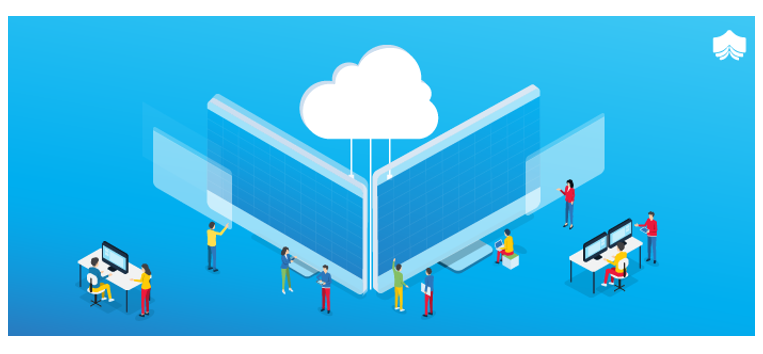
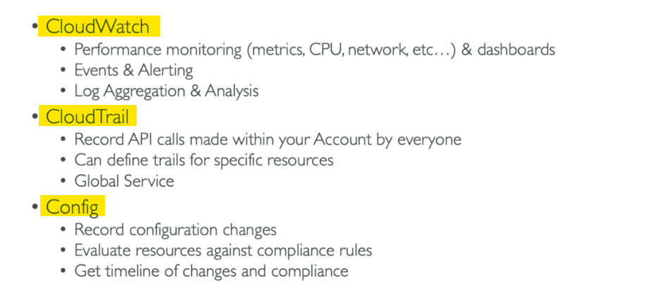
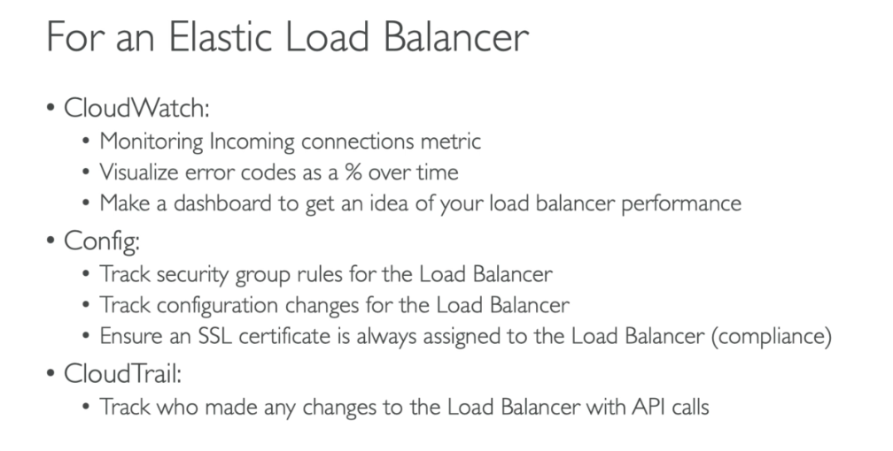

<!-- 2021-02-08 13:53:15 -->

# 10 - Monitoring, Audit, and Performance #
_____________________________________________________

This is one of the most important sections for the exam - monitoring, audit, and performance.



This note is broken down into the following sections:

1.  [CloudWatch Metrics](#cloudwatch-metrics)
    - [EC2 Detailed Monitoring](#ec2-detailed-monitoring)
    - [CloudWatch Custom Metrics](#cloudwatch-custom-metrics)
2.  [CloudWatch Dashboards](#cloudwatch-dashboards)
3.  [CloudWatch Logs](#cloudwatch-logs)
4.  [CloudWatch Alarms](#cloudwatch-alarms)
5.  [CloudWatch Events](#cloudwatch-events)
6.  [CloudTrail](#cloudtrail)
7.  [Config Overview](#config-overview)
8.  [Comparison of the Three](#comparison-of-the-three)

_____________________________________________________

## CloudWatch Metrics ##

It's important to know which EC2 metrics or RD metrics or resource metrics to look out for. CloudWatch provides metrics for every services in AWS.
- **Metric** is the variable to monitor
- metrics have timestamps
- metrics belong to **namespaces** - basically groups
- **DImension** is an attribute of a metric
- you can have up to 10 dimensions per metric
- you can create CloudWatch dashboard of metrics

### EC2 Detailed Monitoring ###

By default, EC2 instance metrics are logged every 5 minutes. You can use **Detailed monitoring** which collects logs every minute.
- faster auto-scaling for ASG
- improving scalability
- free tier allows up to 10 detailed monitoring metrics
- **EC2 Memory usage is not pushed by default** - must be pushed as custom metric

### CloudWatch Custom Metrics ###

You cna send your own custom metrics to CloudWatch using CLI or SDK.
- can also use attributes(dimensions) to segment metrics
    - instance ID
    - environment name
- metric resolution:
    - **Standard** - 1 minute
    **High Resolution** - up to 1 second, higher cost
- to send a metric to CloudWatch, you use **PutMetricData API**
- in case of throttle errors, you can use exponential back offs

_____________________________________________________

## CloudWatch Dashboards ##

Dashboards are a great way to access key metrics
- helpful to get an overview of the application
- global - you can access dashboard from any region
- dashboard can include graphs from different regions
- you can change timezone and time range of dashboards
- you can setup auto-refresh - 10m, 1m, 5m
- **Pricing:**
    - 3 dashboards with up to 50 metrics is free
    - afterwards it'll be $3 per dashboard/month
_____________________________________________________

## CloudWatch Logs ##

Applications can send logs to CloudWatch logs using the SDK. CloudWatch can also collect logs from AWS services:
- Elastic Beanstalk - collection fo logs from application
- ECS - collection from containers
- AWS Lambda - collection from function logs
- VPC Flow Logs - VPC specific logs
- API gateway
- CloudTrail based on filter
- Route53 - log DNS entries
- etc.,

CloudWatch logs can also go to:
- batch exporter to S3 for archival
- stream to ElasticSearch for further analytics

Log Storage Architecture - you must store logs into:

- **Log groups**
    - arbitrary name, usually representing an application

- **Log Stream**
    - within a lgo group, you have many lgo streams
    - this could be stream fo a specific file/application/container

You can also define a **log expiration policies**.
Also, to send logs to CLoudWatch, ensure IAM permissions are correct.

### Log Metrics Filter and Insights ###

CloudWatch Logs can use filter expressions for searching
- you can filter based on specific IP inside of a log
- metric filters can be used tot rigger alarms
- **CloudWatch Logs Insights** can be used to query logs and add queries to CloudWatch Dashboards
_____________________________________________________

## CloudWatch Alarms ##

Alarms can be used to trigger notifications for any kind of metric that you specify.
- can be used to stop, terminate, reboot,or recover an instance.
- can trigger auto-scaling actions
- can send notifications to SNS
- alarm states:
    - **OK**
    - **INSUFFICIENT_DATA**
    - **ALARM**
- you can choose how logn you'e alarm will be evaluated for  - **period**:
    - length of time in seconds
    - hgih resolution metrics allow 10 seconds or 30 seconds
- alarms can be created based on CloudWatch Logs MetricS Filters
- CloudWatch doesn't test or validate actions assigned
- to test alarms and notifications, you can set the slarm state to **Alarm using CLI**

    ```bash
    aws cloudwatch set-alarm-state \
    --alarm-name "my-alarm" \
    --state-value ALARM \
    --state-reason "testing purposes"
    ```
_____________________________________________________

## CloudWatch Events ##

You choose a **source**, apply a **rule** to it, and then you give it a **target**.
- the schedule can be cron jobs
- you can also set an event pattern to react to a service's actions
- you can trigger Lambda functions, SNS, Kinesis messages, etc.
- CloudWatch creates a small JSON document to give ifnromation about the change
_____________________________________________________

## CloudTrail ##

This is used to provide governance, compliance, and audit of your account.
- **tracks every API call made from your account**
- enabled by default
- provides history of all API calls
- CloudTrail logs can be put into CloudWatch logs
- if a resource is deleted, check CloudTrail first!
- only shows **past 90 days**
- default UI only shows **Create, Modify** or **Delete** events
- you can customize this by using **CloudTrail trails**:
    - detailed list of all the events you choose
    - ability to store events in S3 for further analysis
    - can be region-specific or global
- Logs have SSE-S3 encryption when placed in S3
- use IAM to control access to logs stored in S3
_____________________________________________________

## AWS Config Overview ##

This service helps with auditing and compliance of your AWS resources.
- record configurations and changes over time
- record compliance over time
- you can put data into S3 and then be queried by Athena
- answers the following questions:
    - **Is there unrestricted SSH access to my security groups?**
    - **Do my buckets have any public access?**
    - **How has my ALB configuration changed over time?**
- you can receive alerts for any changes through SNS notifications
- **per-region service**
- can be aggregated across regions and accounts

### Config Rules ###

You can use over 75 available AWS-managed config rules.
- you can also make custom config rules (must be defined in AWS Lambda)
- rules can be evaluated based on these triggers:
    - for each config change
    - and/or at regular intervals
- **Pricing:**
    - no free tier
    - $2 per active rule per region per month
_____________________________________________________

## Comparison of the Three ##




_____________________________________________________
