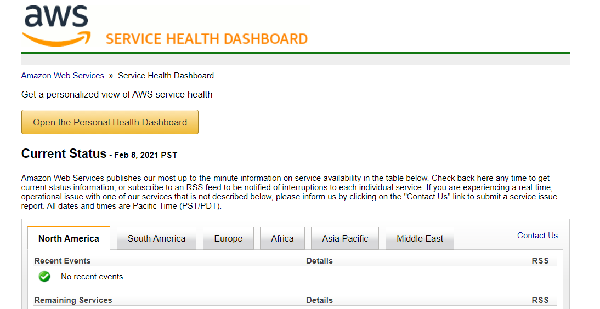
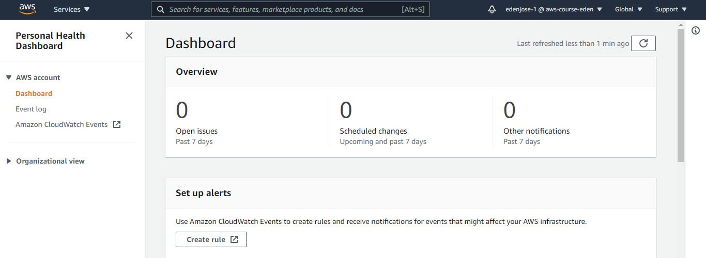
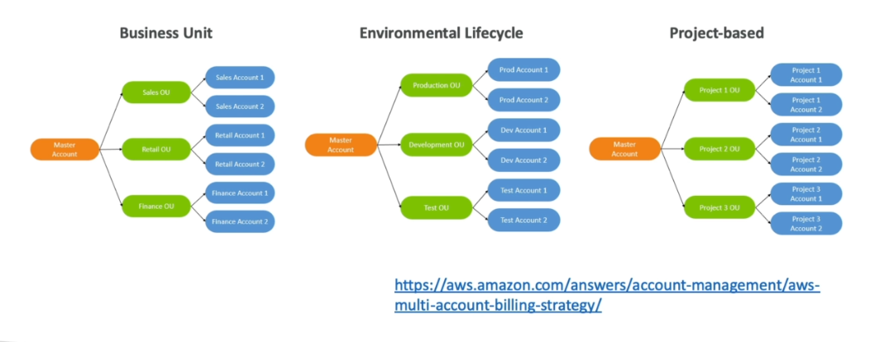
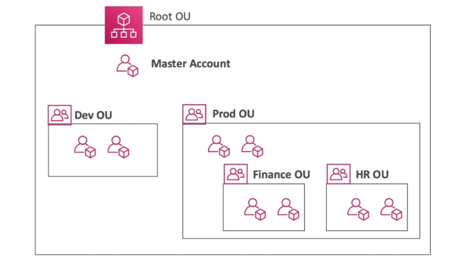
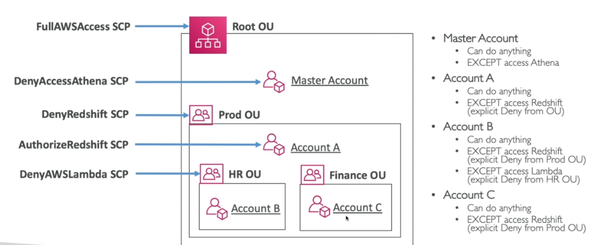
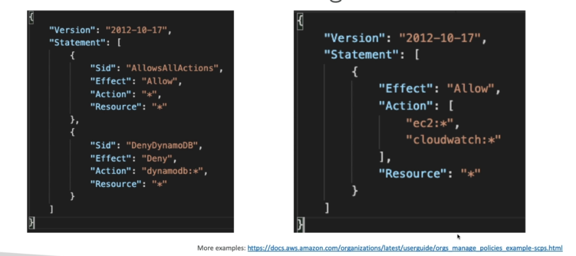
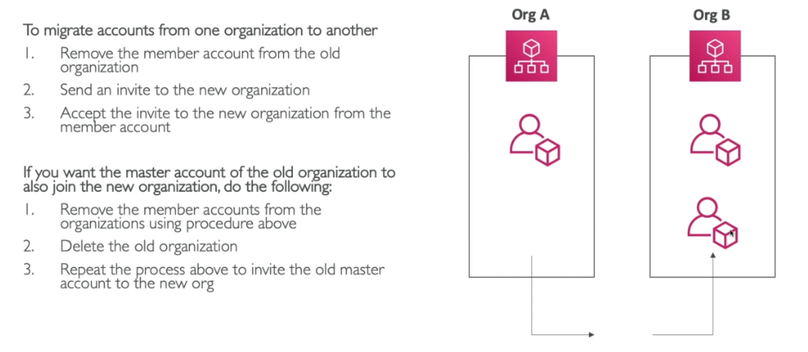
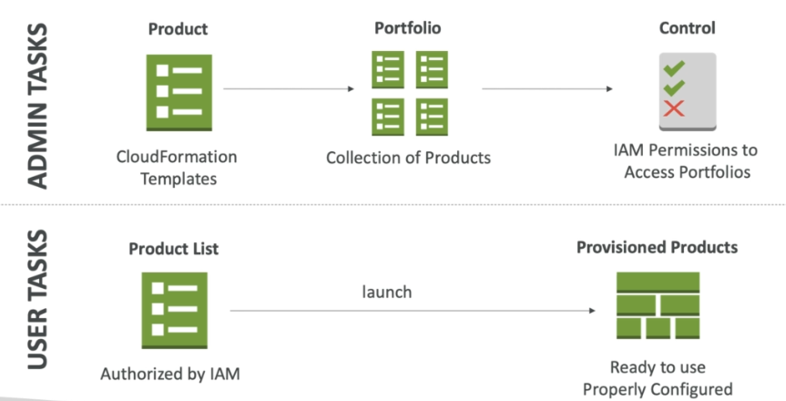

# 11 - AWS Account Management #
_____________________________________________

This section dives more into health dashboards, organizations of accounts and administrative aspects of your AWS accounts.

    

This note is broken down into the following sections:

1.  [AWS Service Health Dashboards](#aws-service-health-dashboards)
    - [AWS Personal Health Dashboard](#aws-personal-health-service-dashboard)
2.  [AWS Organizations Overview](#aws-organizations-overview)
    - [Multi Account Strategies](#multi-account-strategies)
    - [Organization Units](#organization-units)
    - [Service Control Policies (SCP)](#service-control-policies-scp)
    - [Migration of accounts](#migration-of-accounts)
3.  [AWS Service Catalog Overview](#aws-service-catalog-overview)
4.  [AWS Billing Alarms](#aws-billing-alarms)
5.  [AWS Cost Explorer](#aws-cost-explorer)
6.  [AWS Budgets](#aws-budgets)
7.  [AWS Cost Allocation Tags](#aws-cost-allocation-tags)

_____________________________________________

## AWS Service Health Dashboards ##

This shows health of the services on all regions.
- can show historical information for each day
- has an RSS feed you cna subscribe to
- you can check out service health on <code>https://status.aws.amazon.com</code>

### AWS Personal Health Dashboard ###

You can also personalize your view of the services health dashboard.
- global service
- show how AWS outages directly impact you
- show impact on your resources
- list issues and actions you can do to remediate them
- to access the personal health dashboard, just click the orange tab in the services health dashboard page (see picture above)

_____________________________________________

## AWS Organizations Overview ##

This is a global service that allows you to manage multiple AWS accounts in your organization.
- main account is the **master** while the rest are called **member** accounts
- member accounts can only be part of one organization
- member accounts can be moved fromone organization to another
- **consolidated billing** across all accounts
- **single payment method**
- **pricing benefit from aggregated usage**
- an API is available to automate AWS account creation
- you can use **tagging standards** for billing purposes
- you can enable cloudTrail on all accounts to send logs to a central S3 account
- you can enable CloudWatch logs to be send to a central logging account

### Multi Account Strategies ###

You may want to create multiple accounts in your environment for various reasons.
- create an account per department, pper cost center, per environment, etc.
- based on regulatory restrictions (using SCP)
- to have separate per-account service
- isolated account logging

### Organization Units ###

We organize organization accounts using **organization units**. 

Inside your organization, you can have multiple OUs as well.

### Service Control Policies (SCP) ###

These are policies that allows you to blacklist or whitelist IAM actions.
- can be applied at the root, OU, or Account level
- applied to ALL the **Users** and **Roles**, including the **root**
- **does not affect service-linked roles**
- by default, SCP does not allow anything
- SCP must have an **explicit allow**
- use cases:
    - access restriction to certain services, 
    - enforce PCI compliance by explicitly disabling services
- policy at the OU level supersedes policy at the account level

Note that there are two strategies we can take in designing our SCP. Blacklist certain services or whitelist only a certain services.

### Migration of accounts ###

_____________________________________________

## AWS Service Catalog Overview ##

A quick, self-service portal to launch a set of authorized products pre-defined by admins.
- includes VMs, databases, storage options, etc.
- create and manage portfolio of IT services approved internally
- products are CloudFormation templates
- CloudFormation helps ensure consistency and standardization by admins
- all deployed products are centrally managed
- helps with governance, compliance, and consistency
- integrations with ServiceNow, etc.

_____________________________________________

## AWS Billing Alarms ##

Recall that billing alarm data for all the regions in your account is **stored in CloudWatch us-east-1 region**.
- it's for actual costs, not project costs
- you can set threshold or alarm when you're expense goes over a certain limit
_____________________________________________

## AWS Cost Explorer ##

There are three costing tool available to use, the first one is **AWS Cost Explorer**.

- **graphical tool to view and analyze your costs and usage**
- review costs associated with your AWS account or organization
- forecast spending for the next 3 months
- access to default reports
- API to build custom cost management applications
- allows you to **view reservation summary**
- get **recommendations** for which instances to purchase
_____________________________________________

## AWS Budgets ##

AWS Budgets is almost similar with Cost Explorer, except **you can now send alarms when costs exceeds budgets**.

- there are four types of budgets:
    - **Cost**
    - **Usage**
    - **Reservation**
    - **Savings Plan**

- for reserved instances (RI):
    - track utilization
    - support EC2, redshift, elasticache

- up to **5 SNS notifications per budget**

- can filter by any of the following:
    - Service
    - Linked Accounts
    - Tag
    - etc.

- **first 2 budgets are free**

_____________________________________________

## AWS Cost Allocation Tags ##

Tags are used to track resources that relate to each other. We can then use **Cost Allocation Tags** to enable detailed costing reports.
- just like tags, but **show up as columns in Reports**
- cost allocation tags will just **appear in the Billing console**
- can take up to 24 hours to show up in report
- **two types of cost allocation tags:**
    
    - **AWS Generated Cost Allocation Tags**
        - automatically applied to the resource you create
        - start with the prefix *aws: createdBy*
        - not applied to resources created before activation
    
    - **User Tags**
        - tags defined by the user
        - starts with the prefix *user*
_____________________________________________
