<!-- 2021-02-09 00:51:41 -->

# 12 - Security and Compliance #
_______________________________________________________

This section tackles about AWS security technologies with different names and purposes. Security is fascinating, indeed.

This note is divided into the following sections:

1.  [AWS Shared Responsibility Model](#aws-shared-responsibility-model)
2.  [DDoS, Shield, and WAF](#ddos-shield-and-waf)
3.  [AWS Inspector](#aws-inspector)
4.  [Logging in AWS](#logging-in-aws)
5.  [GuardDuty](#guardduty)
6.  [Trusted Advisor](#trusted-advisor)
7.  [Encryption 101](#encryption-101)
    - [Encryption in Flight(SSL)](#encryption-in-flight-ssl)
    - [Server-side Encryption at Rest](#server-side-encryption-at-rest)
    - [Client-side Encryption](#client-side-encryption)
8.  [KMS and Encryption in Place](#kms-and-encryption-in-place)
    - [Encrypt and Decrypt API](#encrypt-and-decrypt-api)
    - [Encryption in AWS Services](#encryption-in-aws-services)
9.  [CloudHSM Overview](#cloudhsm-overview)
    - [CloudHSM vs. KMS](#cloudhsm-vs-kms)
10. [MFA and IAM Credentials Report](#mfa-and-iam-credentials-report)
11. [IAM PassRole Action](#iam-passrole-action)
12. [STS and Cross-account Access](#sts-and-cross-account-access)
13. [Identity Federation with SAML and Cognito](#identity-federation-with-saml-and-cognito)
    - [Cross-account Access](#cross-account-access)
    - [SAML Federation](#saml-federation)
    - [Custom Identity Broker Application](#custom-identity-broker-application)
    - [AWS Cognito - Federated Identity Pools](#aws-cognito-federated-identity-pools)
14. [AWS Compliance Frameworks](#aws-compliance-frameworks)
15. [AWS Artifacts](#aws-artifacts)
16. [Section Summary](#section-summary)
_______________________________________________________

## AWS Shared Responsibility Model ##

**AWS Responsibility** - Security **OF** the Cloud
- they protect their services, the infrastructure
- managed services

**Customer Responsibility** - Security **IN** the Cloud
- customer's responsibilities vary for each type of AWS service
- **for EC2:** customer is repsonsible for everythign except the underlying hardware
- **for RDS:** checking of ports, IP, security groups, etc.,
- **for S3:** bucket configuration, IAM user and roles, enablign encryption, etc.
_______________________________________________________

## DDoS, Shield, and WAF ##

**DDoS** or **Distributed Denial of Service** attack is when there is an attacker which will spun up dozens of botnet and these botnets will start querying the application server. This will eventually flood the server will all the requests until the server can't accomodate all requests anymore, including the requests from legitimate users.

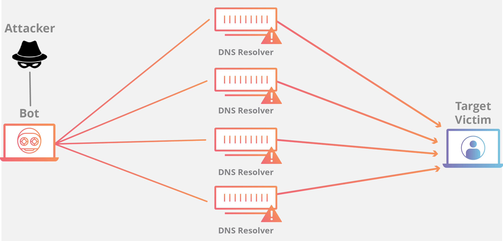

### DDoD Protection on AWS ###

**Simple ways you can protect yourself from DDoS attacks:**
- leverage autoscaling - to ensure instances can keep up with requests
- separate static resources (S3/CloudFront) from dynamic ones (EC2/ALB)

**Protection in CloudFront and Route53:**

- Availability protection using global edge network
- when combined with AWS Shield, this provides attack mitigation at the edge

**Then there are also available AWS Services which you can use:**

1.  **AWS Shield Standard**
    Available for no additional cost, protects against DDoS attacks on your websites and applications.
    - this is the free tier of AWS Shield
    - provides protection from common attacks:
        - SYN/UDP Floods
        - Reflection attacks
        - other Layer 3/4 attacks

2.  **AWS Shield Advanced**
    24/7 Premium DDoS protection.
    - optional DDoS protection
    - costs $3000 per month
    - protection against more sophisticated attacks
    - 24/7 access to AWS DDoS response team (DRP)
    - protection against higher fees incurred from usage spikes due to DDoS

3.  **AWS Web Application FIrewall (WAF)**
    Filter specific requests based on rules.
    - protect your applications frmo common web exploits
    - define customizable security rules
    - can be deployed on CloudFron, ALB, or API Gateway
    - levergae existing rules from marketplace

**Sample Security Architecture**

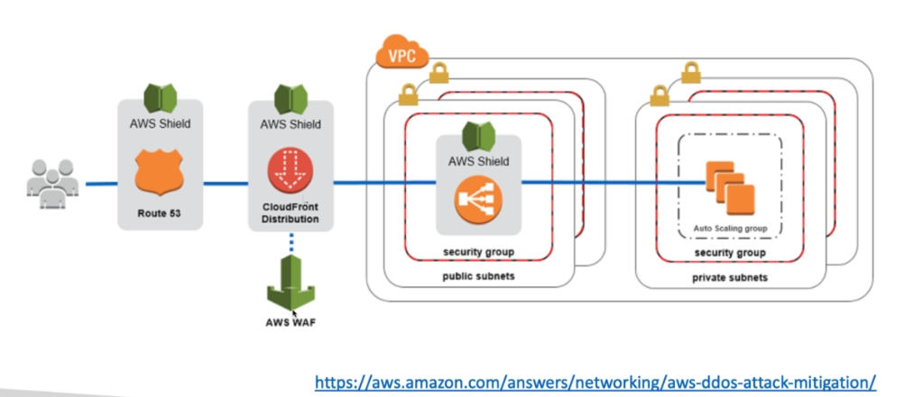
_______________________________________________________

## AWS Inspector ##

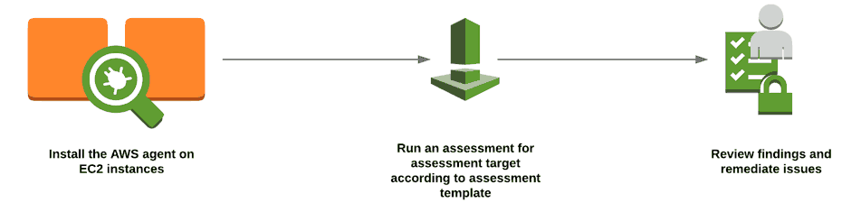

This service helps you **analyze against known vulnerabilities** and is **only used for EC2 instances**.

- analyze against unintended network accessibility
- you need to install an **AWS Inspector Agent** on the instance
- define template (rules package, attributes, duration, etc.)
- no own custom rules possible - only use AWS Managed rules
- note that when assessments are being run, it uses CPU
_______________________________________________________

## Logging in AWS ##

To help you with compliance requirements, AWS provides many service-specific security and audit logs.

**Service Logs** include:
- CloudTrail Logs - trace API calls
- Config Rules - for config and compliance over time
- CloudWatch Logs - for full data retention
- VPC Flow Logs - IP traffic within your VPC
- ELB Access Logs - metadata of requests made to your Load Balancers
- CloudFront Logs -  web distribution access logs
- WAF Logs - full logging of all requests analyzed by the service

All these logs can be put into S3 and can be analyzed using AWS Athena. Just make sure to encrypt logs in S3 and control accessusing IAM, bucket policies, and MFA.
_______________________________________________________

## GuardDuty ##

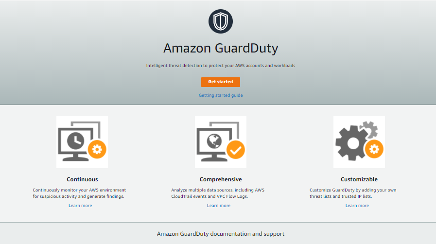

Intelligent threat-discovery to protect your AWS account.
- runs analysis in the background
- protects you from malicious usage
- uses Machine Learning algorithms, anomaly detection, 
- uses 3rd-party data
- one click to enable (30 days trial)
- no need to install software
- can be integrated with AWS Lambda
- input data includes:  
    - CloudTrail Logs
    - VPC Logs
    - DNS Logs
_______________________________________________________

## Trusted Advisor ##

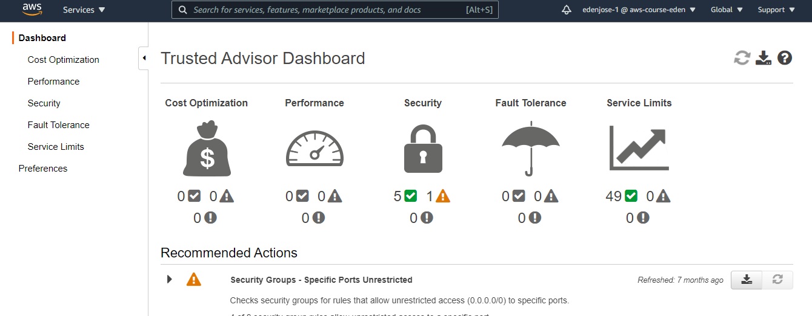

No need to install anything - high-level AWS account assessment.
- analyze your AWS accounts and provides recommendation:
    - Cost Optimization
    - Performance
    - Security
    - Fault Tolerance
    - Service Limits
- Core checks and recommendations are **free** for all customers
- some of the features are **disabled unless you have a support plan**
- can enable weekly notification
_______________________________________________________

## Encryption 101 ##

 

### Encryption in Flight (SSL) ###
Data is encrypted before sending and then decrypted after receiving.
- SSL certificates helps with encryption (HTTPS)
- ensures no **MITM (Man in the middle) attack** can happen

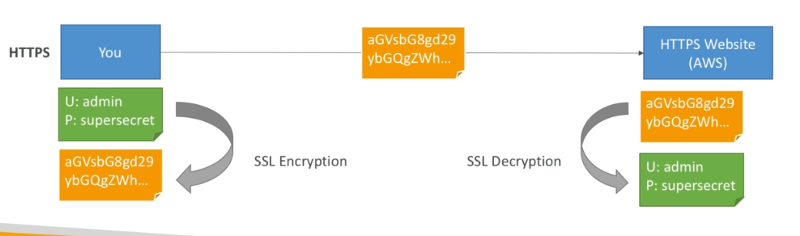

### Server-side Encryption at Rest ###
Data is encrypted after ebing received by the server.
- data is stored on the disk 
- data is decrypted before being sent
- it is stored in an encrypted form using a key
- encryption/decryption keys must be managed somewhere
- server must have access to the key manager

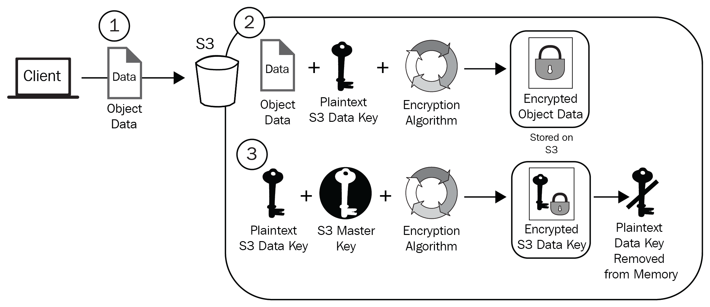

### Client-side Encryption ###
Data is encrypted by the client and never decrypted by the server.
- data is decrypted by receiving client
- server should not be able to decrypt data
- could leverage **Envelope Encryption**

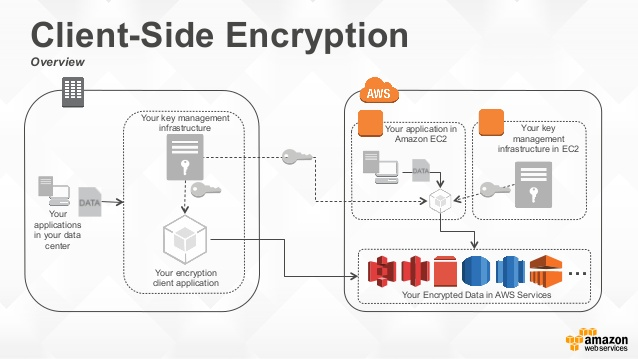
_______________________________________________________

## KMS and Encryption in Place ##

**AWS Key Management Service (KMS)** is an easy way to control access to your data using keys that AWS manages for us.
- fully integrated with IAM for authorization
- integrated with other AWS services as well:
    - EBS
    - S3
    - Redshift
    - RDS
    - etc.,
- you can also use CLI/SDK to perform encryption
- **never store secrets in plain text, especially in code!**  
- user can fully manage keys and policies:
    - Create
    - Rotate
    - Disable
    - Enable
- **KMS can only encrypt up to 4 KB of data per call**
- for data > 4 KB, use **Envelope Encryption**
- encrypted secrets can be stored in code/environment variables
- the **Customer Master Key (CMK)** used to encrypt the data
- thre types of CMK:
    - **AWS Managed Service Default CMK** - Free
    - **User Keys created in KMS** - $1 per month
    - **User Keys imported** - must be 256-bit symmetric key
- you can also audit key usage using CloudTrail
- to give acces to KMS to someone:
    - make sure key policy allows the user
    - make sure IAM policy allows the API calls

### Encrypt and Decrypt API ###

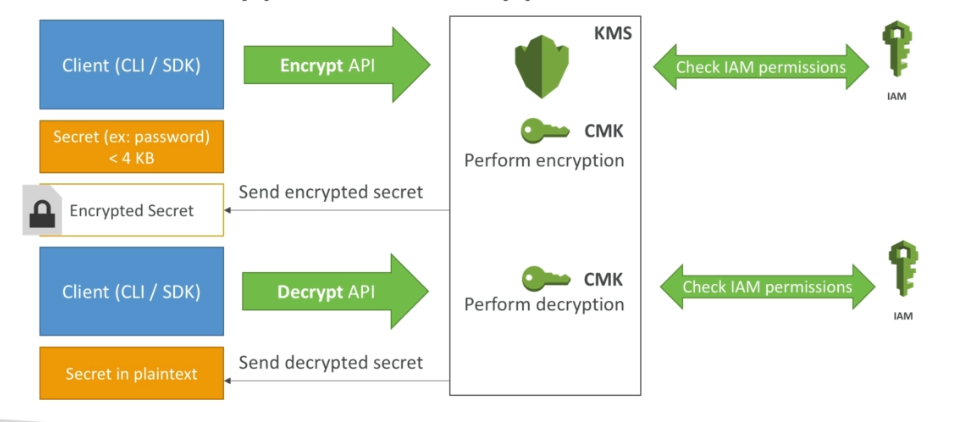

### Encryption in AWS Services ###

When encrypting AWS services, there are some services which require migrating the unencrypted resource/s to an entirely new, encrypted resource:
- EBS Volumes
- RDS Databases
- ElastiCache
- EFS Network File System

Then there's a service which allow in-place encryption:
- S3 buckets
_______________________________________________________

## CloudHSM Overview ##

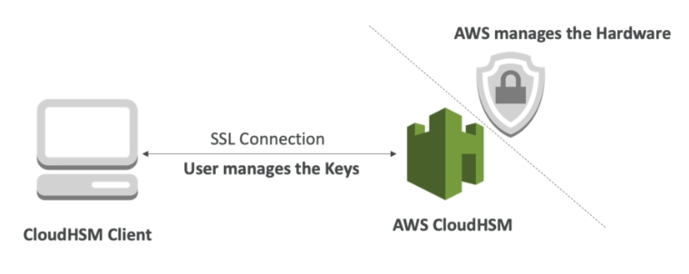

AWS provisions the **Hardware Security Module**.
- dedicated hardware 
- you manage your own encryption keys
- the CloudHSM hardware device is tamper-resistant
- Compliance: **FIPS 140-2 Level 3 Compliance**
- **CloudHSM clusters arespread across multi-AZ - HA**
- supports both **symmetric** and **asymmetric** encryption (SSL/TLS keys)
- no free tier available

### CloudHSM vs. KMS ###

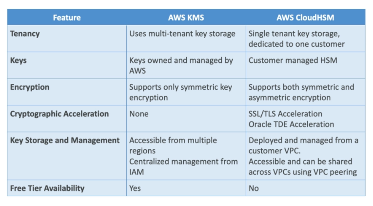

_______________________________________________________

## MFA and IAM Credentials Report ##

Recall that IAM can be integrated with Multi-Factor Authentication (MFA).
- added level of security while accessing your account
- AWS accepts virtual and physical MFA devices
- MFA for root user can be directly configured in IAM dashboard
- MFA can also be configured in MFA
- MFA can also be setup on individual users
- you can generate a CSV - **Credentials Report** - which shows users with enabled MFA   

_______________________________________________________

## IAM PassRole Action ##

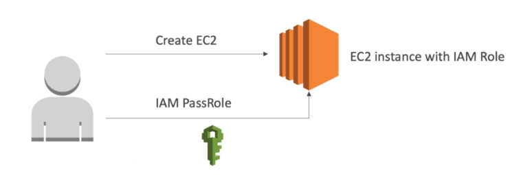

This is the permission that allows us to assign a role to an AWS resource or service.
- when you create an EC2 instance, you can assign a role to it
- to assign a role to it, you need **IAM:PassRole**
- note that this can be used to assign roles to any AWS service
- sample policy:

    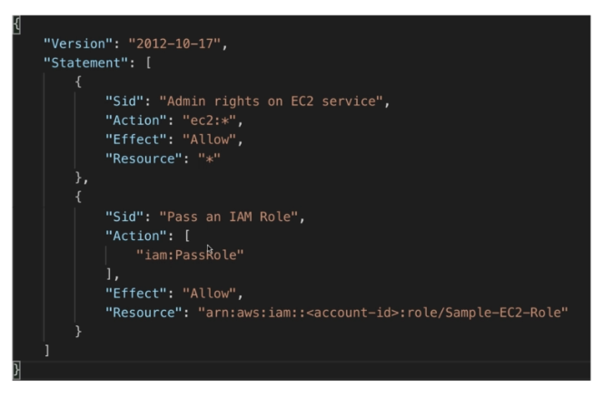
_______________________________________________________

## STS and Cross-account Access ##

**Security Token Service (STS)** allows to grant limited and temporary access to AWS resources.
- tokens are valid up to 1 hour (must be refreshed)
- used for **cross-account access**
- used for **Federation with Active Directory**
    - for non-AWS user
    - for user with SAML
    - for user with SSO
- federation with third-party providers/Cognito
    - used mainly in web and mobile applications

### Cross-account Access ###

Allows one user from one AWS account to access resources in another WS account.
- we define an IAM role for another account to access
- we define which accounts can access this IAM role
- we then AWS STS to retrieve credentials and impersonate the IAM role using **AssumeRole API**
- temporary credentials can be valid between **15 minutes to 1 hour**

&nbsp;&nbsp;&nbsp;&nbsp;&nbsp;&nbsp;&nbsp;&nbsp;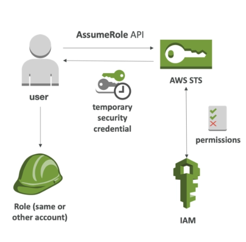
_______________________________________________________

## Identity Federation with SAML and Cognito ##

**Federation** lets users outside of AWS to assume temporary roles to access our AWS resources.
- users assume identity provided access role
- our 3rd-party provider or company identity provider has been trusted by AWS - this is setup in advance
- users will login to 3rd-party provider and provider will give us credentials
- we can use these credentials to access AWS resources
- Federation could include:
    - LDAP
    - Microsoft Active Directory (AD)
    - Single Sign-On
    - Open ID
    - Cognito
- User management is done outside of AWS

### SAML Federation ###

Integration of Active Directory/ADFS with AWS (or any SAML 2.0).
- provide access to AWS console or CLI throught temporary credentials
- no need to create an IAM user for each of your employee
    

 
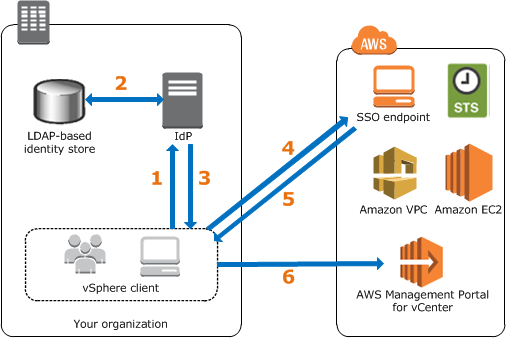

### Custom Identity Broker Application ###

If you don't have a SAML 2.0 Identity Provider, you can use Custom Identity Broker.
- we need to program our identity broker
- identity broker must determinethe appropriate IAM policy
- same process with SAML but requires alot more work since we manage the identity provider

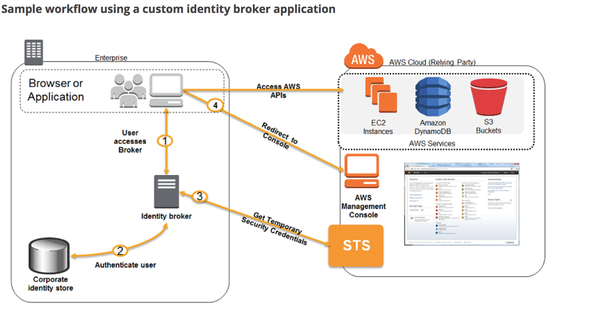

### AWS Cognito - Federated Identity Pools ###

A way to provide direct access to AWS resources from the client side.
- users can log in through a federated identity provider
- users can also remain anonymous
- users will be provided with temporary AWS credentials from the Federated Identity Pool
- these credentials comes with pre-defined IAM policy stating their permissions

**NOTE**: AWS does not recommend Web Identity Federation.

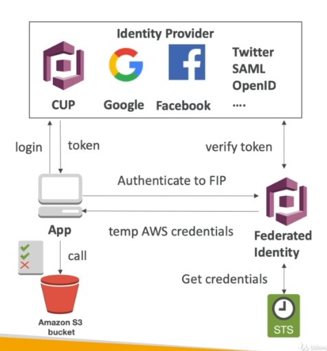

_______________________________________________________

## AWS Compliance Frameworks ##

AWS had their infrastructure audited and they have achieved a lot of certifications.

 

 
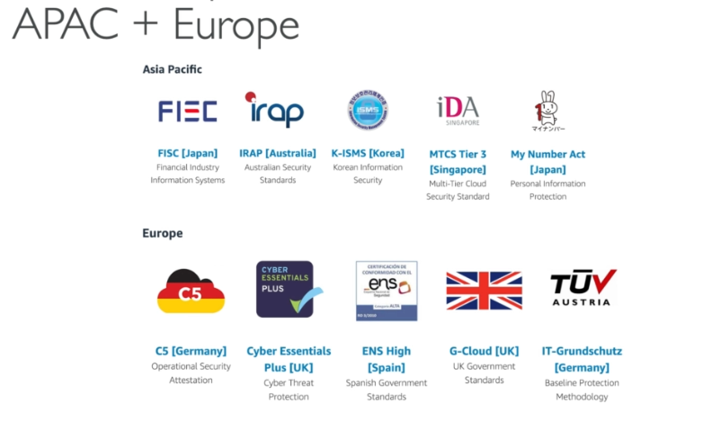
 
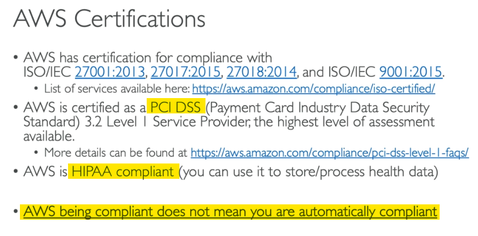

_______________________________________________________

## AWS Artifacts ##

This is not really an AWS service, but is improtant to know. 
**AWS Artifact** is a portal that provides customers with on-demandaccess to AWS compliance documentation and AWS documentation and AWS agreements

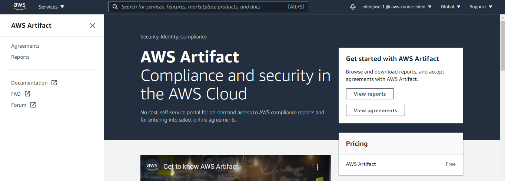

**Artifact Reports**
- security and compliance documents
- AWS ISO certifications
- PCI
- SOC reports

**Artifact Agreements**
- review, accept, and track status of AWS agreements
- Business Associate Addendum (BAA)
_______________________________________________________

## Section Summary ##

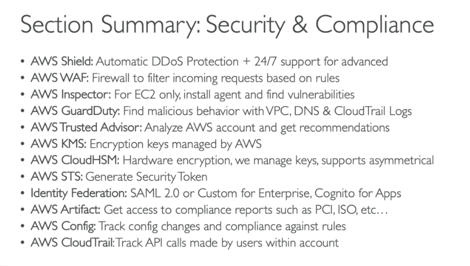

_______________________________________________________
