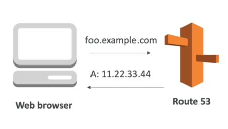
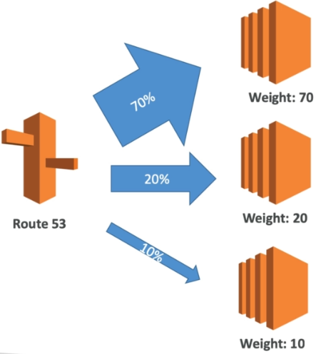
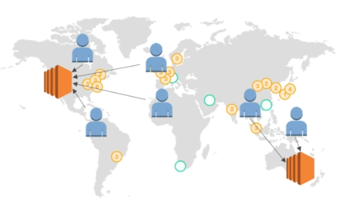
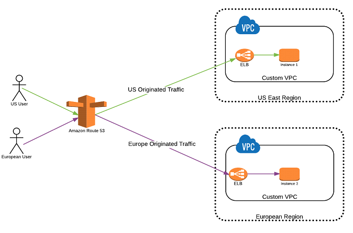
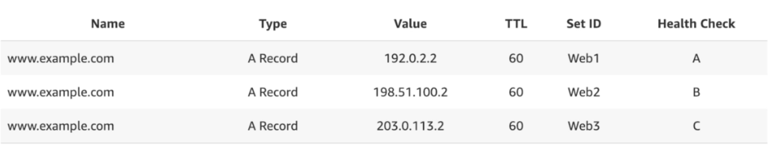

# 13 - Networking and Route 53 #
___________________________________________

This is one of the two networking sections in AWS. This note will focus on **Route 53** - an AWS managed DNS service.

This note is broken down into the following sections:

1.  [Route 53 Overview](#route-53-overview)
2.  [Route 53 - TTL](#route-53-ttl)
3.  [CNAME vs. Alias](#cname-vs-alias)
4.  [Routing Policy - Simple](#routing-policy-simple)
5.  [Routing Policy - Weighted](#routing-policy-weighted)
6.  [Routing Policy - Latency](#routing-policy-latency)
7.  [Route 53 Health Checks](#route-53-health-checks)
8.  [Routing Policy - Failover](#routing-policy-failover)
9. [Routing Policy - Geolocation](#routing-policy-geolocation)
10. [Routing Policy - Multi-Value](#routing-policy-multi-value)
11. [3rd-party Domains and Route 53](#3rd-party-domains-and-route-53)
___________________________________________

## Route 53 Overview ##

**Route 53** is an AWS-managed DNS (Domain Name System) service.

Recall that **DNS** helps clients understand how to reach a server through its domain by resolving the domain name to the corresponding IP address.

In AWS, there are 4 records commonly used:

1.  **A Record** - maps a hostname to IPV4
2.  **AAAA Record** - maps a hostname to IPV6
3.  **CNAME** - maps a hostname to another hostname
4.  **Alias** - maps a hostname to an AWS resource

Route53 can use the following domain names:

- **public domain** names that you own or buy
- **private domain names** that can only be resolved by your instances within your VPC

Route53 also has alot of features:

- loadbalancing 
- health checks
- routing policy
___________________________________________

## Route 53 - TTL ##

**Time-to-Live or TTL** is a way for web browsers and clients to cache the response of a DNS query. The purpose of this is to not overload the DNS.
- we can configure TTL value
- web browser will cache the DNS request and response for the TTL duration
- clients will only be updated with the changes in Route53 once the TTL expires
- **TTL is mandatory for each DNS record**
- **High TTL** - could be 24 hours
    - less DNS queries
    - less traffic on DNS
    - possible outdated records
- **Low TTL** - could be 60 seconds
    - more traffic on DNS
    - records will be updated for less time
___________________________________________

## CNAME vs. Alias ##

Recall that AWS resources expose an AWS hostname. As an example, you can access your load balancer through the link provided by AWS, something like <code>lb1-12334.us-east-2.elb.amazonaws.com</code>.

Instead of using this link, you can have your users access a custom domain name, like <code>myapp.mydomain.com</code> and have this domain name point to your load balancer.

Before we could do this, we must learn first about **CNAME Records**.
- maps a hostname to another hostname
- only work for **NON-ROOT** domain
- non-root domains are in this format: 
    <code>something.domain.com</code>

On the other hand, we have **Alias Records.**
- similar to a CNAME, but it maps hostnames to an AWS resource
- free of charge
- native health check
- works for both **ROOT** and **NON-ROOT** domains
- AWS resource hostnames are in this format
    <code>something.amazonaws.com</code>

Both achieves the same purpose but AWS recommends using **Alias records**.
___________________________________________

## Routing Policy - Simple ##

This policy is used when we want to redirect to a single resource.
- you can't attach health checks
- if multiple values are returned, client chooses a random one.
___________________________________________

## Routing Policy - Weighted ##

Controls the percentage of requests that will go on a certain endpoint.
- we assign weights on each available path to host
- the favorable host will have highest weight
- as an example, this is helpful in testing 1% of traffic on a new app
- helpful to split traffic between regions
- from client's perspective, client is not aware that there are multiple IPs in the backend.
- **can be associated with health checks**

___________________________________________

## Routing Policy - Latency ##

Redirect users to server that has the least latency close to users/s.
- latency is evaluated in terms of user to designated AWS region
- super helpful when latency is the priority

___________________________________________

## Route 53 Health Checks ##

If an instance is not healthy, Route 53 will not send traffic to that instance.

- IP is deemed unhealthy **if it fails 3 health checks in a row**
- IP is deemed healthy **if it passes 3 health checks in a row**
- default health check interval: **30 seconds**
- can be set to **fast healthcheck** = 10 seconds, but at a cost
- about 15 health checks will check endpoint health
- for healthchecks, you can have:
    - HTTP
    - TCP
    - HTTPS (but with no SSL verification)
- can be integrated with CloudWatch
- once defined in Route53, healthchecks can be linked to the DNS queries
___________________________________________

## Routing Policy - Failover ##

Here, we may have a primary instance serving the request and a secondary failover instance in case the primary goes down.
- we need a healthcheck pointing to the primary server
- if that healthcheck fails, route53 automatically points to standby

___________________________________________

## Routing Policy - Geolocation ##

This policy is different with Latency-based routing policy. This one is **routing based on user's location.**
- should create a default policy in case there's no match on location

___________________________________________

## Routing Policy - Multi-Value ##

You can use Multi-value Routing when you want to route traffic to multiple resources.
- associate Route53 health checks with records
- return up to 8 healthy records for each Multi-value query.
- **Multivalue is not a substitue to ELB**

___________________________________________

## 3rd-party Domains and Route 53 ##

Route53 is a **Registrar** - a domain name registrar is an organization that manages the reservation of internet domain names.

Some famous 3rd-party registrars are:
- GoDaddy
- Google Domains
- etc.,

Note that a **domain name registrar is NOT DNS**.
But each domain registrar usually comes with some DNS features.

### 3rd-party Registrar ###

If you buy your domain on another 3rd-party website, you can still use Route53. To do this, you can follow the steps below:

1.  Create a hosted zone in Route53
2.  Update NS Records on 3rd-party website to use Route53 name servers.
___________________________________________
