<!-- 2021-02-09 22:40:44 -->

# 14 - Networking and VPC #
____________________________________

This is the second Networking section in AWS and is a collection of important topics for both the Architect-Associate and SysOps exam.

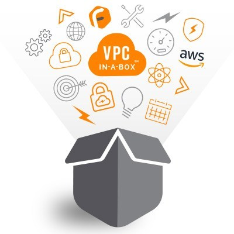

This note is broken down into the following sections:

1.  [CIDR, Private, and Public IP](#cidr-private-and-public-ip)
2.  [Default VPC Overview](#default-vpc-overview)
3.  [VPC Overview](#vpc-overview)
4.  [Subnet Overview](#subnet-overview)
    - [Subnet Mask](#subnet-mask)
    - [Private IP and Public IP](#private-ip-and-public-ip)
5.  [Internet Gateways and Route Table](#internet-gateways-and-route-table)
    - [Internet Gateway](#internet-gateway)
    - [Route Table](#route-table)
6.  [NAT Instances](#nat-instances)
7.  [NAT Gateways](#nat-gateways)
    - [NAT Gateway - High Availability](#nat-gateway-high-availability)
    - [Comparison - NAT Instance vs. NAT Gateway](#comparison-nat-instance-vs-nat-gateway)
8.  [DNS Resolution Options and Route 53 Private Zones](#dns-resolution-options-and-route-53-private-zones)
9.  [NACL and Security Groups](#nacl-and-security-groups)
10. [VPC Peering](#vpc-peering)
11. [VPC Endpoints](#vpc-endpoints)
12. [VPC Flow Logs and Athena](#vpc-flow-logs-and-athena)
    - [Flow Logs Syntax](#flow-logs-syntax)
13. [VPC Flow Logs Troubleshooting for NACL and SG](#vpc-flow-logs-troubleshooting-for-nacl-and-sg)
14. [Bastion Hosts](#bastion-hosts)
15. [Site-to-Site VPN and Gateways](#site-to-site-vpn-and-gateways)
    - [Site-to-site VPN](#site-to-site-vpn)
    - [Virtual Private Gateway](#virtual-private-gateway)
    - [Customer Gateway](#customer-gateway)
16. [Direct Connect and Direct Connect Gateway](#direct-connect-and-direct-connect-gateway)
    - [Direct Connect](#direct-connect)
    - [Direct Connect Gateway](#direct-connect-gateway)
    - [Connection Types](#connection-types)
    - [Direct Connect - Encryption](#direct-connect-encryption)
17. [Egress Only Internet Gateway](#egress-only-internet-gateway)
18. [Section Summary](#section-summary)

______________________________________________________________

## CIDR, Private, and Public IP ##

**CIDR** or **Classless Inter-Domain Routing** for IPv4  is a way to definean IP address range.
- as an example, we know that:
    - 192.168.123.34/32 is one IP
    - 0.0.0.0/0 is all IPs
- but we can also define other ranges using the **subnet mask**
    - 192.168.0.0.**/26** which is 64 IPs
- a CIDR has two components:
    - **Base IP** 
        Represent the IP contained in the range - <code>aaa.bbb.ccc.ddd</code>
    - **Subnet Mask** 
        Defines how many bits can change - <code>/xx</code>

### Subnet Mask ###

Allos part of the underlying IPto get additional next values from the base IP.


### Private IP and Public IP ###

An organization called **Internet Assigned Numbers Authority (IANA)** establsihed certian blocks of IPv4 addresses for the use of private (LAN) and public internet addresses.

| CIDR Block | IP range | |
| --- | --- | --- |
| 10.0.0.0/8 | 10.0.0.0 - 10.255.255.255 | 
| 172.16.0.0/12 | 172.16.0.0 -172.31.255.255 | **default AWS network**  |
| 192.168.0.0/16 |  192.168.0.0 - 192.168.255.255 | **home networks** |
______________________________________________________________

## Default VPC Overview ##

A default VPC on every region comes with our accounts.
- new instances are launched into the default VPC if no subnet is specified
- default VPC comes with internet connectivity
- all instances launched in the default VPC comes with a public IP
- we also get a public and private DNS name
- route table, ACL rules, and internet gateway are also provided
______________________________________________________________

## VPC Overview ##

You can have multiple **VPC** or **Virtual private Cloud** per region. 
- **Max VPC per region**: 5
- **Max CIDR per VPC**: 5
- you can create AWS support ticket to have more than 5 VPC in a region
- For each CIDR:
    - **Min size is /28** or 16 IPs
    - **Max size is /16** or 65,536 IPs
- Because VPC is private, only the private IP ranges are allowed:
    - 10.0.0.0/8
    - 172.16.0.0/12
    - 192.168.0.0/16
- **Your VPC CIDR should not overlap with your other networks**
______________________________________________________________

## Subnet Overview ##

Subnets are tied to an availability zone. On each AZ, we can create a:
- private subnet - usually larger
- public subnet

Note that for each CIDR block, AWS reserves **5 IP addresses** in each subnet. These 5 IPs are not available for use and cannot be assigned to any instance.
- for example, if CIDR block is 10.0.0.0/24:

    | IP | |
    | --- | --- |
    | 10.0.0.0 | Network address |
    | 10.0.0.1 | VPC router or gateway |
    | 10.0.0.2 | Mapping for DNS |
    | 10.0.0.3 | For future use | 
    | 10.0.0.255 | broadcast address |

- note that AWS doesn't support broadcast in a VPC so therefore address is reserved

______________________________________________

## Internet Gateways and Route Table ##

### Internet Gateway ###

This helps our VPC instances connect to the internet.
- scales horizontally
- HA and redundant
- created separately from VPC
- one VPC can only be attached to one gateway
- internet gateway is also a NAT for the instances that have a public IPv4   
- **internet gateways will need route table to allow internet access**

### Route Table ###

We have to create a route table to allow internet access to our VPC.
- note that route table for private subnets must be different with route table for public subnets
______________________________________________________________

## NAT Instances ##

For instances in our private subnet, they cannot access the internet. If they will use the internet gateway, then those instances will also be accessible from the outside. 

As a solution for a private subnets, we can use **Network Address Translation** or **NAT**.

We have two available NAT solutions:
- NAT Instances
- NAT Gateways

**NAT Instances** will allow instances in the private subnets to connect to the internet.
- must be launched in the public subnet
- must have attached Elastic IP
- must have its own security group
- security group must allow some ports from the VPC, going to outside
- route table must be configured to route traffic from private subnets to NAT instance
- must disable flag: **Source/Destination Check**

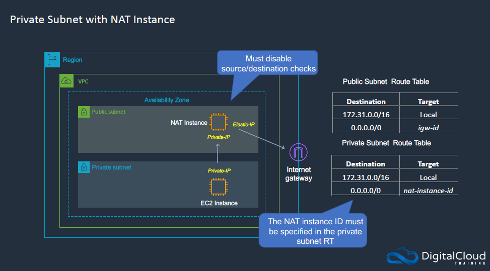

To launch a NAT instance, you follow the same process of launching an instance, but you will use a "nat" for the AMI. This is available in the AWS Marketplace.

**CONS:**
- NAT instances are not highly availablem, not resilient
- you are limited to the BW of the instance type
- you must maintain the NAT instance
- requires more work

As a solution, AWS recommends the use of NAT Gateways.

______________________________________________________________

## NAT Gateways ##

NAT Gateways are a better alternative to NAT instances.

- **AWS-managed NAT**, so less work is needed
- higher BW, higher availability
- pay by the hour for the usage and BW
- NAT is created in a specific AZ
- uses an EIP
- cannot be used by an instance in the subnet (only from the other subnets)
- requires an IGW
- 5 Gbps per bandwidth with auto-scalingup to 45 Gbps
- no security groups to manage

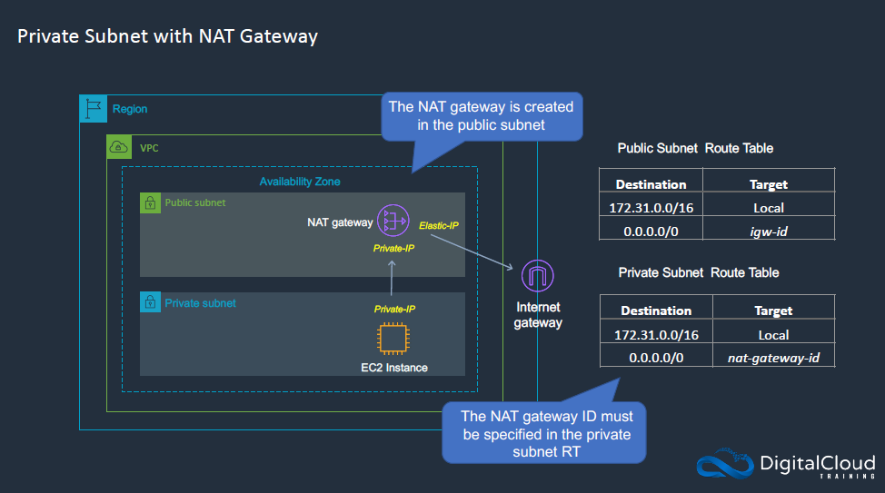

Basically, the private subnet will talk to the NAT Gateway, which in turn will talk to the internet gateway.

### NAT Gateway - High Availability ###

NAT Gateway is only resilient to a single AZ. To have high availability, you will need multiple NAT Gateways in multiple AZ.

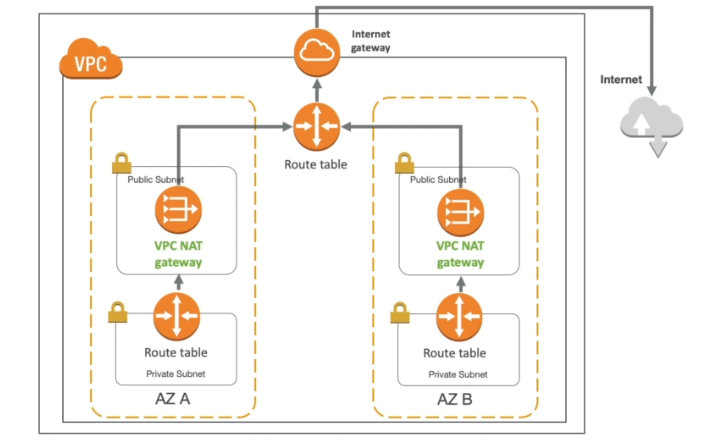

### Comparison - NAT Instance vs. NAT Gateway ###

There's a short comparison found in DigitalCloud's SysOps Cheatsheet.

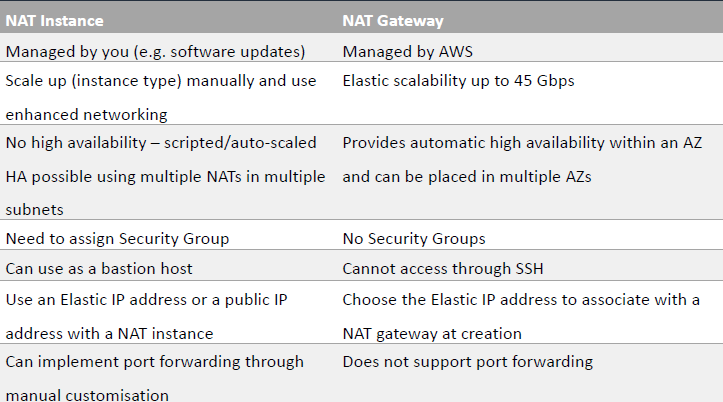

Similarly, you can find an extensive comparison between NAT Instances and NAT Gateways in the [AWS Documentation page](https://docs.aws.amazon.com/vpc/latest/userguide/vpc-nat-comparison.html).

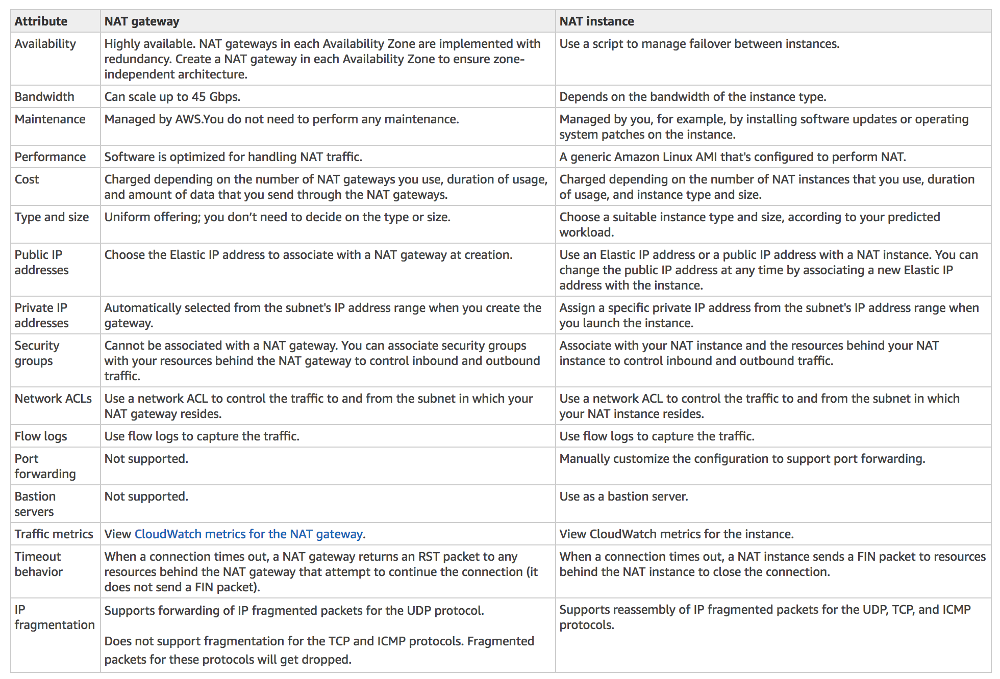

______________________________________________________________

## DNS Resolution Options and Route 53 Private Zones ##

**enableDnsSupport**
- this is a DNS Resolution setting
- helps decide isf DNS resolution is supported for the VPC
- **if True**, queries DNS server at 169.254.169.253
- **default: True**

**enableDnsHostname**
- this is a DNS hostname setting
- no effect unless you have enableDnsSupport: True
- **if True**,assigns public hostname to instance if instance has public IP
- **default: True (default VPC)**
- **default: False (new VPC)**

If you use custom DNS domain names in a private zone in Route 53, you must set both attributes to True.
______________________________________________________________

## NACL and Security Groups ##

**Security Groups**
- **instance-level**
- stateful 
- **default outbound is allowed**
- you can only add/edit inbound rules
- only inbound rules get evaluated

**Network ACLs**
- **subnet-level**
- stateless 
- **default outbound/inbound is allowed**
- similar with firewalls, controls traffic from/to subnet
- one NACL per subnet
- new subnets are assigned with default NACL


For any incoming request, it is always validated first by Network ACLs. If it passes NACLs, request is then checked by the Security group.

**To  define NACL rules:**
- rules must have number (1-32766)
- lower numbers have higher precedence
- as an example:
    ```bash
    # Between these two, the ALLOW wins.
    # ALLOW has 100 while DENY has 200.

    100 ALLOW 10.1.2.3
    200 deny 10.1.2.3
    ``` 
- last rule is an **asterisk (*)** - denies a request in case of no rule match
- AWS recommends adding rules by increment of 100

**Note that newly created NACL will DENY everything.**

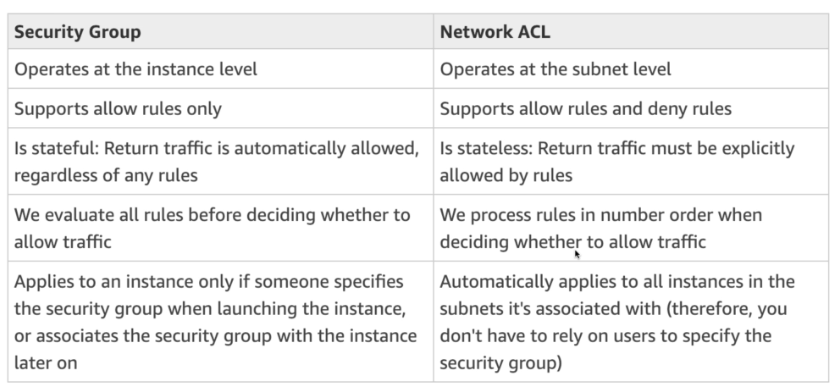

______________________________________________________________

## VPC Peering ##

This allows you to **connect two VPCs directly and privately** using AWS' network.
- both VPCs will behave as part of a single network
- must not have overlapping CIDR
- **you can do VPC peering across regions and across accounts**
- update route tables in each VPC's subnets

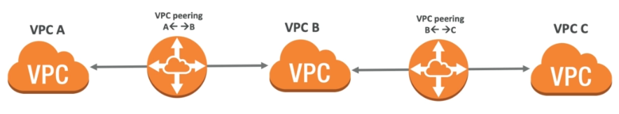   

Note that VPC peering connections are **non-transitive**. This means that VPC-A is connected to VPC-B and VPC-B is connected to VPC-C but this doesn't mean VPC-A is also connected to VPC-C.

To connect VPC-A and VPC-C, they must have their own VPC peering setup.

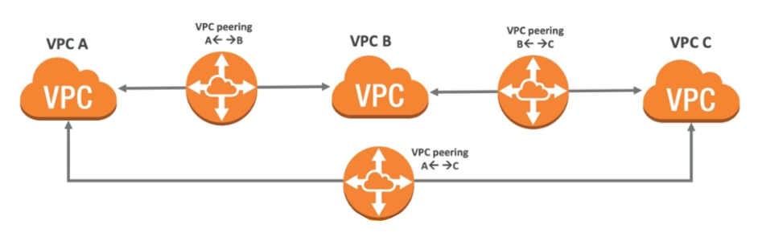   

______________________________________________________________

## VPC Endpoints ##

VPC Endpoints are used to **access AWS services from within a private network**.
- instances in private subnets can talk to the endpoint which will hen allow instance to **directly access another AWS service privately**.
- scale horizontally and are redundant
- remove the need to setup IGW, NAT, etc.
- two kinds of endpoint:
    
    - **Interface Endpoint**
        - provisions an ENI (private IP address) as an entry point
        - must attach security group to it
        - most AWS services use this
    
    - **Gateway Endpoint**
        - provisions a target and must use a route table
        - only **S3 and DynamoDB**

- In case of issues, you can check:
    - DNS Setting Resolution
    - Route Tables
______________________________________________________________

## VPC Flow Logs and Athena ##

**Flow Logs** helps you capture information about the IP traffic going into your interfaces. 

- There are three types of flow logs:

    - **VPC Flow Logs** - applies to everything within your VPC
    - **Subnet Flow Logs** - applies to everything within the subnet
    - **ENI Flow Logs** - applies to traffic for a specific network interface

- By default, VPC Flow Logs will include subnet flow logs and ENI flow logs.
- helps to monitor and troubleshoot connectivity issues
- flow logs data can go to S3 or CloudWatch Logs
- can be used for analyics on usage patterns or malicious behavior
- query VPC flow logs using:
    - Athena on S3
    - Logs Insights on CloudWatch

**To enable flow logs**, go to your VPC and in **Flow Logs** tab, click **Create flow log**.

### Flow Logs Syntax ###

It is important to know how to read flow logs. Below is the flow log format:

```bash
<version> <account-id> <interface-id> <src-addr> <dst-addr> 
<src-port> <dst-port> <protocol> <packets> <bytes> <start> <end>
<action> <log-status>
```

Below is a breakdown of what the parts of a flow log:

<code>src-addr</code> , <code>dst-addr</code>
Helps identify problematic IP

<code>src-port</code> , <code>dst-port</code>
Helps identify problematic port

<code>action</code>
Success or failure of the request due to SG or ACL

______________________________________________________________

## VPC Flow Logs Troubleshooting for NACL and SG ##

| **For incoming requests:** | |
| --- | --- |
| Inbound REJECT | check NACL or SG
| Inbound ACCEPT, outbound REJECT | check NACL |

| **For incoming requests:** | |
| --- | --- |
| Outbound REJECT | check NACL or SG |
| outbound ACCEPT,  inbound REJECT | check NACL |

As reference, you can also see the image below:

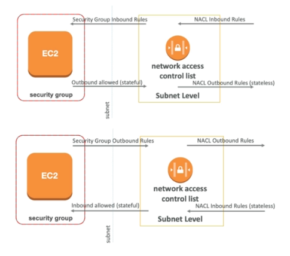

______________________________________________________________

## Bastion Hosts ##

**Bastion Hosts** are used as **jump server** in public subnet - we can access this host from the outside and then from that host, we can easily **"jump"** or ssh into other hosts in the private subnet.
- recall that instances in public subnets can talk to instances in private subnets
- security group of bastion hosts must be tightened
- make sure the bastion hosts **only has port 22** from the traffic you need


______________________________________________________________

## Site-to-Site VPN and Gateways ##

### Site-to-site VPN ###

This is a way to connect your on-prem network to your VPC.
- connection is **over the public internet**
- you need a **customer gateway** setup in your on-prem DC
- on the AWS VPC side, you need a **VPN gateway**
- you can then setup a **site-to-site vpn connection** between the two gateways

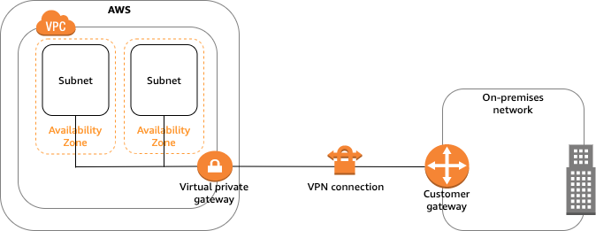

### Virtual Private Gateway ###

This is the VPN concentrator or VPN gateway on the AWS side of connection.
- attached to the VPC that you want to connect to your on-prem network
- you can customize the ASN

### Customer Gateway ###

This is the gateway on the customer's side of connection.
- can be a software application or a physical device
- for the IP address, you can choose either of the following:
    - you can use static, internet-routable IP address
    - if behind a NAT (with NAT-T enabled), use public IP of NAT
______________________________________________________________

## Direct Connect and Direct Connect Gateway ##

### Direct Connect ###

Similar with Sie-to-site VPN's purpose - to connect your on-premise network to your VPC - but this time, **Direct Connect** doesn't go over the public internet. Instead, we have a **dedicated private connection**.
- connection is setup between your DC and an AWS Direct Connect location
- you still need a **Virtual Private Gateway** on AWS side/your VPC
- **supports both IPv4 and IPv6**
- access on public AWS resources (S3) and private resources (EC2) on same connection
- use cases:
    - increased bandwidth throughput
    - working with large data sets
    - more consistent network experience
    - application using real-time feeds
    - hybrid environment (on-prem + cloud)


### Direct Connect Gateway ###

If you want to **connect your on-premise network to multiple VPCs**, you can use a **Direct Connect Gateway**.
- VPCs could be in **different regions** but should be in **same account**
- VPCs must have **non-overlapping CIDR**
- note that VPCs are note peered to each other, they are just accesible from the Direct Connect Gateway

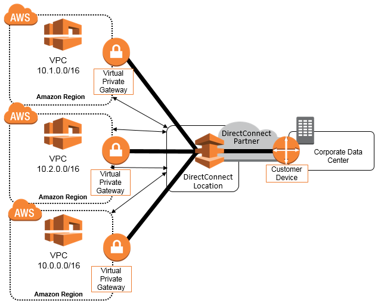


### Connection Types ####

Direct Connect has two types of connections:

1.  **Dedicated Connections**
    - 1 Gbps or 10 Gbps capacity
    - physical ethernet port dedicated to customer
    - to get the port, make a request to AWS first
    - the process will then be completed by AWS Direct Connect Partners
    - can take a while to setup

2.  **Hosted Connections**
    - 50 Mbps, 500 Mbps, all the way up to 10 Gbps
    - can directly request to AWS Direct Connect Partners
    - capacity can be added or removed on demand

Either way, the **lead time** for both connection types **can take more than a month to establish a new connection.**

### Direct Connect - Encryption ###

It is important to note that data in transit in a Direct Connect connection is **private, but is not encrypted.**

To have an **IPsec-encrypted connection on top of the dedicated private connection**, you can use a **AWS Direct Connect + VPN**

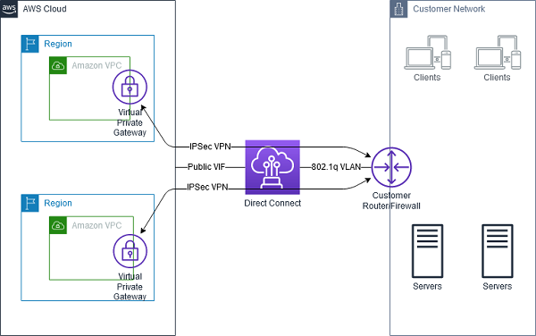

______________________________________________________________

## Egress Only Internet Gateway ##

**Egress-only Internet Gateway is for IPv6 traffic only**
- same function with NAT Instances and NAT Gateway
- so, as comparison:

    | Feature | |
    | --- | ---|
    | NAT | IPv4 | 
    | Egress-only Internet Gateway | IPv6 |

- note that **all IPv6 IP addresses are PUBLIC addresses**
- to prevent instances from being publicly accessible, we can use an Egress-Only Internet Gateway
- to make it work, you would also need to edit the route table

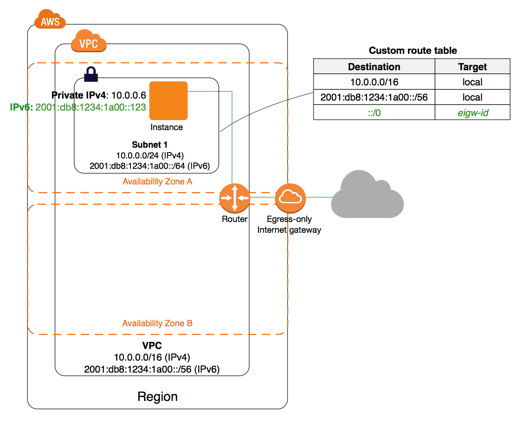

______________________________________________________________

## Section Summary ##

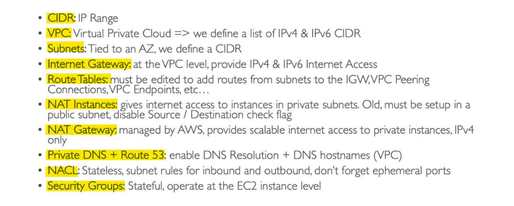
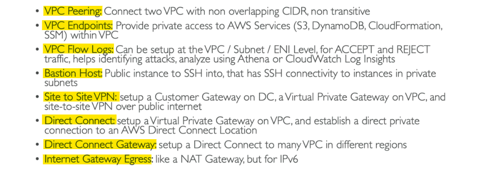

______________________________________________________________
