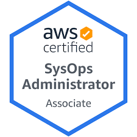

# Notes - AWS SysOps Administrator Associate (SOA-C01) #
__________________________________________________

It's been five months since I passed the **AWS Solutions Architect** exam and I have learned and used a lot of other technologies aswell.

This also meant I have briefly stayed away from AWS for almost half a year to focus on other stuff such as re-learning Python, diving into Ansible, exploring Google Cloud, and also exposing myself more to tools being used at work.

You might be saying I've been spreading myself a little thin, but I do believe that to be a Cloud Engineer, you must have an idea on some of these technologies, at least at a superficial level.

I know there's only a handful that I can truly focus on at a time, which is why I have tried to limit myself in learning only the minimum core pre-requisites

- Linux
- Python
- Git
- At least 1 IaC tool - Ansible
- At least 1 public cloud - AWS
- a bit of Docker and Kubernetes

Yeah I know, that's still a lot. I'm still in progress on learning these stuff. AWS Itself is an entire *universe* of learnings and I've been lucky to have learned about it and fortunately, bagged the Practitioner and Architect exam last year.

So this year, I'm targeting the two remaining Associate certifications. And I'll be starting off with the **AWS SysOps Administrator**.

    

I'm giving myself two months to study and take the exam. I'll put here the notes and projects that I'll be working on while reviewing.

As for the review materials, I'll also be focusing myself on these materials:

- [Ultimate AWS Certified SysOps Administrator Associate 2021](https://www.udemy.com/course/ultimate-aws-certified-sysops-administrator-associate/) by Stephane Maarek

- [[NEW] AWS Certified SysOps Administrator Associate 2021](https://www.udemy.com/course/aws-certified-sysops-administrator-associate-training/) by Neal Davis

- [AWS Certified SysOps Administrator Associate Practice Exams 2021](https://portal.tutorialsdojo.com/product/aws-certified-sysops-administrator-associate-practice-exams/) by Tutorials Dojo

- Official AWS Documentation

Okay, so it's currently 27-Jan-2021 and hopefully I'll get to update this by March 2021 and post the certificate below.

Alright. Full steam ahead.
__________________________________________________
